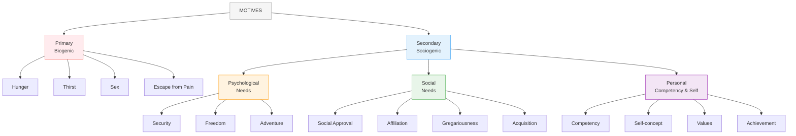

# 3:04 Kinds of Motives

!!! abstract "Section Overview"
    This section classifies motives into **Primary (Biogenic)** and **Secondary (Sociogenic)** motives, further subdividing secondary motives into psychological, social, and personal categories.

---

## 📋 Classification of Motives

Motives may be broadly classified as:

1. **Natural or Biogenic** (Primary Motives)
2. **Acquired or Sociogenic** (Secondary Motives)

---

## 🔄 Motives Classification Diagram

---

## 📊 Primary vs Secondary Motives

### Primary Motives (Biogenic)

!!! quote "Definition"
    **Primary Motives** are **unlearned** motives that are referred to as **biogenic** because they arise from biological needs.

| Examples | Nature |
|----------|--------|
| **Hunger** | Biological need for food |
| **Thirst** | Biological need for water |
| **Sex** | Biological need for reproduction |
| **Escape from pain** | Biological need for safety |

!!! note "Key Points 📌"
    - Primary motives are **unlearned**
    - Animal behaviour is **mainly based** on primary motives
    - These are essential for **survival**

---

### Secondary Motives (Sociogenic)

!!! quote "Definition"
    **Secondary Motives** are **acquired** motives that are essentially **social in character**. They are also called **sociogenic motives**.

#### Three-fold Classification of Secondary Motives

| Category | Description | Examples |
|----------|-------------|----------|
| **Psychological Needs** | Internal psychological requirements | Security, Freedom, Adventure |
| **Social Needs** | Interaction with other people | Social approval, Affiliation, Gregariousness, Acquisition |
| **Personal Motives** | Competency and Self | Competency, Self-concept, Values, Achievement |

!!! note "Key Points 📌"
    - Secondary motives are **acquired through learning**
    - They are **essentially social** in character
    - Both primary and secondary motives play significant roles in **human behaviour**

---

## 📈 Comparison Table

| Aspect | Primary Motives | Secondary Motives |
|--------|-----------------|-------------------|
| **Other Name** | Biogenic | Sociogenic |
| **Nature** | Unlearned | Acquired |
| **Origin** | Biological | Social |
| **Examples** | Hunger, Thirst, Sex | Achievement, Affiliation |
| **Dominant in** | Animal behaviour | Human behaviour |
| **Purpose** | Survival | Social adjustment |

---

## 🧠 Memory Mnemonic

!!! tip "Exam Tip 📝"
    **For Primary Motives** - Remember **"HTSE"**:
    
    - **H**unger
    - **T**hirst
    - **S**ex
    - **E**scape from pain
    
    **For Secondary Motives Categories** - Remember **"PSP"**:
    
    - **P**sychological needs
    - **S**ocial needs
    - **P**ersonal motives (Competency & Self)

---

## 📝 Quick Revision

| Motive Type | Key Feature | Examples |
|-------------|-------------|----------|
| **Primary** | Unlearned/Biological | Hunger, Thirst, Sex |
| **Secondary - Psychological** | Internal needs | Security, Freedom |
| **Secondary - Social** | Interpersonal | Affiliation, Approval |
| **Secondary - Personal** | Self-related | Achievement, Values |

---

## ❓ Review Questions

1. What do you mean by Motives? Explain the different kinds of Motives. **(B)** [Ans. 3:02 + 3:04]
2. Write short notes on Primary and Secondary motives. **(B)** [Ans. 3:04, first two paragraphs only]

---

> **Bridge →** Now let's explore **Maslow's Theory of Hierarchical Needs**, which provides a comprehensive understanding of how human needs are organized and motivate behaviour...
