# 3:05 Theories of Motivation - Maslow's Theory of Hierarchical Needs

!!! abstract "Section Overview"
    This section covers **theories of motivation** with a detailed focus on **Abraham Maslow's Theory of Hierarchical Needs**, including the seven levels of needs, educational implications, differences between deficiency and growth needs, and characteristics of self-actualisers.

---

## 📋 Major Theories of Motivation

| # | Theory | Proponent |
|---|--------|-----------|
| 1 | **Instinct Theory** | McDougall |
| 2 | **Physiological Theory** (Hypodermic Model) | Morgan |
| 3 | **Drive-reduction Theory** | Hull |
| 4 | **Need Theory** | Murray |
| 5 | **Theory of Hierarchical Needs** | **Maslow** |

!!! note "Key Points 📌"
    While **behaviourists** emphasize **extrinsic motivation**, **cognitive theorists** advocate **intrinsic motivation**.

---

## 3:05:1 Maslow's Theory of Hierarchical Needs

### Overview

**Abraham Maslow** proposed a comprehensive theory of:

- **Need gratification**
- **Growth motivation**

This includes:
- Fundamental **physiological needs**
- **Intermediate needs**
- **Meta needs** (creativity and self-actualisation)

!!! quote "Maslow's Fundamental Principles"
    1. Human needs are **many and multiple**; all are not of equal importance - needs can be arranged **hierarchically**
    2. The organism will aspire for **higher order needs** only when the **lower order needs** get fulfilled

---

## 🔺 Maslow's Hierarchy of Needs Pyramid

```mermaid
flowchart TB
    subgraph PYRAMID["🔺 MASLOW'S HIERARCHY OF NEEDS"]
        direction TB
        L7["VII. SELF-ACTUALISATION NEEDS<br/>Fulfill one's individual nature"]
        L6["VI. AESTHETIC NEEDS<br/>Appreciation of order and beauty"]
        L5["V. ACHIEVEMENT NEEDS<br/>Knowledge and Understanding"]
        L4["IV. SELF-ESTEEM NEEDS<br/>Strength, mastery, competency"]
        L3["III. AFFILIATIONAL NEEDS<br/>Affection and belonging"]
        L2["II. SAFETY & SECURITY NEEDS<br/>Shelter, clothing, security"]
        L1["I. PHYSIOLOGICAL NEEDS<br/>Food, water, oxygen, sleep, sex"]
    end
    
    L1 --> L2 --> L3 --> L4 --> L5 --> L6 --> L7
    
    style L1 fill:#ffebee,stroke:#f44336
    style L2 fill:#fff3e0,stroke:#ff9800
    style L3 fill:#fff9c4,stroke:#ffc107
    style L4 fill:#e8f5e9,stroke:#4caf50
    style L5 fill:#e3f2fd,stroke:#2196f3
    style L6 fill:#e1f5fe,stroke:#03a9f4
    style L7 fill:#f3e5f5,stroke:#9c27b0
```

---

## 📊 Detailed Description of Each Need Level

### I. Physiological Needs

| Aspect | Description |
|--------|-------------|
| **Position** | Lowest in the motivational hierarchy |
| **Examples** | Food, water, oxygen, sleep, sex, sensory satisfaction |
| **Importance** | Vital for **survival** |
| **Priority** | Must be fulfilled before higher order motives become prominent |

!!! warning "Limitation"
    The main reason why **disadvantaged and poor children** refuse to be motivated in the classroom to learn is that their **basic bodily needs remain unsatisfied**.

---

### II. Safety and Security Needs

| Aspect | Description |
|--------|-------------|
| **Examples** | Shelter, clothing, personal safety, security of future |
| **Also includes** | Routine, regularity |
| **For children** | Need discipline within their levels of understanding |
| **Purpose** | To perceive an **orderly and organised world** |

---

### III. Affiliational Needs

| Aspect | Description |
|--------|-------------|
| **Definition** | Individual's hunger for **affection** |
| **Related to** | **Identity** and **belongingness** |
| **Impact** | Underachievement often results from lack of love and belonging |

!!! quote "Important Insight"
    "A pupil who is **not loveable** because of his behaviour, **needs to be loved most**."

---

### IV. Self-Esteem Needs

| Aspect | Description |
|--------|-------------|
| **Desire for** | Strength, mastery, competency |
| **Leads to** | Feeling of independence and freedom |
| **Goal** | To be **high in the eyes of others** |

| Satisfaction | Result |
|--------------|--------|
| **When satisfied** | Feelings of worth, confidence, adequacy |
| **When unsatisfied** | Discouragement, feelings of inferiority, inadequacy |

---

### V. Achievement Needs

Two sub-categories:

| Need Type | Description |
|-----------|-------------|
| **Need for Knowledge** | Access to information, knowing how to do things, meaning of things, events, symbols |
| **Need for Understanding** | Knowledge of relationships, process, integration of knowledge into broad structure |

!!! note "Key Points 📌"
    Achievement needs are related to **intellectual domination** and **cognitive competencies**.

---

### VI. Aesthetic Needs

| Aspect | Description |
|--------|-------------|
| **Concerned with** | Appreciation of **order and beauty** |
| **When active** | When lower order needs are fully satisfied |
| **Expression** | Derives pleasure in beauty, nature |
| **Examples** | **Tagore**, **Wordsworth** |

---

### VII. Self-Actualisation Needs

!!! quote "Definition"
    **Self-actualisation** means to **fulfill one's individual nature in all its aspects**.

| Feature | Description |
|---------|-------------|
| **Characteristic** | One talented in a specific area feels uneasy if talent is not nurtured |
| **Goal** | Attain **perfection** in that area |
| **Level** | The **highest level of functioning** |
| **Condition** | People can be motivated towards self-actualisation only when lower order needs are satisfied |

---

## 3:05:1:01 Educational Implications of Maslow's Theory

| # | Implication | Application |
|---|-------------|-------------|
| **i** | **Deficiency needs must be satisfied** | Bear in mind when dealing with economically and culturally disadvantaged children |
| **ii** | **Physical environment** | Look after ventilation, lighting, furniture, blackboard, provision of midday meals |
| **iii** | **Psychological safety** | Classroom arrangement for physical and psychological safety; show interest in every pupil |
| **iv** | **Realistic level of aspiration** | Individuals raise goals after success, lower after failure; provide graded assignments ensuring some success for every pupil |
| **v** | **Growth needs** | Enhance the attraction and minimise the dangers of growth needs |
| **vi** | **Curriculum relevance** | Curriculum should be related to demands of society and aspirations of people; serve vocational needs |

!!! warning "Limitation"
    Indiscipline in classrooms and campus unrest could be traced to curriculum not related to societal demands and uncertain future making students behave hysterically.

---

## 3:05:1:02 Differences Between Deficiency and Growth Needs

| Aspect | Deficiency Needs (D-needs) | Growth Needs (G-needs) |
|--------|---------------------------|------------------------|
| **Source** | Centre around one's self; grow stronger when **denied** | Spring from within; grow stronger when **fulfilled** |
| **Examples** | Food, sleep, water, clothes, shelter, safety | Love, affection, self-esteem, achievement, self-realisation, aesthetic |
| **Tension** | Produces tension; once fulfilled, temporary relief | Productive and pleasant tension; leads to further desires |
| **Duration** | **Episodic** (e.g., breakfast → lunch → supper) | **Continuous and never ending** |
| **Universality** | **Common** to all individuals | **Idiosyncratic** - differ for individuals |
| **Help needed** | Other's help may be required | Most **autonomously** satisfied; tend towards self-help |
| **Completion** | Can be fulfilled completely; may reoccur | Never ending |
| **Nature** | **Selfish** in nature | Belong to a **higher place** |

---

## 3:05:1:03 Characteristics of Self-Actualisers

According to Maslow's book **'Towards a Psychology of Being'**, a consistently self-actualised person has these characteristics:

| # | Characteristic | Description |
|---|----------------|-------------|
| **i** | Sense of detachment | Can step back and observe |
| **ii** | Accepts self and others | Non-judgmental acceptance |
| **iii** | Democratic in outlook | Open to all perspectives |
| **iv** | Problem-centred behaviour | Focuses on solutions |
| **v** | High degree of spontaneity | Acts naturally |
| **vi** | Shows mysticism at times | Spiritual experiences |
| **vii** | Identifies with mankind | Universal connection |
| **viii** | Deep interpersonal relationships | Meaningful connections |
| **ix** | Discriminates ends and means | Ethical clarity |
| **x** | Appreciates basic goods of life | Continued freshness and pleasure |
| **xi** | Creative | Original thinking |
| **xii** | Sense of humour | Healthy laughter |
| **xiii** | Non-conformist | Independent thinker |
| **xiv** | Sufficient perception of reality | Accepts reality |

---

## 🧠 Memory Mnemonics

!!! tip "Exam Tip 📝"
    **For Maslow's Hierarchy** - Remember **"Please Stay And Study Achievement, Art, Self"**:
    
    1. **P**hysiological
    2. **S**afety
    3. **A**ffiliational
    4. **S**elf-esteem
    5. **A**chievement
    6. **A**esthetic
    7. **S**elf-actualisation
    
    **For D-needs vs G-needs** - Remember:
    
    - **D**eficiency = **D**enied makes stronger
    - **G**rowth = **G**iven makes stronger

---

## 📝 Quick Revision Table

| Need Level | Key Word | When Activated |
|------------|----------|----------------|
| Physiological | **Survival** | Always first |
| Safety | **Security** | After physiological |
| Affiliational | **Belonging** | After safety |
| Self-Esteem | **Recognition** | After belonging |
| Achievement | **Knowledge** | After esteem |
| Aesthetic | **Beauty** | After achievement |
| Self-Actualisation | **Perfection** | After all others |

---

## ❓ Review Questions

1. Describe Maslow's theory of Hierarchical needs, bringing out its educational implications. **(A)** [Ans. 3:05:1 + 3:05:1:01]

---

> **Bridge →** Now let's understand the concept of **Level of Aspiration** and how it relates to goal-setting behaviour...
