# 3:06 Concept of 'Level of Aspiration'

!!! abstract "Section Overview"
    This section explains the concept of **Level of Aspiration** - how individuals set future performance goals based on past performance, and how success and failure influence these goals.

---

## 📋 Definitions of Level of Aspiration

### Frank's Definition

!!! quote "Definition"
    **Level of aspiration** is "the level of **future performance** in a familiar task which an individual, **knowing his level of past performance** in the task, explicitly undertakes to reach."

### P. Hoppe's Definition

!!! quote "Definition"
    Level of aspiration is "the **degree of accomplishment** consciously striven after by an individual."

---

## 🔄 How Level of Aspiration Works

```mermaid
flowchart TB
    subgraph NORMAL["✅ Normal People"]
        N1[Set aspiration<br/>slightly ABOVE<br/>present performance]
        N2[After SUCCESS<br/>RAISE goals]
        N3[After FAILURE<br/>LOWER goals<br/>a little]
    end
    
    subgraph ABNORMAL["⚠️ Abnormal People"]
        A1[Set goals<br/>unrealistically TOO HIGH]
        A2[OR set goals<br/>unrealistically TOO LOW]
        A3[Dominated by<br/>excessive fear of failure]
    end
    
    style NORMAL fill:#e8f5e9,stroke:#4caf50
    style ABNORMAL fill:#ffebee,stroke:#f44336
```

---

## 📊 Normal vs Abnormal Goal Setting

| Type | Goal Setting Behaviour | After Success | After Failure |
|------|------------------------|---------------|---------------|
| **Normal** | Set goals **slightly above** present level | **Raise** goals | **Lower** goals a little |
| **Abnormal** | Set goals **unrealistically too high or too low** | May not adjust | Dominated by fear |

---

## 🧠 Personality Factors Influencing Aspiration

| Factor | Influence |
|--------|-----------|
| **N.Ach** (Need for Achievement) | Higher N.Ach leads to higher but realistic aspirations |
| **Self-confidence** | Affects goal-setting optimism |
| **Maturity** | Mature individuals set more realistic goals |
| **Self-esteem** | Higher self-esteem = appropriate goal level |

---

## 📐 Measuring Level of Aspiration

Two popular measures used in aspirational studies:

### 1. Goal Discrepancy (G.D.)

!!! quote "Formula"
    **G.D. = Present Aspiration − Previous Attainment**

### 2. Attainment Discrepancy (A.D.)

!!! quote "Formula"
    **A.D. = Present Attainment − Previous Aspiration**

---

## 📊 Interpretation of Measures

| Person Type | Goal Discrepancy (G.D.) | Attainment Discrepancy (A.D.) |
|-------------|-------------------------|-------------------------------|
| **Normal** | **Slightly positive** | **Slightly negative** |
| **Abnormal** | Too high or too low | Inconsistent |

!!! example "Example"
    For a **normal person**:
    
    - If **previous attainment** was 70 marks
    - **Present aspiration** might be 75 marks (G.D. = +5, slightly positive)
    - If **present attainment** is 73 marks
    - **Previous aspiration** was 75 marks (A.D. = -2, slightly negative)

---

## 🎯 Visual Representation

---

## 🧠 Memory Mnemonic

!!! tip "Exam Tip 📝"
    Remember **"GPA"** for Level of Aspiration:
    
    - **G**oal Discrepancy = Present Aspiration - Previous Attainment
    - **P**ersonality factors (N.Ach, Self-confidence, Maturity, Self-esteem)
    - **A**ttainment Discrepancy = Present Attainment - Previous Aspiration
    
    For Normal persons: **G.D. is + (positive), A.D. is - (negative)**

---

## 📝 Quick Revision Table

| Concept | Description |
|---------|-------------|
| **Level of Aspiration** | Future performance goal based on past performance |
| **Normal behaviour** | Set slightly above, raise after success, lower after failure |
| **Abnormal behaviour** | Unrealistic goals (too high or low) |
| **G.D. Formula** | Present Aspiration − Previous Attainment |
| **A.D. Formula** | Present Attainment − Previous Aspiration |
| **Normal G.D.** | Slightly positive |
| **Normal A.D.** | Slightly negative |

---

## ❓ Review Questions

1. What is meant by Level of Aspiration? **(C)** [Ans. 3:06]

---

> **Bridge →** Let's now explore the **two types of motivation** - extrinsic and intrinsic - and understand their merits and limitations...
