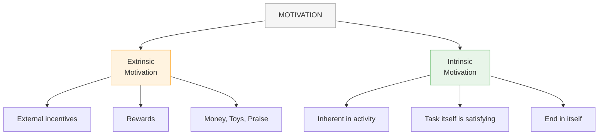
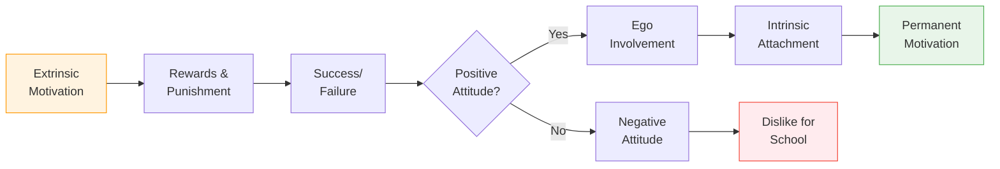

# 3:07 Two Types of Motivation

!!! abstract "Section Overview"
    This section explores the two types of motivation - **Extrinsic** and **Intrinsic** motivation - explaining their nature, differences, merits and limitations.

---

## 📋 Classification of Motivation

There are two types of Motivation:

1. **Extrinsic Motivation**
2. **Intrinsic Motivation**

---

## 3:07:1 Extrinsic Motives

!!! quote "Definition"
    **Extrinsic motivation** refers to certain **incentives or reinforcements** that are **external**. The task is undertaken because it leads to an external reward.

### Characteristics of Extrinsic Motivation

| Feature | Description |
|---------|-------------|
| **Nature** | External incentives |
| **Examples** | Money, toys, sweets, prizes |
| **Purpose** | Task is a **means to an end** |
| **Effect** | Task leads to a goal/reward |

!!! example "Example"
    When a child is assigned a task and told that he would get **Rs. 10/-** on completing it within a specified time, the child puts forth his best efforts to finish the task in time. This is a case of **extrinsic motivation**.

---

## 3:07:2 Intrinsic Motives

!!! quote "Definition"
    **Intrinsic motivation** is **inherent in the activity itself**. The task is **not a means to an end** - it is an **end in itself**. Performing it is satisfying in itself.

### Characteristics of Intrinsic Motivation

| Feature | Description |
|---------|-------------|
| **Nature** | Internal satisfaction |
| **Location** | Inherent in the activity |
| **Purpose** | **End in itself** |
| **Effect** | Performing the task is satisfying |

!!! example "Example"
    - **Children** find intrinsic motivation in **play**
    - **Adults** are intrinsically motivated to hear **music**, go to **temples** and offer **prayer**
    - If we play for the **satisfaction** we derive from it, it is intrinsic motivation
    - If we play for a **trophy or prize money**, it is extrinsic motivation

---

## 📊 Comparison: Extrinsic vs Intrinsic Motivation

| Aspect | Extrinsic Motivation | Intrinsic Motivation |
|--------|---------------------|---------------------|
| **Source** | External rewards | Internal satisfaction |
| **Task purpose** | Means to an end | End in itself |
| **Reward** | External (money, prize) | Internal (satisfaction) |
| **Duration** | Temporary | Permanent |
| **Example** | Playing for trophy | Playing for enjoyment |
| **Attitude** | Task-oriented | Ego-involved |

---

## 3:07:3 Merits and Limitations of Extrinsic and Intrinsic Motives

### Examples of Extrinsic Motivation

| Category | Examples |
|----------|----------|
| **Rewards and punishment** | Prizes, marks, scolding |
| **Success or failure** | Grades, results |
| **Audio-visual aids** | Teaching tools |
| **Cooperation and competition** | Group activities |

### Limitations of Extrinsic Motivation

!!! warning "Limitation"
    When we emphasize **rewards and punishment** (or success and failure) **too much**, it may lead to a **negative attitude towards the school** by the student.

### Benefits of Intrinsic Motivation

!!! success "Advantage"
    When students develop a **positive attitude**, they develop an **involvement of ego** towards the task. They become **intrinsically attached** to the task. This is **permanent**.

---

## 🔄 Flow: From Extrinsic to Intrinsic

---

## 🧠 Memory Mnemonic

!!! tip "Exam Tip 📝"
    Remember **"METS"** for Extrinsic motivation:
    
    - **M**oney
    - **E**xternal rewards
    - **T**rophies
    - **S**weets/prizes
    
    Remember **"SIPE"** for Intrinsic motivation:
    
    - **S**atisfaction within
    - **I**nherent in activity
    - **P**ermanent
    - **E**nd in itself

---

## 📊 Psychological Note

!!! note "Key Points 📌"
    **Psychologically, all motivation is intrinsic.** By "extrinsic motivation," we refer to certain incentives or reinforcements that are external. True motivation comes from within, but external factors can trigger or support it.

---

## 📝 Quick Revision Table

| Type | Nature | Example | Duration |
|------|--------|---------|----------|
| **Extrinsic** | External rewards | Playing for prize | Temporary |
| **Intrinsic** | Internal satisfaction | Playing for fun | Permanent |

---

## ❓ Review Questions

1. What do you understand by Motivation? Explain the various kinds of Motivation. **(A)** [Ans. 3:01 + 3:07 + 3:07:1 + 3:07:2]
2. What are Extrinsic and Intrinsic Motives? **(B)** [Ans. 3:07 + 3:07:1 + 3:07:2]

---

> **Bridge →** Having understood the types of motivation, let's explore practical **Motivational Strategies in the Classroom** that teachers can use...
