# 3:08 Motivational Strategies in the Classroom

!!! abstract "Section Overview"
    This section explores practical **motivational strategies** that teachers can use in the classroom to motivate students for learning, including rewards, feedback, goal setting, and modern instructional methods.

---

## 📋 The Challenge of Classroom Motivation

!!! note "Key Points 📌"
    How to **motivate children** in the classroom for learning is a **crucial problem** which concerns **all teachers at all stages of teaching**.

---

## 🎯 Common Motivational Techniques

### 1. Use of Rewards

| Type | Examples | Effect |
|------|----------|--------|
| **Prizes** | Trophies, certificates | Generates interest and enthusiasm |
| **Distinctions** | Honours, special recognition | Appeals to ego involvement |
| **Graces** | Praise, appreciation | Ego-maximisation |
| **Decorations** | Badges, medals | Sense of achievement |

---

### 2. Age-Appropriate Incentives

```mermaid
flowchart LR
    subgraph PRIMARY["🎒 Primary Classes"]
        P1[Rewards]
        P2[Prizes]
        P3[Stickers]
    end
    
    subgraph HIGHSCHOOL["🎓 High School Classes"]
        H1[Praise]
        H2[Blame/Feedback]
        H3[Recognition]
    end
    
    style PRIMARY fill:#e3f2fd,stroke:#2196f3
    style HIGHSCHOOL fill:#e8f5e9,stroke:#4caf50
```

!!! tip "Exam Tip 📝"
    In **Primary classes**: Rewards and prizes operate effectively
    In **High school classes**: Praise and blame will be more suitable than rewards

---

### 3. Relating Learning to Practical Life

!!! note "Key Points 📌"
    Students should be helped to **feel the utility** of what they learn by **relating them to practical life situations**.

---

### 4. Providing Feedback

| Feedback Type | Method | Effect |
|---------------|--------|--------|
| **Test results** | Announce next day itself | Motivates learner for next test |
| **Verbal appreciation** | Teacher's nod, smile | Immediate reinforcement |
| **Non-verbal** | Head nod, facial expressions | Encourages responses |

!!! success "Summary"
    Immediate feedback makes the learner motivated to learn and face the next test eagerly.

---

### 5. Goal Setting

!!! quote "Principle"
    **Motivational behaviour is always goal-oriented.** When the goal is **clear and attainable**, the students **strive hard** to reach the goal.

---

### 6. Ensuring Success to All

!!! note "Key Points 📌"
    **Graded assignments** should be given such that:
    - Everyone will have **some success initially**
    - This helps them **continue their efforts**
    - Talented students may claim **more success or full success**

---

### 7. Competition and Cooperation

| Strategy | Implementation |
|----------|----------------|
| **Stress cooperation** | Emphasize teamwork in study and sports |
| **Group competitions** | Set competitions among groups, not individuals |
| **Frequent group changes** | Change group members frequently |
| **Self-competition** | Goad individual members for self-competition |

---

### 8. Professional Competency

| Teacher Quality | Benefit |
|-----------------|---------|
| **Professional competency** | Effective task delivery |
| **Sensitivity to pupils' needs** | Kindles students' interest |
| **Imaginative use of A-V aids** | Makes teaching interesting |

---

### 9. Avoiding Excessive Motivation

!!! warning "Caution"
    **Avoid excessive motivation** as it is **self-defeating**.

---

### 10. Developing Positive Attitude

!!! note "Key Points 📌"
    Develop **positive attitude** in pupils towards:
    - The school situation
    - Learning itself
    - **Proper teacher-pupil relationship** is basic to such an attitude

---

## 📊 Modern Dynamic Methods of Instruction

| Method | Description |
|--------|-------------|
| **Team teaching** | Multiple teachers collaborating |
| **Group discussion** | Interactive peer learning |
| **Brain storming** | Creative idea generation |
| **Quiz programmes** | Competitive knowledge testing |

!!! success "Effect"
    These methods **keep the tempo of the class** high and engaged.

---

## 👨‍🏫 Characteristics of a Motivating Teacher

Any teacher can become a **motivating teacher** by adhering to the following:

| # | Characteristic | Description |
|---|----------------|-------------|
| **a** | **Well-structured teaching** | Organised lesson delivery |
| **b** | **Increased participation** | Active learner involvement |
| **c** | **Warmth and enthusiasm** | Appreciation of students' efforts |
| **d** | **Clear-cut goals** | Within reach of the pupils |
| **e** | **Good rapport** | Inside and outside the class |
| **f** | **Stage actor skills** | Proper modulation of voice, gestures |
| **g** | **Varied techniques** | Demonstration, illustration (visual and verbal) |
| **h** | **Continuous internal assessment** | Eliminates needless tension |

---

## 🎭 The Teacher as Stage Actor

---

## 🧠 Memory Mnemonic

!!! tip "Exam Tip 📝"
    Remember **"RFGSCPA-CM"** for Motivational Strategies:
    
    - **R**ewards and incentives
    - **F**eedback (immediate)
    - **G**oal setting
    - **S**uccess ensured for all
    - **C**ompetition & Cooperation
    - **P**rofessional competency
    - **A**void excessive motivation
    - **C**ontinuous assessment
    - **M**odern methods (team teaching, brain storming)

---

## 📝 Quick Revision Table

| Strategy | Key Action |
|----------|------------|
| Rewards | Age-appropriate incentives |
| Feedback | Immediate, next day results |
| Goals | Clear and attainable |
| Success | Graded assignments for all |
| Competition | Group-based, not individual |
| Teaching | Well-structured with varied techniques |
| Assessment | Continuous internal assessment |

---

## ❓ Review Questions

1. Discuss motivational strategies in the classroom. **(B)** [Ans. 3:08]

---

> **Bridge →** Now that we've covered motivation comprehensively, let's move to understanding **Learning** - its meaning, definition, and why it's fundamental to human life...
