# 3:09 Meaning and Definition of 'Learning'

!!! abstract "Section Overview"
    This section defines **learning** as a relatively permanent change in behaviour resulting from activity, training, practice, or experience, and explains its three essential elements.

---

## 📋 What Results from Learning?

The following are all due to learning:

| Type | Examples |
|------|----------|
| **Knowledge** | Facts, concepts, theories we acquire |
| **Language** | The language we speak |
| **Habits** | Regular patterns of behaviour |
| **Attitudes** | Mental dispositions and feelings |
| **Skills** | Abilities developed through practice |

---

## 📚 Definition of Learning

!!! quote "Definition"
    Psychologists define **learning** as "a **relatively permanent change in behaviour**, which occurs as a result of **activity**, **training**, **practice** or **experience**."

### Simple Definition

!!! quote "Alternative Definition"
    Learning could be defined more simply as **"profiting from experience"**.

---

## 🔑 Three Essential Elements of Learning

```mermaid
flowchart TB
    L[LEARNING] --> E1["1️⃣ Results in<br/>CHANGE IN BEHAVIOUR"]
    L --> E2["2️⃣ Through PRACTICE<br/>or EXPERIENCE"]
    L --> E3["3️⃣ Must be RELATIVELY<br/>PERMANENT"]
    
    style L fill:#e3f2fd,stroke:#2196f3
    style E1 fill:#e8f5e9,stroke:#4caf50
    style E2 fill:#fff3e0,stroke:#ff9800
    style E3 fill:#f3e5f5,stroke:#9c27b0
```

---

## 📊 Detailed Analysis of Elements

### Element 1: Change in Behaviour

!!! note "Key Points 📌"
    Learning **results in change in behaviour**. This is the observable outcome of the learning process.

---

### Element 2: Through Practice or Experience

!!! note "Key Points 📌"
    It is a change that takes place through **practice** or **experience**.

!!! warning "Important Distinction"
    Changes due to **growth and maturation** are relatively **independent** of activity, practice, or experience, and hence they are **NOT learning**.

| Change Type | Through | Is it Learning? |
|-------------|---------|-----------------|
| Skill improvement | Practice | ✅ Yes |
| Knowledge gain | Experience | ✅ Yes |
| Height increase | Growth | ❌ No |
| Puberty changes | Maturation | ❌ No |

---

### Element 3: Relatively Permanent

!!! note "Key Points 📌"
    Before it can be called learning, the change must be **relatively permanent**. It must last a **fairly long time**.

!!! warning "Not Learning"
    Behaviour changes brought about by the following are **transitory** in nature and hence are **NOT included under learning**:
    
    | Temporary Factor | Example |
    |------------------|---------|
    | **Fatigue** | Tiredness affecting performance |
    | **Drugs** | Substance-induced behaviour change |
    | **Illness** | Sickness-related changes |
    | **Warm up** | Initial practice effects |

---

## 🔄 Learning vs Non-Learning Changes

```mermaid
flowchart TB
    subgraph LEARNING["✅ LEARNING"]
        L1[Knowledge Acquisition]
        L2[Skill Development]
        L3[Attitude Change]
        L4[Habit Formation]
    end
    
    subgraph NOTLEARNING["❌ NOT LEARNING"]
        N1[Growth & Maturation]
        N2[Fatigue Effects]
        N3[Drug-induced Changes]
        N4[Illness Effects]
        N5[Warm-up Effects]
    end
    
    LEARNING -->|Relatively<br/>Permanent| P[Through Practice<br/>or Experience]
    NOTLEARNING -->|Transitory or<br/>Independent| T[Natural/Temporary<br/>Factors]
    
    style LEARNING fill:#e8f5e9,stroke:#4caf50
    style NOTLEARNING fill:#ffebee,stroke:#f44336
```

---

## 📊 Summary Comparison

| Aspect | Learning | Non-Learning Changes |
|--------|----------|---------------------|
| **Duration** | Relatively permanent | Transitory |
| **Cause** | Practice, experience, training | Growth, maturation, fatigue, drugs |
| **Nature** | Behavioural change | Physical/temporary change |
| **Control** | Activity-dependent | Activity-independent |

---

## 🧠 Memory Mnemonic

!!! tip "Exam Tip 📝"
    Remember **"CPR"** for the three elements of learning:
    
    - **C**hange in behaviour
    - **P**ractice or experience
    - **R**elatively permanent
    
    Remember **"FDIW"** for what is NOT learning:
    
    - **F**atigue
    - **D**rugs
    - **I**llness
    - **W**arm up

---

## 📝 Quick Revision Table

| Question | Answer |
|----------|--------|
| What is learning? | Relatively permanent change in behaviour |
| Through what? | Activity, training, practice, experience |
| Simple definition | Profiting from experience |
| What's NOT learning? | Changes from growth, maturation, fatigue, drugs, illness |

---

## ❓ Review Questions

1. Define 'learning'. **(C)** [Ans. 3:09]

---

> **Bridge →** Having defined learning, let's explore its **nature and characteristics** in more detail...
