# 3:10 Nature of Learning

!!! abstract "Section Overview"
    This section describes the **six important characteristics of learning**, explaining that learning is universal, continuous, purposive, multiple, integrative, and contingent upon experience.

---

## 📋 Important Characteristics of Learning

The following are the important characteristics of learning:

```mermaid
flowchart TB
    subgraph NATURE["📚 NATURE OF LEARNING"]
        N1["1️⃣ UNIVERSAL<br/>All living beings learn"]
        N2["2️⃣ CONTINUOUS<br/>Womb to tomb"]
        N3["3️⃣ IMPROVED PERFORMANCE<br/>Results in better outcomes"]
        N4["4️⃣ PURPOSIVE<br/>Goal-oriented"]
        N5["5️⃣ MULTIPLE & INTEGRATIVE<br/>Different types combined"]
        N6["6️⃣ CONTINGENT UPON EXPERIENCE<br/>Self-gained"]
    end
    
    style NATURE fill:#e3f2fd,stroke:#2196f3
```

---

## 📊 Detailed Analysis of Each Characteristic

### 1. Learning is Universal

!!! quote "Characteristic"
    Learning is **universal**. **All living beings learn**.

---

### 2. Learning is Continuous

!!! quote "Characteristic"
    Learning is **continuous**; it is a perpetual activity that takes place from **'womb to tomb'**.

---

### 3. Learning Results in Improved Performance

!!! quote "Characteristic"
    Learning results in **improved performance**.

---

### 4. Learning is Purposive

!!! quote "Characteristic"
    Learning is **purposive**. A child's learning in and out of school is closely linked up with its **goals**, **purposes**, and **satisfactions**.

!!! note "Key Points 📌"
    **Nobody learns anything without a purpose.**

---

### 5. Learning is Multiple and Integrative

!!! quote "Characteristic"
    Learning is **multiple** and **integrative**.

#### Different Kinds of Learning

For research purposes, psychologists distinguish different kinds of learning:

| Type | Description |
|------|-------------|
| **Verbal learning** | Learning through words and language |
| **Perceptual learning** | Learning through perception |
| **Motor learning** | Learning physical skills |
| **Conceptual learning** | Learning concepts and ideas |
| **Problem-solving** | Learning to solve problems |
| **Emotional learning** | Learning attitudes and feelings |

!!! warning "Important Note"
    These distinctions, though useful, are **artificial**. In reality, different types of learning occur **simultaneously and integratively**.

#### Example: Learning Shorthand

A girl who learns shorthand does not learn a motor skill only. She also learns:

| Learning Type | What is Learned |
|---------------|-----------------|
| **Motor learning** | Physical movements for writing |
| **Verbal learning** | Arbitrary relationships between symbols |
| **Associative learning** | How to make and apply symbols |
| **Emotional learning** | Attitudes about shorthand, commercial world, and herself |

---

### 6. Learning is Contingent Upon Experience

!!! quote "Characteristic"
    Learning is **contingent upon experience**.

!!! note "Key Points 📌"
    - Learning is **not something to be given**; it is to be **gained by self-experience**
    - A person's knowledge or learning is the **result of that person's experience**

---

## 📊 Summary Table

| # | Characteristic | Key Phrase |
|---|----------------|------------|
| 1 | **Universal** | All living beings |
| 2 | **Continuous** | Womb to tomb |
| 3 | **Improved performance** | Better outcomes |
| 4 | **Purposive** | Goals and purposes |
| 5 | **Multiple and Integrative** | Different types combined |
| 6 | **Contingent upon experience** | Self-gained |

---

## 🧠 Memory Mnemonic

!!! tip "Exam Tip 📝"
    Remember **"UCIPME"** (You-See-I-P-Me) for Nature of Learning:
    
    - **U**niversal
    - **C**ontinuous
    - **I**mproved performance
    - **P**urposive
    - **M**ultiple and Integrative
    - **E**xperience-contingent

---

## 📝 Quick Revision Table

| Characteristic | Example |
|----------------|---------|
| Universal | Animals and humans learn |
| Continuous | Lifelong process |
| Improved performance | Skills get better |
| Purposive | Learn for a reason |
| Multiple/Integrative | Shorthand = motor + verbal + emotional |
| Experience-based | Learning through doing |

---

## ❓ Review Questions

1. What are the important characteristics of learning? **(C)** [Ans. 3:10]

---

> **Bridge →** Now let's explore the various **factors that influence learning** and how they affect the learning process...
