# 3:11 Factors Influencing Learning

!!! abstract "Section Overview"
    This section identifies and explains the **fourteen key factors** that have been found to exert influence on one's learning, from motivation and needs to attitudes and perception.

---

## 📋 Factors Affecting Learning

The following factors have been found to exert influence in one's learning:

```mermaid
flowchart TB
    subgraph FACTORS["📚 14 FACTORS INFLUENCING LEARNING"]
        direction TB
        F1["1. Motivation"]
        F2["2. Needs"]
        F3["3. Maturation"]
        F4["4. Feedback"]
        F5["5. Intelligence"]
        F6["6. Attention & Environment"]
        F7["7. Initial Success"]
        F8["8. Audio-Visual Aids"]
        F9["9. Aptitude"]
        F10["10. Guidance"]
        F11["11. Positive Attitudes"]
        F12["12. Distributed Practice"]
        F13["13. Perception"]
        F14["14. Correlation with Past"]
        F15["15. Rewards & Punishment"]
    end
    
    style FACTORS fill:#e3f2fd,stroke:#2196f3
```

---

## 📊 Detailed Analysis of Each Factor

### 1. Motivation

!!! quote "McConnell's Statement"
    "A **driving force** is necessary for an individual to learn."

!!! quote "Gates' Statement"
    "Motives are largely responsible for one's **normal behaviour** as well as **changes noticed in them**."

!!! success "Conclusion"
    **Motivation is a major factor** in one's learning.

---

### 2. Needs

!!! note "Key Points 📌"
    - **Environmental needs** stimulate an individual to learn
    - As needs **multiply**, amount of learning also **increases**

---

### 3. Maturation

!!! note "Key Points 📌"
    - **Maturation** is important for one to learn
    - Maturation provides the necessary **learning readiness** in individuals

---

### 4. Feedback

!!! note "Key Points 📌"
    **Feedback** received while learning helps to **accelerate** and **consolidate** one's learning.

---

### 5. Intelligence

!!! note "Key Points 📌"
    The **level of intelligence** of a person determines:
    
    | Aspect | Influence |
    |--------|-----------|
    | **Learning method** | How one learns |
    | **Rate of learning** | Speed of acquisition |
    | **Nature of material** | Type of content learned |
    | **Amount learned** | Quantity mastered |

---

### 6. Attention and Environment

!!! note "Key Points 📌"
    - **Attention** is a **pre-requisite** for learning
    - A **warm, pleasant atmosphere** is highly helpful in learning

---

### 7. Initial Success

!!! note "Key Points 📌"
    Getting **success initially** as one starts learning **induces further learning**.

---

### 8. Audio-Visual Aids

!!! note "Key Points 📌"
    Use of **audio-visual aids** during instruction helps in:
    - **Attracting** the attention of the learner
    - **Retaining** the attention of the learner
    - Making learning **quite interesting**

---

### 9. Aptitude

!!! note "Key Points 📌"
    Learning becomes **easier** if the field of learning **suits one's aptitude**.

---

### 10. Guidance

!!! quote "Important Insight"
    Though learning is basically an **individual affair**, guidance received from an able teacher enhances:
    - **Feeling of security**
    - **Self-confidence** in the pupil
    
    This paves the way for **superior learning**.

---

### 11. Positive Attitudes

!!! note "Key Points 📌"
    - If pupils take up learning with **positive attitudes**, learning becomes **interesting**
    - If one approaches a task with **negative attitudes**, he acts **without interest and dedication**

---

### 12. Distributed Practice

!!! note "Key Points 📌"
    **Distributed practice** enhances the **effectiveness of learning**.

---

### 13. Perception

!!! note "Key Points 📌"
    Learning based on **perception** makes the lesson or the task **much easier**.

!!! quote "Definition"
    **Perceptual learning** refers to understanding the **relations between different elements** in the learning task which leads to **meaningful learning**.

---

### 14. Correlation with Past Knowledge

!!! note "Key Points 📌"
    Ability to **correlate the present learning** with one's **past knowledge** leads to **meaningful learning**.

---

### 15. Rewards and Punishments

!!! note "Key Points 📌"
    **Rewards** and **punishments** play significant roles in learning.

---

## 📊 Categorization of Factors

---

## 📊 Summary Table

| # | Factor | Key Effect |
|---|--------|------------|
| 1 | **Motivation** | Driving force for learning |
| 2 | **Needs** | More needs = more learning |
| 3 | **Maturation** | Provides learning readiness |
| 4 | **Feedback** | Accelerates and consolidates |
| 5 | **Intelligence** | Determines method, rate, amount |
| 6 | **Attention/Environment** | Pre-requisite; pleasant atmosphere helps |
| 7 | **Initial success** | Induces further learning |
| 8 | **Audio-visual aids** | Attracts and retains attention |
| 9 | **Aptitude** | Easier if field suits aptitude |
| 10 | **Guidance** | Enhances security and confidence |
| 11 | **Positive attitudes** | Makes learning interesting |
| 12 | **Distributed practice** | Enhances effectiveness |
| 13 | **Perception** | Leads to meaningful learning |
| 14 | **Correlation with past** | Meaningful learning |
| 15 | **Rewards/Punishment** | Significant role in learning |

---

## 🧠 Memory Mnemonic

!!! tip "Exam Tip 📝"
    Remember **"MNM-FIA-SAGE-DPCRP"** for Factors Influencing Learning:
    
    - **M**otivation
    - **N**eeds
    - **M**aturation
    - **F**eedback
    - **I**ntelligence
    - **A**ttention & Environment
    - **S**uccess (Initial)
    - **A**udio-Visual Aids
    - **G**uidance
    - **E**asier with Aptitude
    - **D**istributed Practice
    - **P**ositive Attitudes
    - **C**orrelation with Past
    - **R**ewards
    - **P**erception

---

## 📝 Quick Revision Table

| Factor Type | Examples |
|-------------|----------|
| **Internal** | Motivation, Intelligence, Attention, Attitude |
| **External** | Environment, Feedback, Aids, Guidance, Rewards |
| **Process** | Maturation, Practice, Perception, Correlation |

---

## ❓ Review Questions

1. Discuss factors that influence 'learning'. **(B)** [Ans. 3:11]

---

> **Bridge →** Having understood what learning is and factors that influence it, let's explore the **major theories that explain how learning takes place**...
