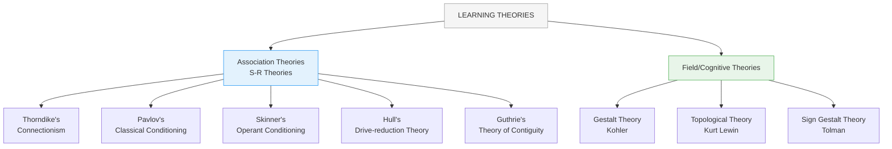

# 3:12 Learning Theories

!!! abstract "Section Overview"
    This section introduces **learning theories**, explaining the six basic questions they attempt to answer and the **two major systems** - Association (S-R) Theories and Field (Cognitive) Theories - along with their key differences.

---

## 📋 Why Study Learning Theories?

!!! note "Context"
    The **versatility of man's adjustment** to diverse environments and the commanding heights achieved by him in **arts, science, philosophy** as well as his rich **cultural accomplishments** are all founded on his **unparalleled learning capacity**.

!!! quote "Definition"
    **Learning** is said to occur whenever one adopts **new behaviour patterns** or **attitude**.

---

## 🧠 What is a Learning Theory?

Psychologists have observed different learning situations and studied the nature of the learning process. As learning is a **complex phenomenon**, different people view it differently, giving importance to one or the other aspect of the learning process.

!!! quote "Definition"
    Each set of views attempting to explain the **learning process** is called a **theory of learning**.

---

## ❓ Six Basic Questions Every Learning Theory Answers

Every theory of learning attempts to explain the following **six basic questions**:

| # | Question | Focus |
|---|----------|-------|
| **i** | What is learning? / How does one learn? | Process |
| **ii** | What are the reasons for individual differences in learning? | Variability |
| **iii** | How does one forget? | Memory |
| **iv** | What is the role of practice and understanding in learning? | Method |
| **v** | How is learning in one area transferred to other areas? | Transfer |
| **vi** | What are the ways of motivating pupils to learn? | Motivation |

---

## 3:12:1 Two Major Systems of Learning Theories

Learning theories may be classified under **two major systems**:

1. **Association Theories** (S-R Theories)
2. **Field or Cognitive Theories**

---

## 📊 Summary of Theories

### Association Theories

| Theory | Proponent |
|--------|-----------|
| **Connectionism** | Thorndike |
| **Classical Conditioning** | Pavlov |
| **Operant Conditioning** | Skinner |
| **Drive-reduction Theory** | Hull |
| **Theory of Contiguity** | Guthrie |

### Field/Cognitive Theories

| Theory | Proponent |
|--------|-----------|
| **Gestalt Theory** | Kohler |
| **Topological Theory** | Kurt Lewin |
| **Sign Gestalt Theory** | Tolman |

---

## 3:12:2 Differences Between Association and Field Theories

### Association Theories (S-R Theories)

!!! quote "Definition"
    **Association theories** include various learning theories which try to explain learning as **a matter of connections established between stimuli and responses**.

### Field/Cognitive Theories

!!! quote "Definition"
    **Cognitive or field theories** of learning are critical of mechanical associationism. They place greater emphasis on:
    - **Internal mental processes** like perception, attitudes
    - **Cognitive structures** acquired from past experience as the basis of learning

---

## 🔑 The Gestalt Point of View

!!! note "Key Concept"
    Field theories arose out of the **Gestalt point of view** according to which human experiences have certain **"field properties"** that make a **'total' or 'whole' phenomenon greater than the sum of its individual parts**.

### Key Principles

| Concept | Description |
|---------|-------------|
| **Field** | The total psychological world in which an individual operates at a given moment |
| **Perception** | Individual reacts not to the environment as it is but **as he perceives it** |
| **Relations** | Relations among elements is **more important than the elements themselves** |
| **Cognitive patterns** | Learning involves formulating cognitive patterns corresponding to relations among stimuli |
| **Reorganisation** | Learning reorganises experiences to make them **systematic and meaningful patterns** |
| **Clarification** | Learning proceeds from a complex unit partially understood to **gradual clarification** |

!!! success "Field Theories Emphasize"
    **Organisation**, **Relationship**, **Meaningfulness**, **Insight**, and **Cognitive clarity**

---

## 📊 Major Differences Table

| Aspect | Association Theories | Field Theories |
|--------|---------------------|----------------|
| **1. Learning is** | Formation and strengthening of **S-R connections** aided by reinforcements | **Organisation of experiences** into a cognitive structure; perception of relationship between whole and parts |
| **2. Direction** | From **simple to complex**; learning is additive and integrative | Begins with perception of **whole imperfectly**; progressive clarification of whole and parts |
| **3. Interpretation** | **Mechanistic** interpretation of human behaviour | **Dynamic, cognitive, and purposeful** interpretation |
| **4. Purpose** | Do not attribute any **motive or purpose** for human behaviour | All human behaviour including learning are **motivated and goal-directed** |
| **5. Emphasis** | **Drill and practice** under condition of reinforcement | Development of **'insight'** |
| **6. Transfer** | Due to **common or identical elements** present in both tasks | Due to **transposability of relationships** between two tasks |

---

## 🔄 The Learning Continuum

!!! note "Key Points 📌"
    Learning tasks involve a **mixture of associative and cognitive learning**:
    - **Simple conditioned responses** (most automatic) depend more on **associative process**
    - **Complex and abstract human learning** depends more on **cognitive process**

---

## 🧠 Memory Mnemonic

!!! tip "Exam Tip 📝"
    **For Association Theories** - Remember **"TPSHG"**:
    
    - **T**horndike (Connectionism)
    - **P**avlov (Classical Conditioning)
    - **S**kinner (Operant Conditioning)
    - **H**ull (Drive-reduction)
    - **G**uthrie (Contiguity)
    
    **For Field Theories** - Remember **"KLT"**:
    
    - **K**ohler (Gestalt)
    - **L**ewin (Topological)
    - **T**olman (Sign Gestalt)

---

## 📝 Quick Comparison

| Feature | Association | Field |
|---------|-------------|-------|
| View of learning | S-R bonds | Cognitive structure |
| Approach | Mechanistic | Purposeful |
| Method | Drill, practice | Insight |
| Transfer | Identical elements | Transposable relations |

---

## ❓ Review Questions

1. What do you mean by a theory of learning? **(C)** [Ans. 3:12, except first paragraph]
2. Discuss the differences between the Association and Cognitive theories of learning. **(A)** [Ans. 3:12:2]

---

> **Bridge →** Let's now explore **Thorndike's Connectionism** - the first major association theory of learning...
