# 3:13 Thorndike's Connectionism

!!! abstract "Section Overview"
    This section covers **Thorndike's Connectionism** (also known as **Trial and Error Learning**), including the puzzle box experiment, characteristics of trial and error learning, the three primary laws of learning, and the theory's limitations.

---

## 📋 What is Thorndike's Connectionism?

!!! quote "Definition"
    **Thorndike's Connectionism**, also referred to as **'trial and error learning'**, is based on experiments conducted by him. Thorndike spoke of learning as a **trial and error process** developing **neural connections between stimuli and responses**.

### The Process

!!! note "Key Points 📌"
    - Learning is a matter of **accidental hitting** of correct response
    - Correct response is **'stamped in'** as a result of **satisfaction**
    - A **trial** is defined by the length of time (or number of errors committed) in a single reaching of the goal
    - According to Thorndike, the **law of effect** is the basic principle of learning

---

## 📊 Who Uses Trial and Error Learning?

| Type | Usage |
|------|-------|
| **Animals** | Mostly use trial and error learning |
| **Human beings** | Resort to it for complex, abstract tasks and motor skills |

---

## 3:13:1 Characteristics of Trial and Error Learning

There are **four characteristic features** of trial and error learning:

| # | Characteristic | Description |
|---|----------------|-------------|
| **i** | **Motive present** | Some sort of motive arouses and sustains the activity (need, problem, or goal) |
| **ii** | **Varied responses** | Organism makes several different kinds of responses to the situation |
| **iii** | **Progressive elimination** | Irrelevant, unsuccessful forms of activity are progressively eliminated |
| **iv** | **Progressive integration** | Final establishment of the response by which the goal is achieved |

---

## 3:13:2 Thorndike's Puzzle Box Experiment

### Setup

| Element | Description |
|---------|-------------|
| **Subject** | A hungry cat |
| **Location** | Inside the puzzle box |
| **Goal** | A piece of fish in a dish kept outside the box |
| **Mechanism** | Box could be opened by correctly manipulating a latch |

### Observations

```mermaid
flowchart TB
    subgraph INITIAL["🐱 Initial Trials"]
        I1[Cat sees fish]
        I2[Becomes restless]
        I3[Makes frantic efforts:<br/>biting, clawing, dashing walls]
        I4[Latch moves accidentally]
        I5[Door opens]
    end
    
    subgraph SUBSEQUENT["📉 Subsequent Trials"]
        S1[Incorrect responses<br/>gradually stamped out]
        S2[Less time taken]
        S3[Wasteful movements<br/>eliminated]
    end
    
    subgraph FINAL["✅ After Learning"]
        F1[Cat operates latch<br/>with considerable ease]
        F2[First attempt success]
        F3[Maximum efficiency reached]
    end
    
    INITIAL --> SUBSEQUENT --> FINAL
    
    style INITIAL fill:#ffebee,stroke:#f44336
    style SUBSEQUENT fill:#fff3e0,stroke:#ff9800
    style FINAL fill:#e8f5e9,stroke:#4caf50
```

### Conclusions from Experiment

!!! success "Key Finding"
    Learning is simply **selecting and connecting** the correct response with the given stimulus by a process of:
    - **Progressive reduction** of incorrect responses
    - **Stamping in** the correct response through trial-and-error

!!! note "Additional Finding"
    If trials continued even after learning, efficiency of performance **increased** (time taken decreased) and reached the **maximum level**, after which there was not much gain in efficiency.

---

## 3:13:3 Thorndike's Laws of Learning

Based on the findings from his puzzle box experiment, Thorndike enunciated **three primary laws of learning**:

### 1. Law of Readiness

!!! quote "Law Statement"
    "When any conducting unit is **ready to conduct**, to allow it to do so is **satisfying**, not to allow it to do so is **annoying**. When any conducting unit is **not ready to conduct**, for it to conduct is **annoying**."

!!! note "Important Note"
    Thorndike's law of readiness is a law of **preparatory adjustment** and not a law about growth.

#### Educational Implications

| # | Implication |
|---|-------------|
| **a** | Teacher should see that child is **motivated to learn** before teaching begins |
| **b** | **Motivation is the royal road to learning** |
| **c** | Preparatory exercises that hasten the state of readiness can be given |
| **d** | Teacher should introduce a lesson by relating it to the **background experience** of the child |
| **e** | **Interest inventories** and **aptitude tests** can be administered for specialised courses |

---

### 2. Law of Exercise

!!! quote "Law Statement"
    "When a modifiable connection is made between a stimulus and response, other things being equal, that connection's strength **increases if it is repeated** a number of times."

This is also called the **'law of frequency'** - akin to saying **"practice makes perfect"**.

#### Sub-Laws

| Law | Description |
|-----|-------------|
| **Law of Frequency** | Repetition strengthens the connection |
| **Law of Recency** | An act recently performed has advantage of being repeated (fresh in experience) |

!!! note "Grouping"
    The laws of **frequency** and **recency** are grouped together under the name of **law of exercise**.

#### Educational Implications

| # | Implication |
|---|-------------|
| **a** | After learning anything, adequate **practice or drill** should be undertaken |
| **b** | **Periodical review** of learned material is necessary |
| **c** | Mere drill is not enough; **continuous feedback** is also necessary |
| **d** | **Bad habits** can be eliminated through disuse, leading to atrophy or forgetting |

---

### 3. Law of Effect

!!! quote "Law Statement"
    "When a modifiable connection is made between a stimulus and a response and is followed by a **satisfying state of affairs**, its strength **increases**; when followed by a **dissatisfying state of affairs**, its strength **decreases**."

#### Educational Implications

| # | Implication |
|---|-------------|
| **a** | Rewards further learning behaviour; **judicious use of praise and encouragement** promotes better learning |
| **b** | **"Success leads to further success"** |
| **c** | School activities can be arranged so that all learners have some **degree of success** |
| **d** | All assignments should be **graded** so that everyone gets some success initially |

---

## 📊 Summary of Three Laws

| Law | Key Principle | Key Phrase |
|-----|---------------|------------|
| **Law of Readiness** | Preparatory adjustment | Motivation before learning |
| **Law of Exercise** | Repetition strengthens | Practice makes perfect |
| **Law of Effect** | Satisfaction strengthens | Rewards promote learning |

---

## 3:13:4 Limitations of Thorndike's Theory

!!! warning "Limitations"
    
    | # | Limitation |
    |---|------------|
    | **1** | Theory is true only for **motor learning** and complex tasks in unfamiliar situations. All human learning does not take place at physical level alone. |
    | **2** | Reduces **intelligence** to capacity to form S-R bonds; learning becomes mechanical. Cognitive skills like **thinking, reasoning, comprehending, imagining** have no relevance. This may be true for animals but not humans. |
    | **3** | Complex high-order learning (e.g., algebraic problems) cannot be solved by repetition without **proper understanding**. |

---

## 🧠 Memory Mnemonic

!!! tip "Exam Tip 📝"
    **For Four Characteristics** - Remember **"MVPE"**:
    
    - **M**otive present
    - **V**aried responses
    - **P**rogressive elimination
    - **E**stablishment of correct response
    
    **For Three Laws** - Remember **"REE"**:
    
    - **R**eadiness
    - **E**xercise
    - **E**ffect

---

## 📝 Quick Revision Table

| Concept | Key Point |
|---------|-----------|
| **Connectionism** | Trial and error learning |
| **Process** | Select correct response, stamp in through practice |
| **Law of Readiness** | Motivation before learning |
| **Law of Exercise** | Practice strengthens connections |
| **Law of Effect** | Satisfaction increases strength |
| **Limitations** | Works for motor learning; ignores cognitive processes |

---

## ❓ Review Questions

1. Mention the characteristics of Trial and Error Learning. **(C)** [Ans. 3:13:1]
2. Discuss Thorndike's theory of trial and error learning bringing out its educational implications. **(A)** [Ans. 3:13 + 3:13:2 + 3:13:3]
3. What are the limitations of Thorndike's theory of learning? **(C)** [Ans. 3:13:4]
4. Explain Thorndike's laws of learning with their educational implications. **(B)** [Ans. 3:13:3]

---

> **Bridge →** Now let's explore **Classical Conditioning** by Pavlov - another foundational association theory...
