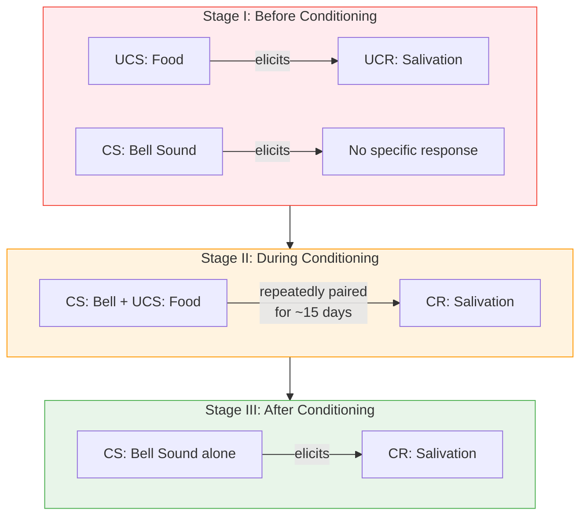
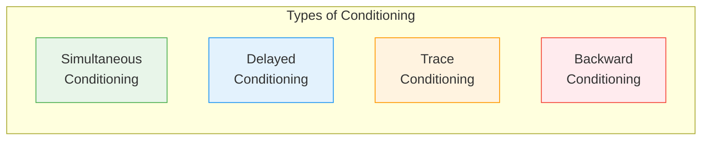

# 3:14 Classical Conditioning

!!! abstract "Section Overview"
    This section covers **Pavlov's Classical Conditioning** (also called stimulus substitution), including the famous dog experiment, the process of conditioning, laws of conditioning, educational implications, and limitations.

---

## 📋 Discovery of Classical Conditioning

!!! info "Historical Context"
    In **1904**, Russian physiologist **Ivan Pavlov**, during his experimental work on dog's digestive process, **accidentally noticed** the secretion of saliva in the dog on:
    - The **sight of food**
    - **Hearing the footsteps** of the caretaker

---

## 📚 Definition of Conditioning

!!! quote "Definition"
    **Conditioning** can be defined as "a process in which a **neutral stimulus** which is not associated with any specific natural response, on pairing with a **natural stimulus**, acquires all the characteristics of natural stimulus."

---

## 🔑 Key Terms in Classical Conditioning

| Term | Abbreviation | Description | Example |
|------|--------------|-------------|---------|
| **Natural/Unconditioned Stimulus** | UCS | Stimulus that naturally elicits a response | Food |
| **Natural/Unconditioned Response** | UCR | Natural, unlearned response | Salivation to food |
| **Neutral Stimulus** | - | Stimulus not associated with specific response | Bell sound |
| **Conditioned Stimulus** | CS | Neutral stimulus that acquired capability to elicit response | Bell sound (after conditioning) |
| **Conditioned Response** | CR | Response to conditioned stimulus | Salivation to bell |

---

## 3:14:1 Pavlov's Experiment

### The Setup

| Element | Description |
|---------|-------------|
| **Subject** | Dog |
| **UCS** | Food |
| **UCR** | Salivation |
| **Neutral Stimulus** | Bell sound |
| **Goal** | Condition dog to salivate at bell sound |

### Three Stages of the Experiment

### Symbolic Representation

| Stage | Process |
|-------|---------|
| **Stage I** (Before conditioning) | UCS (Food) → UCR (Salivation); CS (Bell) → No specific response |
| **Stage II** (Process of conditioning) | CS + UCS → CR (Salivation) |
| **Stage III** (After conditioning) | CS (bell sound) → CR (Salivation) |

---

## 🔄 Classical Conditioning is Also Called

!!! note "Alternative Name"
    Classical conditioning is also called **'stimulus substitution'** because we substitute a neutral stimulus through the process of **'contiguity'** (occurrence of two events in quick succession).

---

## 📖 Classic Examples

### Thenaliraman's Cat

!!! example "Example"
    A cat on **burning its mouth by lipping hot milk**, started **running away from white liquids** after that incident.

### Trained Pigeons

!!! example "Example"
    People bring down **wild pigeons** sitting on high towers by employing **domesticated and trained pigeons**.

---

## 🔍 Extinction

!!! quote "Definition"
    **Extinction**: If CS (sound of the bell) is **not followed by UCS** (food) for a few days (no reinforcement), a stage comes when the dog **stops secreting saliva**. This process is known as **extinction**.

---

## 🎯 Applications of Conditioning

| Application | Examples |
|-------------|----------|
| **Animal learning** | Most animal learnings can be explained through conditioning |
| **Childhood learning** | Simple patterns of behaviour in early childhood |
| **Word learning** | Learning of words and their associated meanings |
| **Emotional responses** | New emotional responses |

!!! note "Key Points 📌"
    Conditioning appears to be the **simplest type of learning** and the **basis for further and more complex types** of learning.

---

## 3:14:2 Educational Implications

| # | Application |
|---|-------------|
| **1** | **Language learning** by associating words with pictures or meanings |
| **2** | Developing **favourable attitudes** towards learning, teachers, subjects, and school |
| **3** | Developing **good habits** in children (cleanliness, respect for elders, punctuality) |
| **4** | **Breaking bad habits** and elimination of conditioned fear through **deconditioning** |

---

## 3:14:3 Limitations of Conditioning Theory

!!! warning "Limitations"
    - **Complex areas of learning** involving generalisation, abstraction, reasoning, understanding, and problem-solving **cannot be explained** by conditioning
    - It can describe only learnings related to **emotional shaping** and **habit formation**

---

## 3:14:4 Laws of Conditioning

From his experiments, Pavlov derived **five laws**:

### 1. Law of Causation

!!! quote "Law Statement"
    A conditioned response is established by a series of **contiguous pairings** of CS and UCS. When UCS and CS are presented in **temporal contiguity** (associated in time), a conditioned response gets established.

#### Temporal Relationships in Conditioning

!!! success "Best Conditioning"
    Best conditioning occurs when CS and UCS are presented **simultaneously** or CS is the **signal heralding** the occurrence of UCS.

---

### 2. Law of Experimental Extinction

!!! quote "Law Statement"
    If the CR is elicited **without reinforcement** by the presentation of UCS, then the CR gets **weakened and finally disappears**.

!!! info "Spontaneous Recovery"
    The disappearance of CR is **not permanent**. When the dog is brought from rest, it **once again salivates** on hearing the bell. This immediate recovery is called **'Spontaneous recovery'**.

---

### 3. Law of Generalisation

!!! quote "Law Statement"
    Once the CR is established, it may be elicited by **any stimulus similar** to the original CS.

!!! example "Examples"
    - If conditioning was established using **bell**, CR will occur even for a **buzzer**
    - If **fear response** is obtained for a policeman, it may be obtained for **anybody in kaki uniform**

---

### 4. Law of Discrimination (Selective Conditioning)

!!! quote "Law Statement"
    A selective CR can be established by **selective reinforcement**. If one stimulus is reinforced and a similar stimulus is not reinforced, the CR to the unreinforced stimulus gets **weakened and becomes inactive**.

---

### 5. Law of Higher Order Conditioning

!!! quote "Law Statement"
    A CS can become a **reinforcing stimulus in its own right** and be used to condition another neutral stimulus. This is called **second order** or **higher order conditioning**.

!!! warning "Note"
    Second order conditioning is **weak** as compared to first order or primary conditioning.

---

## 📊 Summary of Five Laws

| # | Law | Key Principle |
|---|-----|---------------|
| **1** | Law of Causation | Temporal contiguity |
| **2** | Law of Extinction | No reinforcement = CR weakens |
| **3** | Law of Generalisation | Similar stimuli evoke CR |
| **4** | Law of Discrimination | Selective reinforcement |
| **5** | Law of Higher Order | CS becomes reinforcer |

---

## 🧠 Memory Mnemonic

!!! tip "Exam Tip 📝"
    **For Five Laws** - Remember **"CEGDH"** (Conditioning's Essential General Direction Hierarchy):
    
    - **C**ausation (contiguity)
    - **E**xtinction (no reinforcement)
    - **G**eneralisation (similar stimuli)
    - **D**iscrimination (selective)
    - **H**igher order (second order)

---

## 📝 Quick Revision Table

| Concept | Key Point |
|---------|-----------|
| **Classical Conditioning** | Stimulus substitution through contiguity |
| **UCS** | Natural stimulus (food) |
| **UCR** | Natural response (salivation) |
| **CS** | Conditioned stimulus (bell) |
| **CR** | Conditioned response (salivation to bell) |
| **Extinction** | No reinforcement = response disappears |
| **Generalisation** | Similar stimuli evoke same response |

---

## ❓ Review Questions

1. Explain the concept of conditioning as illustrated by Pavlov and bring out its educational significance. **(A)** [Ans. 3:14 + 3:14:1 + 3:14:2]
2. What are the limitations of conditioning theory of learning? **(C)** [Ans. 3:14:3]
3. State and explain the laws of conditioning. **(B)** [Ans. 3:14:4]

---

> **Bridge →** Let's now understand the concept of **Reinforcement** which is central to understanding both classical and operant conditioning...
