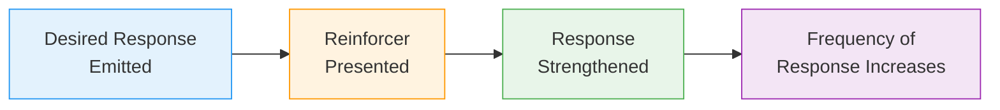

# 3:15 Concept of 'Reinforcement'

!!! abstract "Section Overview"
    This section explains the concept of **reinforcement** - how it strengthens the probability of a desired response by presenting a reinforcer, and how it is fundamental to conditioning theories.

---

## 📋 What is a Reinforcer?

!!! quote "Definition"
    Any stimulus is a **reinforcer** if it **increases the probability of occurrence** of a particular desired response.

---

## 📖 Example: Pavlov's Experiment

!!! example "Example"
    In Pavlov's experiment:
    - Dog heard the bell sound and started salivating
    - **Food was presented immediately** after
    - Food was the **reinforcer** to increase the occurrence of the conditioned response (salivating on hearing the bell sound)

---

## 📚 Definition of Reinforcement

!!! quote "Definition"
    **Reinforcement** could be defined as the phenomenon in which a **desired response when emitted is strengthened** by presenting a reinforcer and thereby **increasing the frequency of occurrence** of that particular response.

---

## 🔄 The Reinforcement Process

---

## 📊 Key Points About Reinforcement

| Aspect | Description |
|--------|-------------|
| **Purpose** | Strengthen desired response |
| **Mechanism** | Present reinforcer after desired response |
| **Effect** | Increase frequency of response occurrence |
| **Role** | Central to conditioning theories |

---

## 🧠 Memory Mnemonic

!!! tip "Exam Tip 📝"
    Remember **"DSIF"** for Reinforcement:
    
    - **D**esired response emitted
    - **S**trengthen by reinforcer
    - **I**ncrease frequency
    - **F**uture occurrence more likely

---

## 📝 Quick Revision

| Term | Meaning |
|------|---------|
| **Reinforcer** | Any stimulus that increases probability of response |
| **Reinforcement** | Process of strengthening response through reinforcer |
| **Effect** | Increased frequency of desired response |

---

## ❓ Review Questions

1. Define the term 'Reinforcement'. **(C)** [Ans. 3:15]

---

> **Bridge →** Now let's distinguish between **Positive and Negative Reinforcers** and understand how they differ from punishment...
