# 3:16 Positive and Negative Reinforcers

!!! abstract "Section Overview"
    This section differentiates between **positive reinforcers** (stimuli added to strengthen response) and **negative reinforcers** (aversive stimuli removed to strengthen response), and explains how they differ from **punishment**.

---

## 📋 Types of Reinforcers

---

## 📊 Positive Reinforcer

!!! quote "Definition"
    A **positive reinforcer** is any stimulus which, when **applied** following an operant response, **strengthens the probability of occurrence** of that response.

### Examples of Positive Reinforcers

| Type | Examples |
|------|----------|
| **Physical** | Food, water |
| **Social** | Prize, praise |
| **Material** | Money, toys |
| **Recognition** | Social recognition, certificates |

!!! info "Training"
    **Reward-training procedures** use positive reinforcers.

---

## 📊 Negative Reinforcer

!!! quote "Definition"
    A **negative reinforcer** is any stimulus which, when **removed** following an operant response, **strengthens the probability of occurrence** of that response.

### Examples of Negative Reinforcers

| Type | Examples |
|------|----------|
| **Auditory** | Loud noise |
| **Visual** | Bright light |
| **Temperature** | Extreme heat or cold |
| **Physical** | Electric shock |

!!! info "Training"
    **Escape or avoidance training** uses negative reinforcers.

---

## ⚠️ Punishment vs Negative Reinforcement

!!! warning "Important Distinction"
    **Punishment is NOT a negative reinforcer!**

### The Difference

| Aspect | Negative Reinforcement | Punishment |
|--------|------------------------|------------|
| **Action** | REMOVAL of aversive stimulus | PRESENTATION of aversive stimulus |
| **Purpose** | INCREASE probability of response | DECREASE probability of response |
| **Effect** | Strengthens desired response | Weakens undesired response |

```mermaid
flowchart TB
    subgraph NEG["✅ Negative Reinforcement"]
        N1[Aversive stimulus<br/>REMOVED]
        N2[↓]
        N3[Response probability<br/>INCREASES]
    end
    
    subgraph PUN["❌ Punishment"]
        P1[Aversive stimulus<br/>PRESENTED]
        P2[↓]
        P3[Response probability<br/>DECREASES]
    end
    
    style NEG fill:#e8f5e9,stroke:#4caf50
    style PUN fill:#ffebee,stroke:#f44336
```

---

## 📊 Comparison Table

| Feature | Positive Reinforcement | Negative Reinforcement | Punishment |
|---------|------------------------|------------------------|------------|
| **Stimulus** | Pleasant/Reward | Aversive (removed) | Aversive (presented) |
| **Action** | Applied/Added | Removed/Withdrawn | Applied/Added |
| **Effect on Response** | Increases | Increases | Decreases |
| **Example** | Give food for correct response | Remove shock when correct | Give shock for wrong response |

---

## 🔄 Visual Summary

```mermaid
flowchart LR
    subgraph REINFORCE["📈 REINFORCEMENT<br/>(Increase Response)"]
        direction TB
        POS[Positive:<br/>Add Pleasant Stimulus]
        NEG[Negative:<br/>Remove Aversive Stimulus]
    end
    
    subgraph PUNISH["📉 PUNISHMENT<br/>(Decrease Response)"]
        direction TB
        ADD[Add Aversive<br/>Stimulus]
    end
    
    style REINFORCE fill:#e8f5e9,stroke:#4caf50
    style PUNISH fill:#ffebee,stroke:#f44336
```

---

## 🧠 Memory Mnemonic

!!! tip "Exam Tip 📝"
    Remember the key difference:
    
    - **Positive Reinforcement**: **ADD** something **PLEASANT** → Response **INCREASES**
    - **Negative Reinforcement**: **REMOVE** something **UNPLEASANT** → Response **INCREASES**
    - **Punishment**: **ADD** something **UNPLEASANT** → Response **DECREASES**
    
    **Both reinforcements INCREASE response!** Punishment DECREASES.

---

## 📝 Quick Revision Table

| Type | Action | Effect | Example |
|------|--------|--------|---------|
| **Positive Reinforcer** | Apply pleasant stimulus | Increase response | Give treat for sitting |
| **Negative Reinforcer** | Remove aversive stimulus | Increase response | Stop loud noise when task done |
| **Punishment** | Apply aversive stimulus | Decrease response | Scold for bad behaviour |

---

## ❓ Review Questions

1. Differentiate positive and negative reinforcers. **(C)** [Ans. 3:16]

---

> **Bridge →** Let's now explore **Skinner's Operant Conditioning** which places reinforcement at the centre of the learning process...
