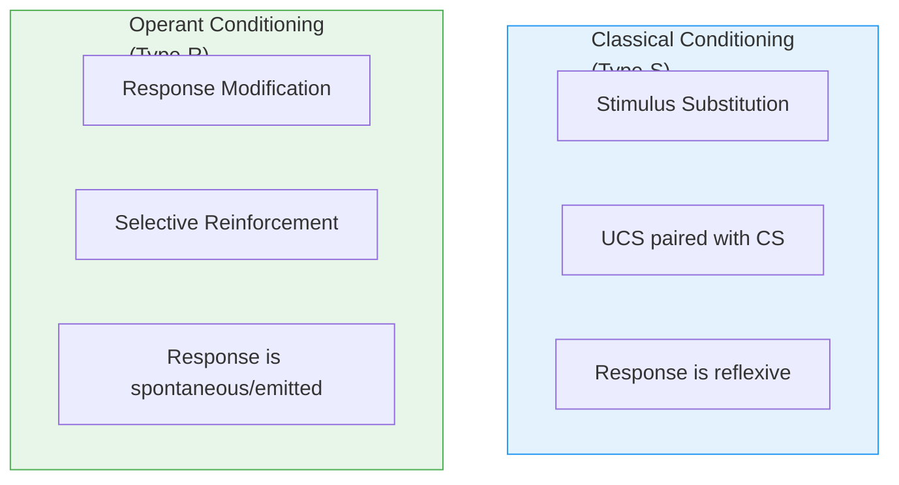
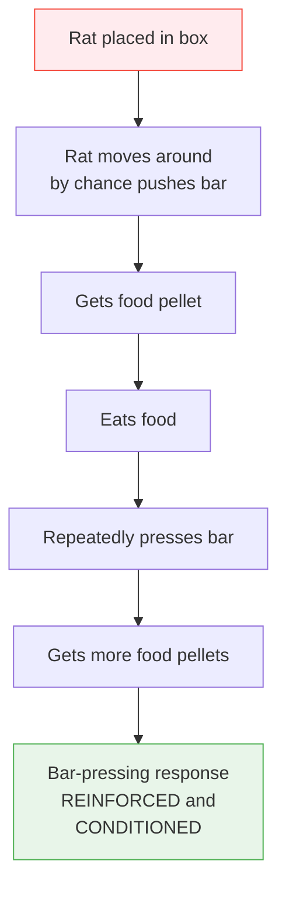

# 3:17 Skinner's Operant Conditioning

!!! abstract "Section Overview"
    This section covers **B.F. Skinner's Operant Conditioning** (also called Type-R or Instrumental Conditioning), explaining how organisms learn through the reinforcement of spontaneously emitted responses, including his famous experiments and educational implications.

---

## 📋 Skinner's Basic Principle

!!! quote "Key Insight"
    **B.F. Skinner** believed that no stimulus is capable of eliciting a unique response from an organism. It is the **organism which emits all kinds of responses spontaneously**.

### Spontaneously Emitted Responses

| Organism | Spontaneous Behaviour |
|----------|----------------------|
| Cat | Licks its face with tongue |
| Dog | Barks |
| Pigeon | Pecks at dots |

!!! note "Key Points 📌"
    Whenever an organism emits a **desired response**, it could be made to occur **frequently** by suitably rewarding it by presenting a **reinforcing stimulus**.

---

## 📚 Key Concept: Operant Conditioning

!!! quote "Definition"
    **Reinforcement of desired response** is the essence of operant conditioning, whereas in classical conditioning, **stimulus substitution** takes place.

### Why "Operant" Conditioning?

| Reason | Explanation |
|--------|-------------|
| **Operant** | The organism has to **operate on** (or deal with) its environment in a particular way to get the reward |
| **Instrumental** | The organism expresses a response or behaviour pattern and through that tries to **fetch the reward** |

---

## 🔄 Classical vs Operant Conditioning

!!! warning "Important Point"
    In operant conditioning, the **reinforcer must come AFTER** the desired response has been made and **not before it**.

---

## 3:17:1 Skinner's Experiments

### Experiment 1: Skinner's Box (Rat)

#### Setup

| Element | Description |
|---------|-------------|
| **Subject** | White hungry rat |
| **Apparatus** | Skinner's box (cage) |
| **Desired Response** | Pressing a lever |
| **Recording** | Movements electrically recorded |
| **Reinforcer** | Food pellet |

#### Process

---

### Experiment 2: Pigeon Pecking

#### Setup

| Element | Description |
|---------|-------------|
| **Subject** | Pigeon |
| **Desired Response** | Pecking a disk |
| **Reinforcer** | Food |
| **Operant** | Behaviour of pecking the disk |

#### Result

!!! success "Outcome"
    Food reinforced the behaviour of pecking the disk (called an **operant**).

---

## 📜 Law of Operant Conditioning

!!! quote "Law Statement"
    If the occurrence of an operant is followed by the **presentation of a reinforcing stimulus**, the **strength of operant is increased**.

### Extinction in Operant Conditioning

!!! note "Key Points 📌"
    - If the response (operant) is **not reinforced**, it results in **extinction** of the response
    - Extinction of a response means its becoming **less and less frequent**

---

## 3:17:2 Educational Implications of Skinner's Theory

Skinner's operant conditioning theory has found application in education in the following ways:

### 1. Individualisation of Instruction

| Application | Description |
|-------------|-------------|
| **Programmed Learning** | Self-paced learning with immediate feedback |
| **Teaching Machines** | Mechanical devices for individualised instruction |
| **Computer-Assisted Instruction** | Technology-based personalised learning |

### 2. Behaviour Modification Techniques

| Technique | Description |
|-----------|-------------|
| **Use of instructional objectives** | Clear behavioural goals |
| **Performance contracting** | Agreement for specific outcomes |
| **Learning for mastery** | Ensuring complete understanding |
| **Teacher Effectiveness Training (T.E.T.)** | Improving teacher skills |

---

## 📊 Summary: Key Features of Operant Conditioning

| Feature | Description |
|---------|-------------|
| **Developer** | B.F. Skinner |
| **Also called** | Type-R conditioning, Instrumental conditioning |
| **Core principle** | Reinforcement of desired response |
| **Response type** | Emitted (spontaneous), not elicited |
| **Reinforcer timing** | After the response, not before |
| **Extinction** | Occurs when reinforcement is withdrawn |

---

## 🧠 Memory Mnemonic

!!! tip "Exam Tip 📝"
    Remember **"SORE"** for Operant Conditioning:
    
    - **S**pontaneous response emitted
    - **O**perating on environment
    - **R**einforcement strengthens
    - **E**xtinction if no reinforcement
    
    **Educational Applications** - Remember **"PTCB"**:
    
    - **P**rogrammed learning
    - **T**eaching machines
    - **C**omputer-assisted instruction
    - **B**ehaviour modification

---

## 📝 Quick Revision Table

| Concept | Key Point |
|---------|-----------|
| **Operant** | Spontaneously emitted response |
| **Reinforcement** | Must come AFTER response |
| **Effect** | Strengthens operant |
| **Extinction** | No reinforcement = response weakens |
| **Applications** | Programmed learning, behaviour modification |

---

## ❓ Review Questions

1. Explain Skinner's theory of operant conditioning. **(B)** [Ans. 3:17 + 3:17:1]
2. Mention the contribution of Skinner to educational theory and practice. **(C)** [Ans. 3:17:2]

---

> **Bridge →** Let's now compare **Classical and Operant Conditioning** to understand their similarities and differences...
