# 3:18 Comparison Between Classical and Operant Conditioning

!!! abstract "Section Overview"
    This section provides a comprehensive comparison between **Classical Conditioning** (Pavlov) and **Operant Conditioning** (Skinner), highlighting their key differences across ten major aspects.

---

## 📊 Comprehensive Comparison Table

| # | Aspect | Classical Conditioning | Operant Conditioning |
|---|--------|------------------------|---------------------|
| **1** | **Developer** | Russian physiologist **Pavlov** | **B.F. Skinner** |
| **2** | **Also called** | **Type-S conditioning** (respondent) | **Type-R conditioning** (operant) |
| **3** | **Essence of learning** | **Stimulus substitution** | **Response modification** through selective reinforcement |
| **4** | **Response occurrence** | CR is **reflexively forced** by UCS | Response is more **voluntary** and **spontaneously emitted** |
| **5** | **Reinforcement** | Occurs **without regard** to subject's behaviour | Reward is **contingent upon** occurrence of desired response |
| **6** | **Basis** | **Law of contiguity** | **Law of effect** |
| **7** | **Nervous system** | Related and controlled by **autonomous nervous system** | Controlled by **central nervous system** |
| **8** | **Focus** | **Single S-R bondage** | A **chain of sequential responses** can be formed through **'shaping'** |
| **9** | **Initial strength** | Classically conditioned reflexes may have **zero strength initially** | Operant **cannot have zero strength** because it has to occur at least once before it can be reinforced |
| **10** | **UCR and CR** | UCR and CR are the **same** | UCR and CR are **different** |
| **11** | **Behaviour type** | **Respondent behaviour is internal** | **Operant behaviour is external** - it is the behaviour with which the organism operates on the environment |

---

## 🔄 Visual Comparison

```mermaid
flowchart TB
    subgraph CLASSICAL["📘 Classical Conditioning"]
        C1[Type-S]
        C2[Stimulus Substitution]
        C3[Response Reflexive]
        C4[Law of Contiguity]
        C5[Autonomous NS]
        C6[Single S-R Bond]
        C7[UCR = CR]
        C8[Internal Behaviour]
    end
    
    subgraph OPERANT["📗 Operant Conditioning"]
        O1[Type-R]
        O2[Response Modification]
        O3[Response Voluntary]
        O4[Law of Effect]
        O5[Central NS]
        O6[Chain through Shaping]
        O7[UCR ≠ CR]
        O8[External Behaviour]
    end
    
    style CLASSICAL fill:#e3f2fd,stroke:#2196f3
    style OPERANT fill:#e8f5e9,stroke:#4caf50
```

---

## 📖 Detailed Explanations

### Type-S vs Type-R

| Type | Meaning |
|------|---------|
| **Type-S** | Stimulus-based (respondent) - the response is determined by the stimulus |
| **Type-R** | Response-based (operant) - focus is on the response and its consequences |

### Stimulus Substitution vs Response Modification

| Classical | Operant |
|-----------|---------|
| A neutral stimulus **replaces** a natural stimulus | Desired response is **modified and strengthened** |
| Focus on stimulus | Focus on response |

### Law of Contiguity vs Law of Effect

| Law | Description |
|-----|-------------|
| **Contiguity** | Events occurring together in time become associated |
| **Effect** | Responses followed by satisfaction are strengthened |

### Response Nature

### Shaping in Operant Conditioning

!!! note "Key Points 📌"
    In operant conditioning, a **chain of sequential responses** can be formed through **'shaping'** - gradually reinforcing successive approximations of the desired behaviour.

---

## 📊 Quick Reference Table

| Feature | Classical | Operant |
|---------|-----------|---------|
| **Abbreviation** | Type-S | Type-R |
| **Core Process** | Stimulus substitution | Response modification |
| **Response** | Reflexive/Elicited | Voluntary/Emitted |
| **Reinforcement** | Before or with response | After response |
| **Basic Law** | Contiguity | Effect |
| **Neural Control** | Autonomic | Central |

---

## 🧠 Memory Mnemonic

!!! tip "Exam Tip 📝"
    Remember **"SREV-CAVE"** for Classical vs Operant:
    
    **Classical (S-R-E-V)**:
    - **S**timulus substitution
    - **R**eflexive response
    - **E**licited
    - **V**ia autonomous NS
    
    **Operant (C-A-V-E)**:
    - **C**onsequence-based
    - **A**ctive response
    - **V**oluntary/Emitted
    - **E**ffect law

---

## 📝 Summary

| Conditioning Type | One-Line Summary |
|-------------------|------------------|
| **Classical** | A neutral stimulus acquires the ability to elicit a reflexive response through pairing with UCS |
| **Operant** | A voluntary response is strengthened through reinforcement |

---

## ❓ Review Questions

1. Compare and contrast classical and operant conditioning. **(A)** [Ans. 3:14 + 3:17 + 3:18]

---

> **Bridge →** Let's now understand the difference between **Reinforcement and Feedback** to complete our understanding of conditioning...
