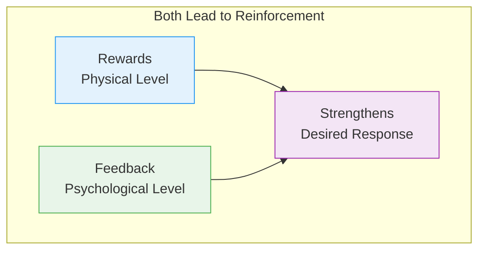
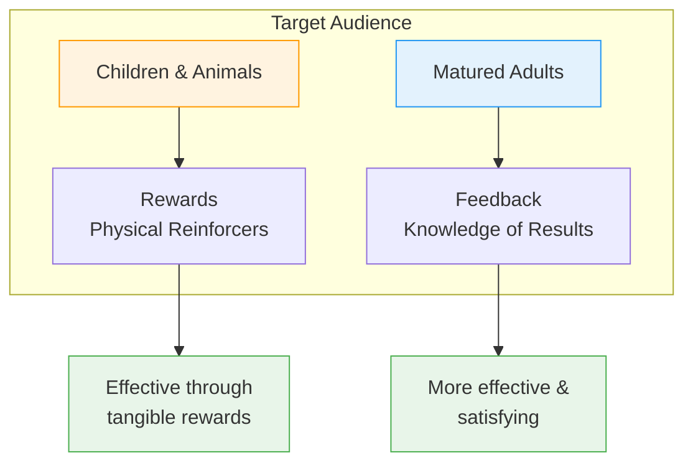

# 3:19 Differences Between 'Reinforcement' and 'Feedback'

!!! abstract "Section Overview"
    This section differentiates between **Reinforcement** and **Feedback** as means of strengthening desired responses, explaining that while both achieve similar outcomes, they operate at different levels (physical vs psychological).

---

## 📋 Definition: Reinforcement

!!! quote "Definition"
    **Reinforcement** refers to strengthening the probability of occurrence of a desired response either by:
    - **Presenting** the organism with a **positive reinforcer** after the operant response is exhibited, OR
    - **Withdrawal** of a **negative reinforcer**

### Examples of Positive Reinforcers

| Category | Examples |
|----------|----------|
| **Food** | Treats, snacks, pellets |
| **Objects** | Toys, prizes |
| **Monetary** | Money, coins |

---

## 📋 Definition: Feedback

!!! quote "Definition"
    **Feedback** refers to the **knowledge of results** of one's own actions.

!!! note "Key Finding"
    It has been demonstrated that in the case of **grown-up adults**, **knowledge of results** of one's own action **itself serves as a positive reinforcer** and enhances the level of performance.

---

## 🔄 Relationship Between Feedback and Reinforcement

!!! note "Key Points 📌"
    **Feedback** is one of the **means of achieving reinforcement** of desired responses.

---

## 📊 Key Differences

| Aspect | Reinforcement (Rewards) | Feedback |
|--------|------------------------|----------|
| **Level of Operation** | **Physical level** | **Psychological level** |
| **Nature** | Tangible rewards | Knowledge of results |
| **Examples** | Food, toys, money | Scores, grades, performance information |
| **Suitable for** | **Children and animals** | **Matured adults** |
| **Effectiveness** | Works universally | More effective and satisfying for adults |

---

## 👥 Suitability by Age Group

---

## 📊 Comparison Table

| Feature | Reinforcement by Rewards | Reinforcement by Feedback |
|---------|-------------------------|--------------------------|
| **Type** | Tangible | Intangible |
| **Level** | Physical | Psychological |
| **Form** | Objects, food, money | Information, results, scores |
| **Best for** | Children, animals | Adults |
| **Why effective** | Immediate gratification | Self-awareness and improvement |

---

## 🧠 Memory Mnemonic

!!! tip "Exam Tip 📝"
    Remember **"RPP-FPP"**:
    
    **Reinforcement**:
    - **R**ewards
    - **P**hysical level
    - **P**erfect for children/animals
    
    **Feedback**:
    - **F**acts about performance
    - **P**sychological level
    - **P**referred by adults

---

## 📝 Quick Revision Table

| Concept | Key Feature | Best For |
|---------|-------------|----------|
| **Reinforcement** | Physical rewards | Children, Animals |
| **Feedback** | Knowledge of results | Matured Adults |

---

## 🔑 Key Insight

!!! success "Important Conclusion"
    Though both **rewards** and **feedback** serve as means of reinforcement:
    - **Rewards** operate at the **physical level**
    - **Feedback** operates at the **psychological level**
    
    The choice depends on the **maturity level** of the learner.

---

## ❓ Review Questions

1. Differentiate 'reinforcement' from 'feedback'. **(C)** [Ans. 3:19]

---

> **Bridge →** Let's now move to a different approach to understanding learning - **Jean Piaget's Theory of Cognitive Development**...
