# 3:20 Jean Piaget's Theory of Cognitive Development

!!! abstract "Section Overview"
    This section covers **Jean Piaget's Theory of Cognitive Development**, explaining how cognitive development arises from the interaction between the individual and the world, passing through four sequential, invariant, and universal stages.

---

## 📋 Overview of Piaget's Theory

!!! quote "Key Principle"
    **Cognitive development** arises as a result of the **interaction between the individual and the world** and passes through a series of **sequential stages**.

### Key Concepts

| Concept | Description |
|---------|-------------|
| **Schemata** | Cognitive structures for processing information |
| **Transformations** | Structures undergo significant changes during development |
| **Stages** | Become qualitatively different at different stages |
| **Nature of stages** | **Sequential, invariant, and universal** |

---

## 📚 What are Schemas?

!!! quote "Piaget's View"
    "To **know an object** one must **act upon it** either physically or mentally."

!!! quote "Definition"
    The activities that people perform on objects are called **'Schemas'**.

### Development of Schemas

| Stage | Schema Type |
|-------|-------------|
| **Early development** | Mostly **physical actions** on objects of immediate environment |
| **Adolescence** | Physical actions become **mental operations** |

---

## 🔺 Four Stages of Cognitive Development

```mermaid
flowchart TB
    subgraph STAGES["🧠 PIAGET'S FOUR STAGES"]
        S1["1️⃣ SENSORY-MOTOR STAGE<br/>0-2 years"]
        S2["2️⃣ PRE-OPERATIONAL STAGE<br/>2-7 years"]
        S3["3️⃣ CONCRETE OPERATIONAL STAGE<br/>7-11 years"]
        S4["4️⃣ FORMAL OPERATIONAL STAGE<br/>11+ years"]
    end
    
    S1 --> S2 --> S3 --> S4
    
    style S1 fill:#ffebee,stroke:#f44336
    style S2 fill:#fff3e0,stroke:#ff9800
    style S3 fill:#e3f2fd,stroke:#2196f3
    style S4 fill:#e8f5e9,stroke:#4caf50
```

---

## 3:20:1 Sensory-Motor Stage (0-2 years)

### Overview

!!! note "Key Features"
    - Based on **immediate experience** through the **senses**
    - Major intellectual activity is **sensory interaction** with environment
    - Activities are **physical** and **without language** to label experiences

### Characteristics

| # | Characteristic | Description |
|---|----------------|-------------|
| **i** | Sensory-motor-perceptual skills | Development of basic skills |
| **ii** | Motor coordination | Learning to coordinate movements |
| **iii** | Object permanence | Learns objects exist even when out of sight (by end of 2nd year) |
| **iv** | Rudimentary memory | Basic memory development |
| **v** | Reflex to intentional | Progression from reflex to intentional behaviour |
| **vi** | Curiosity | Trial and error exploration of surroundings |
| **vii** | Self-differentiation | Can differentiate itself from objects (basis of self-concept) |

### Example: Object Permanence

!!! example "Example"
    - **6-7 month old**: If a toy is covered with cloth, baby stops searching (out of sight = out of mind)
    - **18 month old**: Continues searching for hidden toy (knows object exists)

---

## 3:20:2 Pre-Operational Stage (2-7 years)

### Key Characteristics

| # | Characteristic | Description |
|---|----------------|-------------|
| **i** | **Ego-centrism** | Uses words with unique meaning; cannot understand others' point of view |
| **ii** | **Animism** | Treats inanimate objects as living (bathing, dressing dolls) |
| **iii** | **Realism** | Dreams are considered real; imaginary friends |
| **iv** | **Centering** | Can concentrate on only one aspect at a time |
| **v** | **No conservation** | Cannot understand objects are conserved when shapes change |
| **vi** | **Irreversibility** | Cannot reverse mental operations |
| **vii** | **Omnipotent parents** | Consider parents omnipresent and omnipotent |
| **viii** | **Cannot follow rules** | Inability to play games following rules |

### Conservation Example

!!! example "Water Conservation Test"
    - Child accepts jars A and B contain equal water
    - Water from B transferred to wide jar C
    - Child says A has MORE water than C
    - Child focuses only on HEIGHT (centering), not width

---

## 3:20:3 Concrete Operational Stage (7-11 years)

### Key Achievements

| Achievement | Description |
|-------------|-------------|
| **Conservation** | Masters various conservation concepts |
| **Logical manipulations** | Can perform logical operations |
| **Classification** | Can classify objects into groups |
| **Seriation** | Can organise objects into ordered series (by size, etc.) |
| **Mental representation** | Can form mental representation of a series of acts |

### Limitations

!!! warning "Limitation"
    Operations are at **concrete level** only - can mentally represent only objects **perceivable in the real world**. Cannot think beyond self-experiences.

### Other Hallmarks

| # | Characteristic | Description |
|---|----------------|-------------|
| **a** | Transversivity | If A=2B and A=2C, understands B=C |
| **b** | Decentering | Can think of more than one quality at a time |
| **c** | Rule-following | Can play games according to rules |
| **d** | Magnitude-based judgment | Evaluates crime by magnitude, not motive |
| **e** | Egocentric thinking | Believes only own point of view is possible |
| **f** | Rigid thinking | Does not understand relativistic ideas; believes morality is same everywhere |

---

## 3:20:4 Formal Operational Stage (11+ years)

### Key Achievements

| Achievement | Description |
|-------------|-------------|
| **Abstract thinking** | Thought becomes flexible and abstract |
| **Systematic experiments** | Can carry out systematic experiments and keep records |
| **Hypothetical reasoning** | Can consider hypothetical objects and events |
| **Abstract ideas** | Can understand abstract ideas and principles |
| **Critical evaluation** | Theorising and critical evaluation |
| **Possible vs Real** | "Pitting the possible against the real" |

### Chemical Problem Example

!!! example "Chemical Problem Solving"
    Given four beakers (A, B, C, D) with colourless liquids and chemical 'g':
    
    | Age Group | Behaviour |
    |-----------|-----------|
    | Below 2 years | Ignore problem, play with toys |
    | Pre-operational | Try combinations but don't track systematically |
    | Concrete operational | Try some combinations, get confused, lose interest |
    | **Formal operational** | **Systematic approach**: list all possibilities, test methodically, keep records, find solution |

### Additional Characteristics

| # | Characteristic | Description |
|---|----------------|-------------|
| **i** | Motive-based evaluation | Evaluates acts in terms of underlying motives |
| **ii** | Rules as agreements | Understands rules are developed by mutual agreement and can be changed |
| **iii** | Multiple perspectives | Believes many points of view exist on any problem |
| **iv** | Relativism | Understands nothing is absolute; searches for better alternatives |

---

## 📊 Stage Summary Table

| Stage | Age | Key Feature | Thinking Type |
|-------|-----|-------------|---------------|
| **Sensory-Motor** | 0-2 | Practical intelligence | Physical actions |
| **Pre-Operational** | 2-7 | Symbolic but ego-centric | Intuitive |
| **Concrete Operational** | 7-11 | Logical but concrete | Concrete logic |
| **Formal Operational** | 11+ | Abstract and systematic | Abstract logic |

---

## 🧠 Memory Mnemonic

!!! tip "Exam Tip 📝"
    Remember **"SPICE OF"** for Piaget's stages and ages:
    
    - **S**ensory-motor: **0-2** years
    - **P**re-operational: **2-7** years
    - **I**n-between (Concrete): **7-11** years
    - **C**oncrete → Formal at **11**
    - **E**nd: Formal = **11+** years
    
    **Pre-operational features** - Remember **"EARCIO"**:
    - **E**go-centrism
    - **A**nimism
    - **R**ealism
    - **C**entering
    - **I**rreversibility
    - **O**mnipotent parents

---

## ❓ Review Questions

1. Discuss briefly Jean Piaget's Theory of Cognitive development and bring out all the educational implications. **(A)** [Ans. 3:20 + 3:20:1 + 3:20:2 + 3:20:3 + 3:20:4 + 3:21]

---

> **Bridge →** Let's now explore the **Educational Implications of Piaget's Theory** and how teachers can apply these insights...
