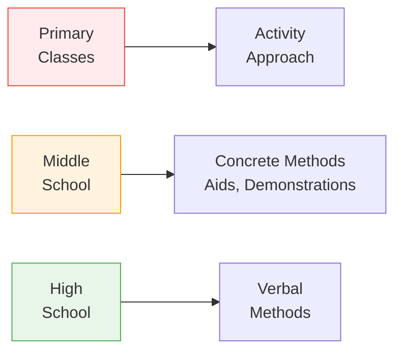

# 3:21 Educational Implications of Piaget's Theory

!!! abstract "Section Overview"
    This section presents the **educational implications** of Piaget's Theory of Cognitive Development, providing practical guidelines for teachers on how to apply developmental psychology in the classroom.

---

## 📋 Key Educational Implications

### 1. Experiential Curriculum

!!! quote "Key Insight"
    "**True learning**" as discriminated from "**verbal learning**" involves the acquisition of **new structures of mental operations** that permit the child to assimilate new experiments.

!!! success "Implication"
    **Experiential curriculum is advocated** - learning through direct experience rather than just verbal instruction.

---

### 2. Discovery Approach

!!! note "Key Points 📌"
    Emphasis on **discovery approach** in learning - allowing students to discover knowledge through exploration.

---

### 3. Developmental Level-Based Curriculum

!!! note "Key Points 📌"
    Curriculum should provide **specific educational experience** based on children's **developmental level**.

---

### 4. Self-Learning Environment

!!! note "Key Points 📌"
    Arrange classroom activities so that they **assist and encourage self-learning**.

---

### 5. Children Are Not Miniature Adults

!!! warning "Important"
    Do **NOT treat children as miniature adults** - they think and learn **differently from adults**.

---

### 6. Co-Curricular Activities

!!! note "Key Points 📌"
    **Co-curricular activities** have **equal importance** as that of curricular experiences in the cognitive development of children.

---

### 7. Avoid Pushing or Delaying

!!! warning "Caution"
    - **Fruitless pushing** beyond a child's cognitive stage should be avoided
    - **Needless delays** should also be avoided
    - **Sufficient time** should be provided to the child to **internalise the experiences**

---

### 8. Moral and Intellectual Growth

!!! note "Key Points 📌"
    - **Moral and intellectual growth** go together
    - Only **after the age of 11** can the child evaluate actions in the light of motives

---

### 9. Stage-Appropriate Teaching Methods

!!! success "Teaching Methods by Level"
    
    | Level | Recommended Method |
    |-------|-------------------|
    | **Primary classes** | **Activity approach** |
    | **Middle school** | **Concrete methods** (use of aids, demonstrations) |
    | **High school** | **Verbal method** of teaching |

---

## 📊 Summary Table of Implications

| # | Implication | Application |
|---|-------------|-------------|
| **1** | Experiential learning | Hands-on experiences over verbal instruction |
| **2** | Discovery approach | Allow exploration and self-discovery |
| **3** | Developmental level | Match curriculum to cognitive stage |
| **4** | Self-learning | Create environment for autonomous learning |
| **5** | Not miniature adults | Recognize children think differently |
| **6** | Co-curricular | Equal importance to extra activities |
| **7** | No pushing/delaying | Allow time for internalization |
| **8** | Moral development | Motive-based evaluation from age 11 |
| **9** | Stage-appropriate methods | Activity → Concrete → Verbal |

---

## 🧠 Memory Mnemonic

!!! tip "Exam Tip 📝"
    Remember **"EDSCCAMP"** for Piaget's Educational Implications:
    
    - **E**xperiential curriculum
    - **D**iscovery approach
    - **S**tage-based curriculum
    - **C**lassroom for self-learning
    - **C**hildren ≠ miniature adults
    - **A**ctivities (co-curricular) are important
    - **M**oral development after 11
    - **P**acing - no pushing or delaying

---

## 📝 Quick Revision

| Principle | Key Action |
|-----------|------------|
| True learning | Experiential, not just verbal |
| Discovery | Let students explore |
| Curriculum | Match to developmental level |
| Teaching | Assist self-learning |
| Understanding | Children think differently |
| Timing | Allow internalization time |
| Methods | Activity → Concrete → Verbal |

---

## ❓ Review Questions

1. Discuss briefly Jean Piaget's Theory of Cognitive development and bring out all the educational implications. **(A)** [Ans. 3:20 + 3:20:1 + 3:20:2 + 3:20:3 + 3:20:4 + 3:21]

---

> **Bridge →** Let's now explore **John Dewey's Theory of Constructivism** - another cognitive approach to understanding learning...
