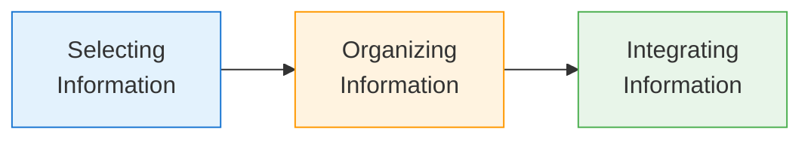

# 3:22 John Dewey's Theory of Constructivism

!!! abstract "Section Overview"
    This section introduces **John Dewey's Theory of Constructivism** and the **SOI Model** of meaningful learning, along with the characteristics of constructivist classrooms and cooperative learning approaches.

---

## 📋 What is Constructivism?

!!! quote "Definition"
    **Constructivist view of learning** maintains that the learner must be actively engaged in the **construction of meaning** through direct experience.

---

## 3:22:1 SOI Model of Meaningful Learning

!!! info "SOI Model"
    The **SOI Model** proposes that meaningful learning occurs when the learner engages in **three cognitive processes**:



### The Three Cognitive Processes

| Process | Description |
|---------|-------------|
| **S - Selecting** | Learner attends to relevant information presented in the environment |
| **O - Organizing** | Learner builds internal connections among selected pieces of information |
| **I - Integrating** | Learner builds external connections between incoming information and **existing relevant knowledge (schemata)** |

---

## 3:22:2 Characteristics of a Constructivist Classroom

!!! note "Key Characteristics 📌"
    The constructivist classroom differs significantly from traditional classrooms:

| Characteristic | Description |
|----------------|-------------|
| **1. Student-centered** | Student ideas and interests are valued and pursued |
| **2. Curricular flexibility** | Curriculum is **adaptable** to student needs |
| **3. Prior knowledge** | Building on what students **already know** |
| **4. Interactive learning** | Teacher engages students through **dialogue** |
| **5. Questioning approach** | Open-ended questions that promote **elaboration** |
| **6. Problem-posing** | Teachers pose **problems of emerging relevance** |
| **7. Raw data use** | Use of **primary sources and manipulatives** |
| **8. Group learning** | Encourages **collaborative work** |
| **9. Authentic assessment** | Assessment through **portfolios**, **performances** |
| **10. Real-world context** | Learning in context of **real-life situations** |

---

## 3:22:3 Cooperative Learning

!!! info "Definition"
    **Cooperative learning** is an instructional strategy that emphasizes:
    
    - **Collaborative work** among students
    - **Shared responsibility** for learning outcomes
    - **Peer interaction** and support

### 3:22:3:01 Forming Groups

!!! note "Group Formation Guidelines 📌"
    
    | Aspect | Guideline |
    |--------|-----------|
    | **Size** | Small groups (typically 4-6 students) |
    | **Composition** | Heterogeneous (mixed abilities, backgrounds) |
    | **Roles** | Assigned roles (leader, recorder, reporter, etc.) |
    | **Duration** | Groups can be temporary or long-term |

### 3:22:3:02 Cooperative Learning Phases

!!! success "Implementation Phases"
    
    ```mermaid
    flowchart TD
        P1[Phase 1:<br/>Present Goals & Set] --> P2[Phase 2:<br/>Present Information]
        P2 --> P3[Phase 3:<br/>Organize Students<br/>into Teams]
        P3 --> P4[Phase 4:<br/>Assist Team Work<br/>& Study]
        P4 --> P5[Phase 5:<br/>Test on Materials]
        P5 --> P6[Phase 6:<br/>Provide Recognition]
        
        style P1 fill:#e3f2fd,stroke:#1976d2
        style P2 fill:#e3f2fd,stroke:#1976d2
        style P3 fill:#fff3e0,stroke:#ff9800
        style P4 fill:#fff3e0,stroke:#ff9800
        style P5 fill:#e8f5e9,stroke:#4caf50
        style P6 fill:#e8f5e9,stroke:#4caf50
    ```

| Phase | Activity | Teacher Behavior |
|-------|----------|------------------|
| **1** | Present goals & set | State lesson goals and prepare students |
| **2** | Present information | Provide information verbally or with text |
| **3** | Organize into teams | Explain to students how to form teams, assist |
| **4** | Assist team work | Guide teams as they work together |
| **5** | Test materials | Test knowledge through quizzes, presentations |
| **6** | Provide recognition | Recognize individual and group efforts |

### 3:22:3:03 Teacher Characteristics in Cooperative Learning

!!! tip "Effective Teacher Characteristics"
    Teachers in cooperative learning environments should:
    
    - **Facilitate** rather than direct
    - **Monitor** group progress
    - **Intervene** when necessary
    - **Encourage** equal participation
    - **Model** collaborative behaviors

### 3:22:3:04 Advantages of Cooperative Learning

!!! success "Benefits"
    
    | Category | Advantages |
    |----------|------------|
    | **Academic** | Higher achievement, deeper understanding |
    | **Social** | Better interpersonal skills, reduced prejudice |
    | **Personal** | Higher self-esteem, better attitudes toward learning |
    | **Cognitive** | Critical thinking, problem-solving skills |

---

## 🧠 Memory Mnemonic

!!! tip "Exam Tip 📝"
    Remember **"SOI"** for Meaningful Learning:
    
    - **S**elect relevant information
    - **O**rganize internal connections
    - **I**ntegrate with existing schemata

---

## 📊 Comparison: Traditional vs Constructivist Classroom

| Aspect | Traditional | Constructivist |
|--------|-------------|----------------|
| **Focus** | Teacher-centered | Student-centered |
| **Curriculum** | Fixed, rigid | Adaptable, flexible |
| **Knowledge** | Transmitted | Constructed |
| **Role of student** | Passive recipient | Active constructor |
| **Assessment** | Tests, grades | Authentic, portfolios |
| **Learning context** | Abstract | Real-world |

---

## 📝 Quick Revision

| Concept | Key Points |
|---------|------------|
| **Constructivism** | Learner constructs meaning through experience |
| **SOI Model** | Select → Organize → Integrate |
| **Constructivist class** | Student-centered, flexible, interactive |
| **Cooperative learning** | Collaborative, shared responsibility |
| **Six phases** | Goals → Info → Teams → Work → Test → Recognition |

---

## ❓ Review Questions

1. Explain John Dewey's Theory of Constructivism and the SOI Model. **(A)**
2. What are the characteristics of a constructivist classroom? **(A)**
3. Discuss the phases of cooperative learning and their implementation. **(A)**
4. Compare traditional and constructivist approaches to learning. **(SA)**

---

> **Bridge →** Let's now explore **Humanistic Psychology** and its perspective on learning...
