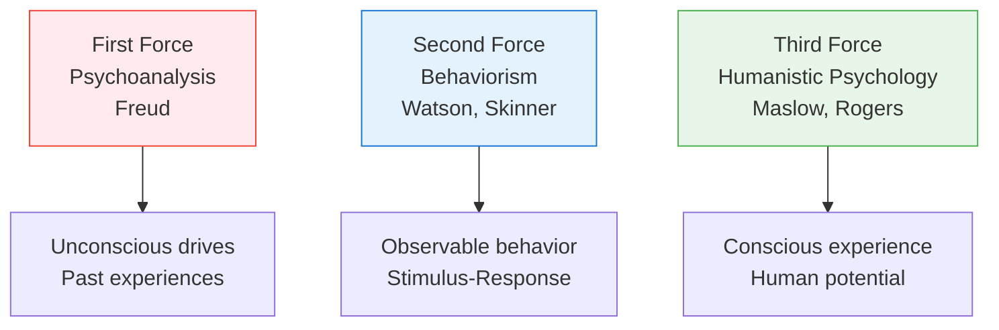

# 3:23 Humanistic Psychology and its Basic Premises

!!! abstract "Section Overview"
    This section introduces **Humanistic Psychology**, also known as the **Third Force** in psychology, and outlines its fundamental premises that emphasize human potential, conscious experience, and self-actualization.

---

## 📋 What is Humanistic Psychology?

!!! quote "Definition"
    **Humanistic Psychology** is often called the **"Third Force"** in psychology (after psychoanalysis and behaviorism). It emerged in the **1950s-1960s** as a reaction to the limitations of other approaches.

!!! info "Key Founders"
    - **Abraham Maslow**
    - **Carl Rogers**
    - **Rollo May**
    - **Gordon Allport**

---

## 📊 The Three Forces in Psychology

---

## 📋 Basic Premises of Humanistic Psychology

!!! note "Fundamental Beliefs 📌"
    Humanistic Psychology is based on several key premises:

### 1. Human Dignity and Potential

!!! success "Premise"
    Every human being has **inherent worth and dignity**, and the potential for **growth and self-improvement**.

### 2. Conscious Experience

!!! success "Premise"
    Emphasis on **conscious experience** rather than unconscious drives or observable behavior alone.

### 3. Free Will and Choice

!!! success "Premise"
    Humans have **free will** and make **conscious choices** that shape their lives.

### 4. Holistic View

!!! success "Premise"
    Focus on the **whole person** - not just isolated behaviors or unconscious conflicts.

### 5. Self-Actualization

!!! success "Premise"
    Humans have an innate drive toward **self-actualization** - becoming the best version of themselves.

### 6. Present Focus

!!! success "Premise"
    Emphasis on the **here and now** rather than dwelling on past experiences or future anxieties.

### 7. Subjective Experience

!!! success "Premise"
    The individual's **subjective perception** of reality is more important than objective external reality.

### 8. Personal Responsibility

!!! success "Premise"
    Individuals are **responsible** for their own actions and personal growth.

---

## 📊 Summary Table of Premises

| # | Premise | Key Idea |
|---|---------|----------|
| **1** | Human dignity | Inherent worth of every person |
| **2** | Conscious experience | Importance of awareness |
| **3** | Free will | Power of choice |
| **4** | Holistic view | Whole person approach |
| **5** | Self-actualization | Drive to reach potential |
| **6** | Present focus | Here and now emphasis |
| **7** | Subjective experience | Personal perception matters |
| **8** | Personal responsibility | Accountability for growth |

---

## 🔄 Comparison with Other Approaches

| Aspect | Psychoanalysis | Behaviorism | Humanistic |
|--------|----------------|-------------|------------|
| **Focus** | Unconscious | Observable behavior | Conscious experience |
| **View of human** | Driven by impulses | Shaped by environment | Free to choose |
| **Goal** | Insight into past | Behavior change | Self-actualization |
| **Method** | Analysis | Conditioning | Facilitation |
| **Key figure** | Freud | Skinner | Maslow, Rogers |

---

## 🧠 Memory Mnemonic

!!! tip "Exam Tip 📝"
    Remember **"HOPES-CPR"** for Humanistic Psychology Premises:
    
    - **H**olistic view
    - **O**wn responsibility
    - **P**otential for growth
    - **E**xperience (conscious)
    - **S**elf-actualization
    - **C**hoice (free will)
    - **P**resent focus
    - **R**eality (subjective)

---

## 📝 Quick Revision

| Concept | Key Points |
|---------|------------|
| **Third Force** | Humanistic psychology (after psychoanalysis, behaviorism) |
| **Key focus** | Conscious experience, human potential |
| **View of humans** | Free, responsible, capable of growth |
| **Goal** | Self-actualization |
| **Approach** | Holistic, present-focused |

---

## ❓ Review Questions

1. What is Humanistic Psychology and why is it called the "Third Force"? **(SA)**
2. Explain the basic premises of Humanistic Psychology. **(A)**
3. Compare Humanistic Psychology with Behaviorism and Psychoanalysis. **(A)**

---

> **Bridge →** Let's explore the **Humanistic View of Learning** and its implications for education...
