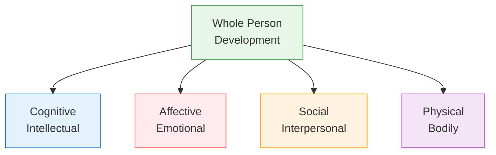

# 3:24 Humanistic Psychologists' View of Learning

!!! abstract "Section Overview"
    This section presents the **Humanistic perspective on learning**, emphasizing learner-centered education, personal meaning, and the development of the whole person.

---

## 📋 Core Principles of Humanistic Learning

!!! info "Fundamental Beliefs"
    Humanistic psychologists view learning as a **personal, meaningful experience** that engages the **whole person** - cognitively, emotionally, and socially.

---

## Key Characteristics of Humanistic Learning

### 1. Learner-Centered Approach

!!! success "Principle"
    The learner is at the **center** of the learning process. Education should be designed around student **needs, interests, and goals**.

### 2. Felt Needs

!!! quote "Key Concept"
    Learning should address the **"felt needs"** of the learner - what they perceive as important and meaningful to their lives.

### 3. Whole Person Development

!!! success "Principle"
    Education should develop the **whole person**:
    
    - **Cognitive** (intellectual)
    - **Affective** (emotional)
    - **Social** (interpersonal)
    - **Physical** (bodily)

### 4. Self-Directed Learning

!!! success "Principle"
    Learners should have **autonomy** and **choice** in what and how they learn. Self-directed learning promotes intrinsic motivation.

### 5. Experiential Learning

!!! success "Principle"
    **Direct experience** is the best teacher. Learning should involve active engagement, not passive reception.

### 6. Meaningful Learning

!!! success "Principle"
    Learning must be **personally meaningful** and relevant to the learner's life and goals.

### 7. Emotional Climate

!!! success "Principle"
    A **positive emotional climate** is essential for effective learning. Learners need to feel **safe, accepted, and respected**.

### 8. Teacher as Facilitator

!!! success "Principle"
    The teacher is a **facilitator of learning**, not a transmitter of knowledge. The teacher's role is to:
    
    - Create conditions for learning
    - Support and guide
    - Encourage self-discovery

---

## 📊 Summary Table of Humanistic Learning Principles

| # | Principle | Educational Implication |
|---|-----------|------------------------|
| **1** | Learner-centered | Design around student needs |
| **2** | Felt needs | Address what students find meaningful |
| **3** | Whole person | Develop all aspects of personality |
| **4** | Self-directed | Provide choice and autonomy |
| **5** | Experiential | Hands-on, active learning |
| **6** | Meaningful | Personal relevance in content |
| **7** | Emotional climate | Safe, supportive environment |
| **8** | Facilitation | Teacher as guide, not lecturer |

---

## 🔄 Traditional vs Humanistic Learning

| Aspect | Traditional | Humanistic |
|--------|-------------|------------|
| **Focus** | Content/Subject | Learner/Person |
| **Teacher role** | Expert/Authority | Facilitator/Guide |
| **Learning type** | Passive/Receptive | Active/Experiential |
| **Motivation** | Extrinsic (grades) | Intrinsic (meaning) |
| **Development** | Cognitive only | Whole person |
| **Climate** | Competitive | Supportive |
| **Assessment** | Standardized tests | Self-evaluation |

---

## 🧠 Memory Mnemonic

!!! tip "Exam Tip 📝"
    Remember **"SELF-WFEM"** for Humanistic Learning:
    
    - **S**elf-directed learning
    - **E**xperiential learning
    - **L**earner-centered
    - **F**elt needs addressed
    - **W**hole person development
    - **F**acilitator (teacher as)
    - **E**motional climate (positive)
    - **M**eaningful learning

---

## 📝 Quick Revision

| Concept | Key Points |
|---------|------------|
| **Central focus** | Learner, not content |
| **Learning type** | Personal, meaningful, experiential |
| **Teacher role** | Facilitator, not transmitter |
| **Development** | Cognitive + Affective + Social + Physical |
| **Motivation** | Intrinsic, self-directed |
| **Environment** | Safe, accepting, supportive |

---

## ❓ Review Questions

1. What are the key principles of the humanistic view of learning? **(A)**
2. How does humanistic learning differ from traditional approaches? **(SA)**
3. Explain the concept of "felt needs" in humanistic education. **(SA)**
4. What is the role of the teacher in humanistic learning? **(SA)**

---

> **Bridge →** Let's now explore **Carl Rogers' Theory of the Fully Functioning Person** - a key concept in humanistic psychology...
