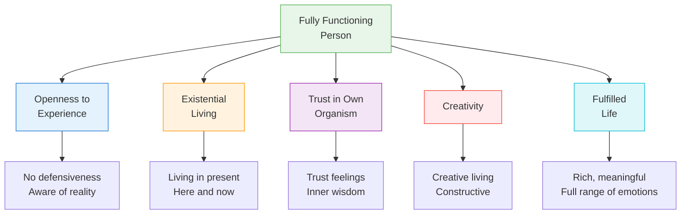

# 3:25 Carl Roger's Theory of Fully Functioning Person

!!! abstract "Section Overview"
    This section presents **Carl Rogers' concept of the Fully Functioning Person** - the ideal of psychological health and optimal human development in humanistic psychology.

---

## 📋 Who was Carl Rogers?

!!! info "About Carl Rogers (1902-1987)"
    - American psychologist and one of the founders of **humanistic psychology**
    - Developed **client-centered (person-centered) therapy**
    - Emphasized **unconditional positive regard** in relationships
    - Contributed significantly to understanding of **self-concept** and **personal growth**

---

## 📋 The Fully Functioning Person

!!! quote "Definition"
    The **Fully Functioning Person** represents Rogers' concept of the **psychologically healthy individual** who is living life to the fullest, experiencing optimal psychological well-being.

---

## 3:25:1 Characteristics of the Fully Functioning Person

!!! success "Five Key Characteristics"
    Rogers identified **five characteristics** that define a fully functioning person:

### 1. Openness to Experience

!!! note "First Characteristic 📌"
    
    | Aspect | Description |
    |--------|-------------|
    | **What it means** | Ability to experience feelings and events **without defensiveness** |
    | **Opposite** | Defensive, closed to new experiences |
    | **Result** | Greater awareness of reality and one's own reactions |

### 2. Existential Living

!!! note "Second Characteristic 📌"
    
    | Aspect | Description |
    |--------|-------------|
    | **What it means** | Living fully in the **here and now** |
    | **Focus** | Present moment rather than past or future |
    | **Result** | Each moment is experienced freshly and fully |

### 3. Trust in One's Own Organism

!!! note "Third Characteristic 📌"
    
    | Aspect | Description |
    |--------|-------------|
    | **What it means** | Trusting one's own **feelings, instincts, and judgment** |
    | **Basis** | Confidence in own abilities to make decisions |
    | **Result** | Authentic decision-making based on inner wisdom |

### 4. Creativity

!!! note "Fourth Characteristic 📌"
    
    | Aspect | Description |
    |--------|-------------|
    | **What it means** | Tendency to be **creative** and live **constructively** |
    | **Expression** | New ways of thinking, problem-solving, living |
    | **Result** | Adaptive, innovative approach to life |

### 5. Fulfilled Life

!!! note "Fifth Characteristic 📌"
    
    | Aspect | Description |
    |--------|-------------|
    | **What it means** | Experience of a **rich, full, and meaningful life** |
    | **Features** | Wide range of emotions, deep experiences |
    | **Result** | Sense of satisfaction and purpose |

---

## 📊 Visual Summary of Characteristics

---

## 📋 Summary Table

| # | Characteristic | Key Feature | Outcome |
|---|----------------|-------------|---------|
| **1** | Openness | Non-defensive awareness | Reality acceptance |
| **2** | Existential | Present-focused | Fresh experience |
| **3** | Trust | Self-confidence | Authentic decisions |
| **4** | Creativity | Constructive living | Innovation |
| **5** | Fulfilled | Meaningful life | Satisfaction |

---

## 🧠 Memory Mnemonic

!!! tip "Exam Tip 📝"
    Remember **"OETCF"** for Fully Functioning Person Characteristics:
    
    - **O**penness to experience
    - **E**xistential living
    - **T**rust in own organism
    - **C**reativity
    - **F**ulfilled life
    
    Or use: **"Open Eyes Trust Creative Fulfillment"**

---

## 📊 Conditions for Becoming Fully Functioning

!!! info "What is Needed?"
    According to Rogers, becoming a fully functioning person requires:
    
    | Condition | Description |
    |-----------|-------------|
    | **Unconditional Positive Regard** | Being accepted and valued without conditions |
    | **Empathy** | Being understood by others |
    | **Congruence** | Experiencing genuine relationships |
    | **Self-Actualization** | Freedom to grow and develop |

---

## 🔄 Implications for Education

!!! success "Educational Implications"
    
    | Principle | Application |
    |-----------|-------------|
    | Openness | Create safe environments for exploration |
    | Existential | Focus on present learning experiences |
    | Trust | Encourage student self-direction |
    | Creativity | Foster creative expression and problem-solving |
    | Fulfillment | Help students find meaning in learning |

---

## 📝 Quick Revision

| Concept | Key Points |
|---------|------------|
| **Fully Functioning Person** | Rogers' ideal of psychological health |
| **Five characteristics** | Open, Existential, Trusting, Creative, Fulfilled |
| **Key requirement** | Unconditional positive regard |
| **Educational goal** | Develop whole, self-actualizing persons |

---

## ❓ Review Questions

1. Explain Carl Rogers' concept of the Fully Functioning Person. **(A)**
2. What are the five characteristics of a fully functioning person? **(A)**
3. How can teachers help students become more fully functioning? **(SA)**
4. What is the role of unconditional positive regard in personal growth? **(SA)**

---

> **Bridge →** Let's now explore the **Educational Implications of Learning Theories** - bringing together all the theories we've studied...
