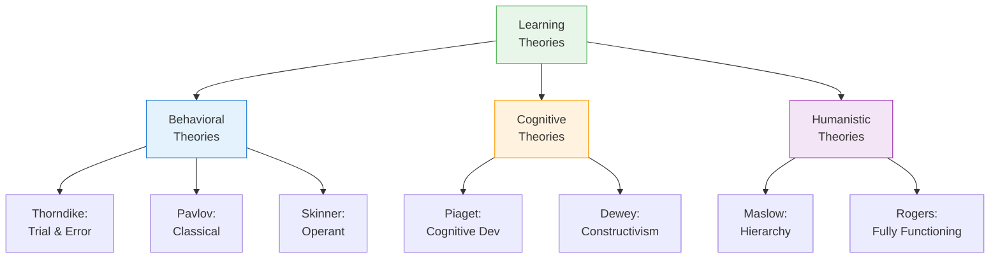

# 3:26 Educational Implications of Learning Theories

!!! abstract "Section Overview"
    This section presents the **educational implications** of the various learning theories studied in this unit, providing practical guidance for teachers on how to apply these theories in classroom settings.

---

## 📋 Why Study Learning Theories?

!!! quote "Key Insight"
    Understanding learning theories helps teachers to:
    
    - Select **appropriate teaching methods**
    - Create **effective learning environments**
    - Understand **why students behave** as they do
    - Design **better instructional strategies**
    - Adapt teaching to **individual differences**

---

## 📊 Summary of Learning Theories and Their Implications

### 1. Thorndike's Connectionism (Trial and Error)

!!! success "Educational Implications"
    
    | Theory Principle | Classroom Application |
    |-----------------|----------------------|
    | **Law of Readiness** | Ensure students are motivated and prepared to learn |
    | **Law of Exercise** | Provide practice and repetition opportunities |
    | **Law of Effect** | Give immediate feedback; reward correct responses |
    | **Trial and error** | Allow students to learn from mistakes |

---

### 2. Classical Conditioning (Pavlov)

!!! success "Educational Implications"
    
    | Theory Principle | Classroom Application |
    |-----------------|----------------------|
    | **Association** | Create positive associations with learning |
    | **Emotional conditioning** | Build positive attitudes toward subjects |
    | **Fear elimination** | Use counterconditioning for anxious students |
    | **Stimulus generalization** | Help transfer learning to similar situations |

---

### 3. Operant Conditioning (Skinner)

!!! success "Educational Implications"
    
    | Theory Principle | Classroom Application |
    |-----------------|----------------------|
    | **Positive reinforcement** | Praise, rewards for good performance |
    | **Negative reinforcement** | Remove unpleasant conditions for good behavior |
    | **Shaping** | Break complex tasks into smaller steps |
    | **Immediate reinforcement** | Provide quick feedback |
    | **Programmed instruction** | Self-paced learning materials |

---

### 4. Cognitive Development (Piaget)

!!! success "Educational Implications"
    
    | Theory Principle | Classroom Application |
    |-----------------|----------------------|
    | **Developmental stages** | Match curriculum to cognitive level |
    | **Active learning** | Provide hands-on experiences |
    | **Discovery learning** | Let students explore and discover |
    | **Concrete operations** | Use manipulatives for younger students |
    | **Formal operations** | Introduce abstract concepts for older students |

---

### 5. Constructivism (Dewey)

!!! success "Educational Implications"
    
    | Theory Principle | Classroom Application |
    |-----------------|----------------------|
    | **Meaning construction** | Students build their own understanding |
    | **Prior knowledge** | Connect new learning to existing knowledge |
    | **Social learning** | Use cooperative learning strategies |
    | **Authentic tasks** | Real-world, meaningful problems |
    | **SOI Model** | Help students Select, Organize, Integrate |

---

### 6. Humanistic Psychology (Rogers, Maslow)

!!! success "Educational Implications"
    
    | Theory Principle | Classroom Application |
    |-----------------|----------------------|
    | **Self-actualization** | Support student potential |
    | **Felt needs** | Address what students find meaningful |
    | **Whole person** | Develop cognitive, affective, social aspects |
    | **Teacher as facilitator** | Guide rather than lecture |
    | **Positive climate** | Create safe, accepting environment |

---

## 📊 Comparative Overview

---

## 📋 Quick Reference Table

| Theory | Key Principle | Main Implication |
|--------|--------------|------------------|
| **Thorndike** | Connections, laws | Practice, feedback, readiness |
| **Pavlov** | Association | Positive attitudes, emotions |
| **Skinner** | Reinforcement | Rewards, shaping, programmed instruction |
| **Piaget** | Stages | Age-appropriate curriculum |
| **Dewey** | Construction | Active, meaningful learning |
| **Maslow** | Needs hierarchy | Meet basic needs first |
| **Rogers** | Person-centered | Facilitation, acceptance |

---

## 🧠 Memory Mnemonic

!!! tip "Exam Tip 📝"
    Remember **"TCPCDHR"** for Learning Theories:
    
    - **T**horndike (Trial & Error)
    - **C**lassical (Pavlov)
    - **P**skinner (Operant) - think "Programming"
    - **C**ognitive (Piaget)
    - **D**ewey (Constructivism)
    - **H**umanistic (Maslow)
    - **R**ogers (Fully Functioning)

---

## 📋 Choosing the Right Approach

!!! info "Teacher Decision Guide"
    
    | Situation | Best Approach |
    |-----------|---------------|
    | Building basic skills | Behaviorist (drill, practice) |
    | Developing attitudes | Classical conditioning |
    | Behavior management | Operant conditioning |
    | Complex problem-solving | Cognitive (Piaget, Dewey) |
    | Personal growth | Humanistic (Rogers, Maslow) |
    | Group learning | Constructivist (cooperative) |

---

## 📝 Quick Revision

| Aspect | Key Points |
|--------|------------|
| **Purpose** | Guide teaching decisions |
| **Behavioral theories** | Focus on observable behavior, reinforcement |
| **Cognitive theories** | Focus on mental processes, understanding |
| **Humanistic theories** | Focus on whole person, self-actualization |
| **Integration** | Use multiple approaches as needed |

---

## ❓ Review Questions

1. Discuss the educational implications of any two learning theories. **(A)**
2. How can teachers integrate different learning theories in classroom practice? **(A)**
3. Compare the educational implications of behavioral and cognitive theories. **(A)**
4. What is the importance of learning theories for teachers? **(SA)**
5. How does humanistic psychology differ from behaviorism in educational applications? **(SA)**

---

## 🎯 Unit Conclusion

!!! success "Unit 3 Summary"
    In this unit, we have studied:
    
    **Part A - Motivation:**
    - Meaning and definition of motivation
    - Motives and their characteristics
    - Maslow's hierarchy of needs
    - Intrinsic and extrinsic motivation
    - Motivational strategies
    
    **Part B - Learning:**
    - Meaning and nature of learning
    - Factors affecting learning
    - Learning theories (Behavioral, Cognitive, Humanistic)
    - Classical and Operant conditioning
    - Piaget's cognitive development
    - Constructivism and cooperative learning
    - Rogers' fully functioning person
    
    Understanding these concepts is essential for effective teaching and creating optimal learning environments!

---

> **Congratulations!** You have completed **Unit 3: Motivation and Learning**. Proceed to **Unit 4: Intelligence and Creativity**.
