# Unit - IV: Intelligence and Creativity

!!! abstract "Unit Overview"
    This unit provides a comprehensive exploration of **Intelligence and Creativity** – two fundamental constructs in educational psychology. It covers the meaning, definitions, and various theories of intelligence proposed by psychologists like Spearman, Thorndike, Thurstone, Guilford, and Gardner. The unit also examines the measurement of intelligence through standardized tests, concepts of Mental Age and Intelligence Quotient, and the uses and limitations of intelligence tests. The second half focuses on creativity – its meaning, characteristics, stages in the creative process, differences from intelligence, and methods to identify and foster creativity among children.

---

## 🎯 Introduction

Understanding intelligence and creativity is essential for educators to effectively identify, nurture, and develop the mental abilities of learners.

**Key Learning Points:**

- Understand the multiple perspectives on the nature of intelligence
- Learn various theories that explain the structure of intelligence
- Master the concepts of Mental Age (M.A.) and Intelligence Quotient (I.Q.)
- Differentiate between various types of intelligence tests
- Comprehend the meaning and characteristics of creativity
- Learn techniques to identify and foster creativity in children

---

## 🔗 Connection to Other Units

| Connected Unit | Relationship |
|----------------|--------------|
| Unit I: Growth & Development | Intelligence develops across developmental stages |
| Unit II: Attention & Memory | Cognitive processes underlying intelligence |
| Unit III: Motivation & Learning | Intelligence affects learning capacity |
| Unit V: Personality | Creativity relates to personality traits |

---

## 📚 Unit Overview

### Topics at a Glance

| Section | Topic | Focus |
|---------|-------|-------|
| 4:00 | **Introduction** | Overview of unit contents |
| 4:01 | **Meaning of Intelligence** | Three perspectives on intelligence |
| 4:02 | **Definitions of Intelligence** | Key definitions by psychologists |
| 4:03 | **Characteristics of an Intelligent Person** | Behavioral indicators |
| 4:04 | **Types of Intelligence** | Thorndike's classification |
| 4:05 | **Theories of Intelligence** | Major theoretical frameworks |
| 4:06 | **Gardner's Multiple Intelligence** | Eight types of intelligence |
| 4:07 | **Measurement of Intelligence** | Tests, M.A., and I.Q. |
| 4:08 | **Types of Intelligence Tests** | Classification of tests |
| 4:09 | **Uses of Intelligence Tests** | Practical applications |
| 4:10 | **Limitations of Intelligence Tests** | Drawbacks and concerns |
| 4:11 | **Culture-Fair Tests** | Addressing cultural bias |
| 4:12 | **Meaning of Creativity** | Definitions and nature |
| 4:13 | **Stages in Creative Process** | Four-stage model |
| 4:14 | **Differences: Intelligence vs Creativity** | Key distinctions |
| 4:15 | **Identification of Creative Children** | Testing and non-testing methods |
| 4:16 | **Fostering Creativity** | Techniques and strategies |

### Learning Outcomes

By the end of this unit, you will be able to:

1. **Define** intelligence from multiple perspectives
2. **Explain** various theories of intelligence
3. **Calculate** Intelligence Quotient using Mental Age
4. **Compare** different types of intelligence tests
5. **Differentiate** between intelligence and creativity
6. **Apply** techniques to foster creativity in children

---

## 🗺️ Topic Connection Map

```mermaid
flowchart TB
    subgraph INTELLIGENCE["📊 Intelligence"]
        A[4:01 Meaning] --> B[4:02 Definitions]
        B --> C[4:03 Characteristics]
        C --> D[4:04 Types]
        D --> E[4:05 Theories]
        E --> F[4:06 Gardner's MI]
    end
    
    subgraph MEASUREMENT["📏 Measurement"]
        G[4:07 Measuring Intelligence]
        H[4:08 Types of Tests]
        I[4:09 Uses]
        J[4:10 Limitations]
        K[4:11 Culture-Fair Tests]
    end
    
    subgraph CREATIVITY["💡 Creativity"]
        L[4:12 Meaning]
        M[4:13 Stages]
        N[4:14 Intelligence vs Creativity]
        O[4:15 Identification]
        P[4:16 Fostering]
    end
    
    F --> G
    G --> H --> I --> J --> K
    K --> L --> M --> N --> O --> P
```

---

## 4:00 Introduction

In this Unit, **Meaning and Definition of Intelligence**, **Types of Intelligence**, **Theories of Intelligence**, **Difficulty in Measuring Intelligence**, **Historical Development of Intelligence Tests**, **Concept of Mental Age**, **Concept of Intelligence Quotient**, **Intelligence Tests and their Types**, **Uses of Intelligence Tests**, **Limitations of Intelligence Tests and Culture-Fair Tests**, **Meaning of Creativity**, **Characteristics of Creativity**, **Stages in the Creative Process**, **Difference Between Intelligence and Creativity**, **Identification of the Creative Children** and **Fostering Creativity among Children** are to be explained in detail.

---

## 4:01 Meaning of Intelligence

Psychologists have suggested various points of view regarding the nature of intelligence. All the definitions can be classified under the following **three groups**:

!!! note "Three Perspectives on Intelligence 📌"
    
    | Perspective | Description |
    |-------------|-------------|
    | **Ability for Adjustment/Adaptation** | Intelligence is the general mental adaptability for new problems and new situations of life. A more intelligent person can more easily and extensively vary his behaviour as changing conditions demand. |
    | **Ability to Learn** | One's intelligence is a matter of the extent to which he is educable. The more intelligent a person, the more readily and extensively he is able to learn and enlarge his field of activities and experiences. |
    | **Ability to Carry on Abstract Thinking** | Emphasis is laid on the effective use of concepts and symbols in dealing with situations, especially presenting a problem to be solved through the use of verbal and numerical symbols. |

!!! tip "Exam Tip 📝"
    The three categories of definitions are **not exclusive** but are **inclusive and interdependent** on each other. Learning ability is the basic requisite condition for the other two aspects of intelligence.

> **Bridge →** Having understood the perspectives, let's examine specific definitions given by renowned psychologists.

---

## 4:02 Definitions of Intelligence

!!! quote "Definition - Studdard"
    Intelligence is the "**ability to start and sustain, inspite of emotional interferences, activities that are difficult, novel and useful in an economical manner**".

!!! quote "Definition - Wechsler (Most Comprehensive)"
    "**Intelligence is the aggregate or global capacity of an individual to act purposefully, to think rationally and to deal effectively with the environment**".

This definition encompasses all three major viewpoints:

- Adjustment or adaptation ability
- Ability to learn
- Ability to carry on abstract thinking

!!! quote "Definition - Alfred Binet"
    Intelligence involves such abilities as "**understanding, originality, persistence and self-criticism**".

---

## 4:03 Characteristics of an Intelligent Person

An **Intelligent person** is one who:

| # | Characteristic |
|---|----------------|
| i | **Learns fast** and with ease |
| ii | Displays **good adjustment** in behaviour and has the capacity to solve problems encountered |
| iii | Is capable of successfully completing even **difficult and complex tasks** with high efficiency and economically |
| iv | **Adjusts behaviour** according to the demands of the goals which he seeks to attain |
| v | Generally acts in pursuit of the **welfare of the society** |
| vi | Does **not get easily carried away by emotions** but focuses attention and efforts on the task at hand |
| vii | Is capable of handling any **trying situation** and win over it |
| viii | Has the ability to **analyse any problem thoroughly** |
| ix | Knows the **knack of getting along with others** and bring them around his point of view |

!!! info "British Psychologists' View"
    British psychologists point out **two essential behavioural aspects** exhibited by intelligent persons:
    
    - **Perceive** the appropriate relations that exist among objects or ideas
    - **Apply** the relations so perceived to new situations in life

---

## 4:04 Types of Intelligence

Some Psychologists, notably **Thorndike**, believe that several kinds of intelligence should be distinguished from each other.

!!! note "Thorndike's Three Types of Intelligence 📌"
    
    | Type | Description |
    |------|-------------|
    | **Social Intelligence** | The knack of getting along with people. Socially intelligent person makes friends easily and understands human relations. |
    | **Mechanical Intelligence** | The ability to deal effectively with machines or mechanical contrivances. |
    | **Abstract Intelligence** | The ability to deal with symbols (both verbal and numerical), diagrams, formulae etc. |

**Prof. Howard Gardner** of Harvard University in his book *"Frames of Mind: The Theory of Multiple Intelligence"* has posted a provisional list of intelligences which include:

- **Linguistic** and **Logical skills** (which I.Q. tests measure)
- **Musical skills**
- **Kinesthetic skills** (exhibited by Surgeons, dancers etc.)
- **Spatial skills** (displayed by Sculptors etc.)
- **Interpersonal skills** (important for politicians, salesmen etc.)
- **Intrapersonal skills** (exhibited by planners and strategists)

> **Bridge →** Understanding types of intelligence leads us to explore various theories that explain its structure.

---

## 4:05 Theories of Intelligence

There are many views regarding what constitutes "intelligence". The different viewpoints expressed by psychologists regarding the structure and functioning of intelligence go by the name **theories of intelligence**.

---

### 4:05:1 Unitary Theory or Monarchic Theory

This theory holds that intelligence consists of **all pervasive capacity**. **Binet**, **Terman** and some other classical psychologists supported this view.

!!! info "Key Points"
    - If one has a fund of intelligence, he can utilise it to any area of his life
    - The intelligence of a person gets stamped in all what he thinks and acts

!!! warning "Limitation"
    - A genial mathematical professor may be absent minded or socially ill-adjusted
    - Analysis of scores in an intelligence test battery shows that different tests are **not highly correlated**
    - The unifactor approach is **too simple** and a complex model is needed

---

### 4:05:2 Spearman's Two-factor Theory

**Spearman** proposed his two-factor theory of intelligence in **1904**.

!!! quote "Definition"
    According to this theory, every different mental ability involves a **general factor (G)**, which it shares with all other mental activities, and a **specific factor (S)**, which it shares with none.

| Factor | Description |
|--------|-------------|
| **'G' Factor** | Largely **innate** and accounts for success in all activities. It is constant for any individual across all correlated activities but differs from individual to individual. |
| **'S' Factor** | Essentially **learnt**. Success in any specialised field depends on the concerned specific factor. |

```mermaid
flowchart TB
    G["G : General Factor<br/>(approximates to 'common sense')"]
    S1["S₁"] 
    S2["S₂"]
    S3["S₃"]
    S4["S₄"]
    S5["S₅"]
    
    G --> S1
    G --> S2
    G --> S3
    G --> S4
    G --> S5
```

!!! example "Example"
    - Persons who are good in natural sciences may be poor in social sciences
    - Some who excel in mathematics are poor in language
    - Performance in any situation is predicted by the amount of share of 'G' and 'S' in different intellect activities

---

### 4:05:3 Thorndike's Multifactor Theory

**Thorndike** was an **associationist** and he opposed the theory of general intelligence (Unifactor theory).

!!! quote "Definition"
    Intelligence is nothing more than a convenient name for almost infinite number of actual or potential **specific connections** between stimuli and responses. This theory is also known as the **atomistic theory of intelligence**.

**Four Attributes of Intelligence (Thorndike):**

| Attribute | Description |
|-----------|-------------|
| **Level** | Refers to the **difficulty** of a task that can be solved. The height we can ascend on the ladder of difficulty determines our level of intelligence. |
| **Range** | Refers to the **number of tasks** at any given degree of difficulty that we can solve. Determined by level, breadth of experience, and opportunity to learn. |
| **Area** | The **total number of situations** at each level to which the individual is able to respond. Area is the summation of all the ranges at each level. |
| **Speed** | The **rapidity** with which an individual can respond to items. Speed and altitude are positively related. |

!!! tip "Exam Tip 📝"
    Every intelligence test consists of these four attributes: **tasks (area)** that vary in **difficulty (level)** with items at each level of difficulty **(range)** responded in a given **time (speed)**.

---

### 4:05:4 Thurstone's Group-factor Theory

**Group factor theory** has been advocated by **Thurstone** and his associates.

!!! info "Key Concept"
    - Intelligent activity is **not** an expression of innumerable highly specific factors (as Thorndike claimed)
    - **Nor** is it the expression primarily of a general factor (as Spearman held)
    - Certain mental operations have in common a **'primary' factor** which gives them psychological and functional unity

**Seven Primary Mental Abilities (PMA):**

| # | Ability | Description |
|---|---------|-------------|
| 1 | **Space Visualisation** | Ability to visualise geometric patterns in space |
| 2 | **Perceptual Speed** | Quick and accurate noting of details |
| 3 | **Numerical Ability** | Quickness and accuracy in simple arithmetic operations |
| 4 | **Verbal Comprehension** | Knowledge of meaning and relationship of words |
| 5 | **Word Fluency** | Ability to think and use many isolated words at a rapid rate |
| 6 | **Rote Memory** | Immediate recall of materials learned |
| 7 | **Reasoning** | Ability to see relationships in situations described in symbols |

---

### 4:05:4:01 Contributions of Thurstone's Theory of Intelligence

Important contributions of Thurstone's theory of intelligence are:

1. More clearly **specified and defined test categories** and type of test items to be included emerged
2. Several **test batteries** have been constructed on the basis of group factor theory
3. **H.E. Garrett** has postulated a **developmental theory of intelligence** based on this theory, arguing that with increasing age, abilities differentiate out of general abstract intelligence into relatively independent factors

---

### 4:05:5 Guilford's Structure of Intellect

**Structure of Intellect model** is the result of factor analysis conducted by **Guilford** and his associates in the psychology laboratory at the University of South California in **1966**.

!!! note "Three Dimensions of Mind 📌"
    Guilford suggests that mind is composed of at least three major dimensions:
    
    - **Process of Operation**
    - **Material or Content**
    - **Product**

**I. Six Operations:**

| Operation | Description |
|-----------|-------------|
| **Cognition** | Immediate discovery, rediscovery, awareness, comprehension and understanding |
| **Memory Recording** | Retention of what is recognised for a short duration (Short term memory) |
| **Memory Retention** | Retention of what is recognised for a long period of time (Long term memory) |
| **Convergent Thinking** | Generation of information from given data with emphasis on conventionally accepted best outcomes |
| **Divergent Thinking** | Thinking in different directions, searching and seeking variety and novelty. Closely associated with **creativity**. |
| **Evaluation** | Reaching conclusions and decisions as to goodness, correctness, adequacy and desirability of information |

**II. Five Contents:**

| Content | Description |
|---------|-------------|
| **Visual Content** | Concrete material perceived through ideas |
| **Auditory Content** | Information perceived through ears |
| **Symbolic Content** | Letters, digits or other conventional signs organised in general patterns |
| **Semantic Content** | Clear cut verbal meanings or ideas (self-explanatory) |
| **Behavioural Content** | Social intelligence enabling understanding of human communications |

**III. Six Products:**

| Product | Description |
|---------|-------------|
| **Units** | Similar to gestalt psychology of figure and ground; relatively segregated items |
| **Classes** | Sets of information grouped by virtue of common properties |
| **Relations** | Connections between items based on variables; more meaningful and definable |
| **Systems** | Aggregate of items of information with a structure |
| **Transformation** | Changes like redefinition, modification in existing information or its function |
| **Implications** | Explorations of information in the form of expectancies, predictions and consequences |

!!! success "Total Mental Abilities"
    According to Guilford, there can be **180 different mental abilities** (6 × 5 × 6 = 180)

!!! info "Guilford's Unique Position"
    - Does **not** agree to the idea of some fixed amount of intelligence
    - Claims development of intellectual skill depends on **practice**
    - Concerned with **social behaviour** in addition to academic success
    - Devised tests of **social sensibility** and takes into account **inter-personal skills**

---

### 4:05:5:01 Educational Implications of Guilford's Structure of Intellect Model

!!! tip "For Teachers 📝"
    - Useful in identifying and defining **specific learning outcomes**
    - Elements relating to **convergent and divergent thinking** have stimulated considerable interest
    - **High divergent thinking** people are high in creativity and produce new forms of responses
    - **High I.Q.** people try to focus on socially acceptable responses

---

## 4:06 Howard Gardner's Theory of Multiple Intelligence

**Prof. Howard Gardner** of Harvard University in his book *"Frames of Mind: The Theory of Multiple Intelligence"* (1983) has listed **eight types of intelligence**.

!!! quote "Gardner's View"
    Intelligence as measured at present through intelligence tests is **narrowly conceived**. Human intelligence is really broad based and of many kinds. Attempting to assess such a wide range of mental abilities by a single measure called I.Q. is akin to **caging an elephant in a glass bottle**.

---

### 4:06:1 Gardner's Eight Types of Intelligence

| # | Intelligence Type | Description | Exhibited By |
|---|-------------------|-------------|--------------|
| i | **Linguistic Intelligence** | Verbal ability of an individual | Writers, Poets, Speakers |
| ii | **Logical-Mathematical Intelligence** | Logical reasoning and numerical skills | Scientists, Mathematicians |
| iii | **Spatial Intelligence** | Ability to visualise and manipulate spatial information | Sculptors, Engineers, Architects, Draughtsmen |
| iv | **Kinesthetic Intelligence** | Body movement and physical skills | Surgeons, Dancers, Sportsmen, Therapists |
| v | **Musical Intelligence** | Musical abilities | Musicians, Violinists, Guitarists, Pianists |
| vi | **Interpersonal Intelligence** | Understanding and interacting with others | Politicians, Salesmen, PR Officers, Business Executives |
| vii | **Intrapersonal Intelligence** | Self-understanding and planning | Planners, Strategists |
| viii | **Naturalist Intelligence** | Understanding nature and environment | Poets, Horticulturists, Environmentalists, Ecologists |

!!! warning "Criticism of Current Education System"
    - Present school system gives importance to promote only the **first two categories** (Verbal, Numerical ability, Logical reasoning)
    - Should take equal interest in developing **other types of intelligence** too
    - System labels children with exceptional skills in other fields as those with **'learning disability'**
    - Those who lag behind in verbal and numerical abilities don't get due care despite exceptional skills in other fields

!!! success "Revolutionary Changes Needed"
    Gardner's Theory insists on bringing revolutionary changes in the instructional system:
    
    - Classroom activities should become **manifold and multimodal**
    - Include: **Multimedia learning**, graphical representations, field trips, self-reflections, team projects, dramatisation, music
    - Learning becomes **optimal and joyful** when learner's potentials are exploited

---

## 4:07 Measurement of Intelligence

### 4:07:1 Difficulty in Measuring Intelligence

!!! warning "Challenges in Measurement"
    - Measurement of intelligence is **not possible** in the same way as we measure the length of a table or temperature
    - Intelligence is **not a concrete thing** - it is only an idea and abstraction
    - **Direct measurement is not possible**
    - Intelligence tests do not measure intellectual capacity directly but through action or behaviour

**The level of intelligence is measured by:**

| Factor | Description |
|--------|-------------|
| **Difficulty** | The difficulty of the task one can perform |
| **Range** | The range of tasks one can perform |
| **Speed** | The speed with which one performs |

!!! quote "Samdiford's Statement"
    "The **harder** the task a person can perform, the greater is his intelligence. Secondly, **more** of tasks that an individual can do, the more intelligence he has, and thirdly, the **quicker** the response of an individual to the given task, the greater his intelligence is".

---

### 4:07:2 Some of the Standardised Intelligence Tests

### 4:07:2:01 Stanford-Binet Test of Intelligence

**Alfred Binet**, a French Psychologist, is known as the **father of intelligence testing**.

**Binet's Assumptions:**

| # | Assumption |
|---|------------|
| a | Intelligence refers to a **complex variety of abilities**, not one or two narrow abilities. Testing should involve **variety of tests** assessing higher order mental functions. |
| b | Intelligence is best displayed by **general information and knowledge** and is independent of school learning. |
| c | More intelligent individuals show greater **initiative and persistence**, are more careful in observing details and chalking out consistent plans. |
| d | Intelligence **increases in amount as age increases**. Simpler items for younger children, more difficult for older children. |

**Historical Development:**

- **1905**: Binet and Simon scale contained **30 items**
- **1908**: Revised scale with tests arranged for **different age levels**, enabling computation of **Mental Age (M.A.)**

---

### 4:07:2:02 Concept of Mental Age

!!! quote "Definition"
    **Mental Age** is defined as "an expression of the extent of development achieved by the individual, stated in terms of the performance that can be expected at any given age".

!!! example "Example"
    If a person of **chronological age 8 years** is able to score satisfactorily on a test meant for children of chronological age **10**, then the **mental age of the former is 10**.

---

### 4:07:3 Concept of Intelligence Quotient (I.Q.)

!!! quote "Definition"
    **Intelligence Quotient** is an index of intelligence. It is a comparative index showing how a particular child performs when compared with others of the same chronological age.

**Formula:**

$$I.Q. = \frac{M.A.}{C.A.} \times 100$$

Where:
- **M.A.** = Mental Age (from standardised intelligence test)
- **C.A.** = Chronological Age (from date of birth; taken as 16 for persons 16 and above)

| I.Q. Value | Interpretation |
|------------|----------------|
| **100** | Normal (average) intelligence |
| **Above 100** | High intelligence |
| **Below 100** | Low level of intelligence |

---

### 4:07:3:01 Wechsler's Adult Intelligence Scale (WAIS)

**Wechsler's Adult Intelligence Scale (WAIS)** was published in **1939** and modified and standardised in **1955**.

!!! info "Key Features"
    - Wechsler adopts a **general intelligence approach**
    - Individuals have **different measures of intelligence** and not of the same kind
    - Sub-tests measure the **different ways** intelligence may manifest itself

**Test Structure (11 Sub-tests):**

| Verbal Scale (6 tests) | Performance Scale (5 tests) |
|------------------------|----------------------------|
| Vocabulary | Block Design |
| Information | Picture Arrangement |
| Comprehension | Object Assembly |
| Arithmetic | Picture Completion |
| Similarities | Digit Symbol |
| Digit Spans | |

!!! note "Point Scale vs Age Scale 📌"
    - WAIS is a **Point Scale**, not an Age Scale like Stanford-Binet
    - Items are **not grouped by age level**
    - Score based on **number of items scored correctly**
    - Raw score transformed into standard score with **mean of 10** and **SD of 3**
    - Reliability: Verbal and Performance I.Qs have split-half reliabilities of **more than 0.93**
    - Total scale I.Qs have split-half reliability coefficient of **0.97**

---

### 4:07:4 Classroom Teacher Assessing the Intelligence of his Students

Teachers with a little amount of training can administer suitable standardised intelligence tests. **Steps to follow:**

| Step | Action |
|------|--------|
| a | Select a suitable **standardised intelligence test** (standardised to our socio-economic culture backgrounds) |
| b | Carefully read and understand the **manual** w.r.t. administration, scoring and interpretation |
| c | Create a suitable **testing climate** - pupil should take test without fear or nervousness |
| d | Instruct pupil to commence at a level **2 years below** his chronological age. Determine the **Basal Age**. |
| e | Stop when child cannot answer any test item further. Note the age from items answered correctly. |
| f | Compute **Mental Age** and then **I.Q.** |

!!! quote "Definition - Basal Age"
    **Basal Age** is that age, all the test items meant for which are solved by the child successfully.

**Computing Mental Age:**

$$M.A. = Basal\ Age + Additional\ months\ for\ correctly\ answered\ items\ at\ higher\ age\ levels$$

!!! example "Illustration"
    For a child with chronological age of **9 years and 2 months (110 months)**:
    
    | Age | Items Answered Correctly | Basal Age | Additional Months |
    |-----|-------------------------|-----------|-------------------|
    | 7 | All | 7 | - |
    | 8 | 4 out of 6 | | 8 |
    | 9 | 4 out of 6 | | 8 |
    | 10 | 3 out of 6 | | 6 |
    | 11 | 2 out of 6 | | 4 |
    | 12 | 1 out of 6 | | 2 |
    | 13 | None | | 0 |
    
    **Computed M.A.** = 84 + 28 = **112 months**
    
    **I.Q.** = (112/110) × 100 = **101.8**

---

## 4:08 Types of Intelligence Tests

---

### 4:08:1 Individual and Group Tests

**Individual Tests:**
- Can test only **one subject at a time**
- Results in enormous expenditure of **time and energy**
- May penalise **bright but shy and nervous children**

**Group Tests:**
- Developed to overcome limitations of individual testing
- **First group tests**: Army Alpha Test (for English speakers) and Army Beta Test (for non-English speakers, using digits and diagrams)
- **Paper and pencil tests** with time limit
- Examples: Stanford-Binet tests of Terman, Otis group tests, Kuhlman-Anderson group tests

**Sample Types of Group Test Items:**

| # | Type |
|---|------|
| i | Vocabulary items |
| ii | Word analogies items |
| iii | Sentence completion items |
| iv | Tests of mathematical reasoning |
| v | Number series |
| vi | Classification |
| vii | Following directions |
| viii | Picture arrangement tests |
| ix | Memory for designs |
| x | Absurdities test |
| xi | Common sense tests |
| xii | Digit-symbol substitution tests |
| xiii | Paper and pencil mazes |

---

### 4:08:1:01 Advantages of Group Tests of Intelligence

| # | Advantage |
|---|-----------|
| 1 | **Economical** - many can be tested at the same time |
| 2 | Permit **shy and socially withdrawn** subjects to display their best |
| 3 | **Administration is comparatively easy**. Stencil scoring and mechanical devices help in quick and accurate scoring |

---

### 4:08:1:02 Limitations of Group Tests of Intelligence

| # | Limitation |
|---|------------|
| 1 | Not useful for **in-depth study** of a single person's intelligence |
| 2 | Resemble class examinations - children with **negative attitude** towards examinations may transfer such attitudes |
| 3 | **Time limit** brings pressure and tension on testees |
| 4 | Children with **reading difficulties** may have problems comprehending and score lower |

!!! tip "When to Use Group Tests"
    Useful when intelligence of **many persons** has to be **roughly measured** for some practical purpose in a **short period of time**.

---

### 4:08:2 Verbal and Performance Tests

**Verbal Tests:**
- Early tests were **verbal or linguistic** in nature
- Requires knowledge of **language of the test**

!!! warning "Disadvantages of Verbal Tests"
    - Some may give wrong responses due to **misunderstanding of language items**
    - Those with **language proficiency** but lower mental abilities may score high
    - **Cannot be applied** to: those who don't know the language, very young children, tribal or aboriginals, those with sensory handicaps

**Performance Tests:**
- Devised to overcome limitations of verbal tests
- Use **concrete objects** with which the subject has to do something
- Assess behaviour arising out of intelligence using ordinary materials like cubes, beads, etc.

**Notable Performance Test Batteries:**
- Pinter and Patterson
- Collins and Draver
- **Bhatia** (for Indian children)

**Bhatia's Tests of Intelligence includes:**

| # | Test |
|---|------|
| i | Koh's Block Design test |
| ii | Alexander's Pass Along test |
| iii | Pattern-Drawing test |
| iv | Immediate Memory test for digits |
| v | Picture construction test |

!!! note "Scoring Performance Tests 📌"
    Both **time taken** to complete the assigned task and **errors committed** are taken into account. M.A. is arrived at from the table of norms provided with the test battery.

---

### 4:08:2:01 When to Use Performance Tests?

!!! info "Important"
    - Results from verbal and performance tests correlate only to a **moderate extent**
    - Performance tests **cannot be used as good substitutes** for verbal tests
    - Can be used **along with verbal tests** for those with sufficient linguistic ability

**Preferred in situations where verbal tests cannot be employed effectively:**
- Those with no or poor linguistic ability
- Very young children
- Tribal or aboriginals
- Those with sensory handicaps

---

### 4:08:2:02 Limitations of Performance Tests

| # | Limitation |
|---|------------|
| 1 | Requires **specially trained personnel** for administering and interpreting |
| 2 | **Little positive correlation** between verbal and performance test scores - not as reliable as verbal tests |
| 3 | **Cannot predict scholastic achievement** |
| 4 | Materials are **costly** |
| 5 | Many factors **other than intelligence** seem to help success |
| 6 | Cannot be used as **group tests** |
| 7 | Materials may be similar to **sophisticated toys** familiar to higher socio-economic groups - may cause bias |

---

## 4:09 Uses of Intelligence Tests

| # | Use |
|---|-----|
| 1 | Help in providing **educational and vocational guidance** |
| 2 | Give most valuable **objective information** regarding level and quality of mental abilities |
| 3 | Help in **classifying students** into homogeneous groups of ability or performance |
| 4 | Help in **diagnosing causes for backwardness** |
| 5 | Help in **predicting future progress** |
| 6 | Useful in **selecting individuals** for different jobs |
| 7 | Used in **research** in Psychology and Education |
| 8 | Used in **clinics and mental hospitals** to record effectiveness of treatment |

---

## 4:10 Limitations of Intelligence Tests

| # | Limitation |
|---|------------|
| 1 | Difficult to say that intelligence tests have **cent per cent validity** and measure only native mental capacity |
| 2 | **Socio-cultural differences**, lack of interest, coaching, test unreliability affect computed I.Q. |
| 3 | Intelligence tests are **culture-specific** and not completely culture-fair |
| 4 | Cannot use scales with **known zero point and equal intervals** - a person answering no items is not necessarily totally lacking intelligence |
| 5 | A score of 140 does **not represent twice** the intelligence of a score of 70 |
| 6 | Measured I.Qs are affected by **testing climate**, familiarity with test items, emotional interference, etc. |

---

## 4:11 Culture-Fair Tests

!!! warning "The Problem"
    - Most intelligence tests are **culture specific**
    - Items often favour socio-economic groups which the test conductor is linked
    - Matters taken for granted in one culture cannot be taken for granted in another
    - Mental tests emphasize **speed** which is not valued in non-competitive cultures

**Culture-Free/Culture-Fair Tests:**

| Test | Description |
|------|-------------|
| **Cattell's Tests** | Items of classification, completion of series, matrices and spatial perception |
| **Raven's Progressive Matrices** | Consists of figures and designs; subject apprehends relationships between figures and selects appropriate part for completion of each pattern |

!!! success "Advantage"
    These tests appear to be **culture-free** and applicable to children of **different cultures** as well as **socio-economic levels**.

---

## 4:12 Meaning of 'Creativity'

!!! quote "Definition"
    **Creativity** is the capacity of the individual to discover or produce new ideas. It may also include restructuring or rearranging the old idea. The only precaution for renaming an expression as creative is that it should **not be a mere repetition or reproduction** of what has already been experienced or learned.

### Definitions by Various Psychologists

!!! quote "Ausubel"
    Creativity is "a rare capacity for developing **insights, sensitivities and appreciations** in a circumscribed content area of intellectual or artistic activities".

!!! quote "Torrance"
    Creativity is a mental process of seeing or creating most **unforeseen and novel relationships** between two or more things or ideas.
    
    Two stages involved:
    
    1. To shake and throw things together, and discriminate from different possibilities
    2. To synthesize and bring together elements in new and original ways

!!! quote "Bruner"
    All forms of creativity grow out of a **combinational activity**, a placing of things in new perspective.

!!! quote "Drevdahl"
    Creativity is the capacity of a person to produce compositions, products or ideas which are **essentially new or novel** and previously unknown to the producer.

!!! quote "C.R. Rogers"
    "Creative process is the **emergence in action of a novel relation or product**, growing out of the uniqueness of the individual on the one hand, and the materials, events, people or circumstances of his life on the other".

---

### 4:12:1 Nature (Characteristics) of Creativity

| # | Characteristic |
|---|----------------|
| 1 | End product should be something **tangible** (poem, music, scientific theory, mechanical contrivance) |
| 2 | **Everyone** possesses creative powers to some degree |
| 3 | Creative abilities are **natural endowments** but capable of being nurtured by training or education |
| 4 | Creative expression is a source of **joy and satisfaction** to the creator |
| 5 | **Complete ego involvement** - "It is my idea", "I have solved the problem" |
| 6 | Involves **divergent thinking** - freedom for multiplicity of responses, choices and lines of action |
| 7 | Field of creative expression is **very wide** - scientific inventions, poems, stories, dramas, dance, music, painting, sculpture, leadership, business, teaching |

**Components of Creativity (Guilford & Torrance):**

| # | Component |
|---|-----------|
| i | **Ideational fluency** |
| ii | **Originality** |
| iii | **Flexibility** |
| iv | **Divergent thinking** |
| v | **Persistence** |
| vi | **Self-confidence** |
| vii | **Sensitiveness** |
| viii | **Ability to see relationships and make associations** |

---

## 4:13 Stages in the Process of Creative Thinking

**Graham Wallas** and **Patrick** (independently) have indicated **four stages of creativity**:

| Stage | Description |
|-------|-------------|
| **1. Preparation** | Problem is defined and explained. Involves purposeful study, discussion with others and acquisition of facts. Relevant facts and materials are gathered. Plan of action is formulated. "**Perspiration, rather than inspiration** is proper preparation." |
| **2. Incubation** | Characterised by **overt behaviour**. One can rest, sleep or work on another problem. Nothing new is added to existing stock - just kept warm. **No external disturbance**. "Hurry and compulsion are fatal to creativity." Mind is relaxed. |
| **3. Illumination** | **Sudden appearance** of the solution to the problem. Like the sudden dawn of **insight** in Kohler's chimpanzee experiment. May occur any time, even during dreams. |
| **4. Verification** | Determine whether the solution is **correct or not**. Sometimes needs **modification**. Evaluation of the solution. Revision is made till the solution is workable. |

!!! tip "Exam Tip 📝"
    These stages should **not be considered as rigid and fixed**. One may get illumination without passing through incubation. In certain cases, the cycle has to be repeated till they get the solution.

---

## 4:14 Differences Between Intelligence and Creativity

| # | Intelligence | Creativity |
|---|--------------|------------|
| 1 | Based on **Convergent thinking** | Based on **Divergent thinking** |
| 2 | Convergent thinking is **stimulus bound** and limited to data given | Divergent thinking is **stimulus free** and goes beyond the data |
| 3 | Focuses on finding **one most appropriate** or socially approved response | Allows **as many responses as possible** |
| 4 | Deals with **tradition and rules of logic** | Identified with **originality** |
| 5 | High I.Q. people focus on **socially acceptable** responses | High creativity produces **new forms of responses** |
| 6 | Emphasizes **speed and accuracy** | Emphasizes **novelty, flexibility, originality, fluency and elaboration** |
| 7 | High intelligence is **not essential** for creativity | Adequate level of intelligence is **necessary** for creativity |
| 8 | A mentally retarded person may have low I.Q. | A mentally retarded person **cannot be expected** to be creative |

!!! success "Conclusion"
    Intelligence and creativity are **related** (having low positive correlation) but **not synonymous**.

---

## 4:15 Identification of the Creative Children

!!! note "Important Distinction 📌"
    The term **'creativity'** cannot be used synonymously with **giftedness**. Creativity is the highest expression of giftedness that may or may not be found in a particular gifted child.

**Two Approaches for Identification:**

---

### 4:15:1 Use of Tests of Creativity

**Notable Tests:**

| Test | Author |
|------|--------|
| Minnesota Tests of Creative Thinking | Paul Torrance |
| Remote Associative Test | - |
| Creativity Instruments | Wallach and Kogan |
| Test of Creativity | Guilford |
| Test of Creative Thinking | Baquer Mehdi |

**Types of Items:**

**Verbal Items:**

| # | Item Type |
|---|-----------|
| 1 | Unusual uses of ordinary things (tin can, cardboard box) |
| 2 | Possible consequences of an impossible event (e.g., if sunlight is a liquid) |
| 3 | Producing ideas for improving a toy to increase fun for children |

**Non-Verbal Items:**

| # | Item Type |
|---|-----------|
| a | Picture construction test |
| b | Incomplete figures to be completed |
| c | Using cut-outs repeatedly to produce new figures |

---

### 4:15:2 Use of Non-testing Techniques

**External Characteristics of Creative Individuals:**

| # | Characteristic |
|---|----------------|
| i | **Keen observation** |
| ii | Indulge in activities with **total devotion** |
| iii | **Keen desire to listen** to others |
| iv | Using **analogies** much in their speech |
| v | **Energetic and enthusiastic**, spending a lot of time in reading, writing, drawing etc. |
| vi | **Not readily accepting** what others say |
| vii | Examining presented ideas from **different angles** |
| viii | **Verbal fluency** |
| ix | **Richness in flow of ideas** and speed in associating apparently disconnected ideas |
| x | **Flexible and adaptive** in free atmosphere but restive under rigid conditions |
| xi | Exhibiting **feelings and emotions openly** and express ideas however bizarre |
| xii | **Low distractibility** |
| xiii | Always **puzzled about something** and absorbed in thinking |
| xiv | Never cast aside any solution merely because it looks **unconventional and foolish** |
| xv | **Not satisfied with a single solution** and seek other possible solutions |

---

## 4:16 Fostering Creativity among Children

!!! info "Why Foster Creativity?"
    Creativity is an attribute that leads to solving problems in new ways. Therefore, **educational objectives**, **methodology of learning**, **stimulating environment** and **evaluative techniques** all have to be reconstructed.

**Blocks to Creative Thinking (to be removed):**

| Block | Description |
|-------|-------------|
| a | **High standards** of achievement for low levels of work such as routine skills |
| b | **Inflexibility** of assignments and methods of work |
| c | **Over-emphasis** on school marks |
| d | The **authoritarian** teacher |

### Gallagher's Suggestions for Development of Creativity

| # | Suggestion |
|---|------------|
| i | Organise curriculum primarily on the basis of **concepts rather than facts** |
| ii | Allow more **individual assignments** under competent supervision |
| iii | Bring students in contact with the **best talent and knowledge** available from teaching staff |
| iv | Follow the philosophy that **truth is something to be sought for** rather than revealed |
| v | Provide **inservice teacher education** for more competence in subject mastery and method of teaching |

### Torrance's Five Steps for Fostering Creativity

| # | Step |
|---|------|
| 1 | Be **respectful of unusual questions** |
| 2 | Be **respectful to imaginative unusual ideas** |
| 3 | **Show pupils that their ideas have value** |
| 4 | Occasionally let pupils do something for practice **without the threat of evaluation** |
| 5 | **Evaluate with causes and consequences** - instead of "this is good" and "that is bad", point out the consequences |

### Brain Storming Technique

!!! info "Osborn (1963)"
    **Brain Storming** is a special technique for facilitating the production of novel ideas:
    
    - Group members **suggest ideas as rapidly as possible**
    - **Prohibiting criticism**
    - **Encouraging speaking out**
    - **Evaluating at a later session**

### Other Methods

| Proponent | Method |
|-----------|--------|
| **Bruner & Suchman** | Use of **discovery and inquiry methods** in teaching |
| **Wallach & Nathan Kogan** | **Gamelike, relaxed, untimed and evaluative situation** is necessary for fullest expression of creativity |

### Demos and Gowan's Steps for Furthering Creativity

| # | Phase | Description |
|---|-------|-------------|
| 1 | **Inspiration** | Inspire the student to learn to disagree or emulate |
| 2 | **Stimulation** | Provide for exciting and new experiences in curriculum |
| 3 | **Psychological Safety & Freedom** | Provide warm, safe and permissive atmosphere |
| 4 | **Guided Discovery** | Provide direction to level and area most effective for learning by independent discovery |
| 5 | **Encouragement** | Develop child's ideas through constructive criticism and refer to competent authorities, books and other sources |

### Summary: Techniques of Promoting Creativity

| # | Technique |
|---|-----------|
| i | **Freedom to express** without hesitation or fear |
| ii | **Encourage originality and flexibility**; welcome unusual ideas |
| iii | **Encourage enquiry spirit** in children |
| iv | Test items should **stimulate divergent thinking**, not just test memory (e.g., "If the Himalayas were not there, what would have happened to India?") |
| v | Ensure an **unthreatening classroom atmosphere** - no punishment, scolding or ridiculing |
| vi | Develop **healthy study habits and self-learning**; plan strategies that require students to use school library and laboratory |

---

## Conclusion

In this Unit, **"Intelligence and its Measurement"** deals with meaning and definition of intelligence, theories of intelligence, difficulty in measuring intelligence, historical development of intelligence, intelligence quotient, types of intelligent tests, growth of intelligence, constancy of I.Q., uses of intelligent tests, limitations of intelligent tests and culture-fair tests, Meaning of Creativity, Characteristics of Creativity, Stages in the Creative Process, Difference Between Intelligence and Creativity, Methods of Identification of the Creative Children and Fostering Creativity among Children have been discussed in detail.

---

## 📝 Quick Revision Table

| Topic | Key Points |
|-------|------------|
| **Meaning of Intelligence** | Three perspectives: Adaptation, Learning, Abstract thinking |
| **Wechsler's Definition** | Aggregate capacity to act purposefully, think rationally, deal effectively with environment |
| **Thorndike's Types** | Social, Mechanical, Abstract |
| **Spearman's Theory** | G factor (general) + S factor (specific) |
| **Thurstone's PMA** | 7 abilities: Space, Perceptual speed, Numerical, Verbal, Word fluency, Memory, Reasoning |
| **Guilford's SI Model** | 6 Operations × 5 Contents × 6 Products = 180 abilities |
| **Gardner's MI** | 8 types: Linguistic, Logical-Math, Spatial, Kinesthetic, Musical, Interpersonal, Intrapersonal, Naturalist |
| **Mental Age** | Performance level compared to age norms |
| **I.Q. Formula** | (M.A./C.A.) × 100 |
| **WAIS** | 11 sub-tests: 6 verbal + 5 performance |
| **Creativity** | Divergent thinking, novelty, originality |
| **Creative Stages** | Preparation → Incubation → Illumination → Verification |
| **Intelligence vs Creativity** | Convergent vs Divergent thinking |

---

## 🧠 Memory Mnemonics

!!! tip "For Thurstone's 7 Primary Mental Abilities"
    **"Some People Need Very Wonderful Reading Resources"**
    
    - **S**pace visualisation
    - **P**erceptual speed
    - **N**umerical ability
    - **V**erbal comprehension
    - **W**ord fluency
    - **R**ote memory
    - **R**easoning

!!! tip "For Guilford's 6 Operations"
    **"Can My Memory Create Diverse Evaluations?"**
    
    - **C**ognition
    - **M**emory Recording
    - **M**emory Retention
    - **C**onvergent thinking
    - **D**ivergent thinking
    - **E**valuation

!!! tip "For Gardner's 8 Intelligences"
    **"LLSKMMII"** (Logical Learners Study Kinesthetically, Making Musical, Interpersonal, Intrapersonal, Natural)
    
    - **L**inguistic
    - **L**ogical-Mathematical
    - **S**patial
    - **K**inesthetic
    - **M**usical
    - **I**nterpersonal
    - **I**ntrapersonal
    - **N**aturalist

!!! tip "For Creative Process Stages"
    **"PIIV"** (Pronounced "Pee-IV")
    
    - **P**reparation
    - **I**ncubation
    - **I**llumination
    - **V**erification

---

## ❓ Review Questions

| # | Question | Level | Reference |
|---|----------|-------|-----------|
| 1 | What do you mean by intelligence? | C | [4:01] |
| 2 | Give a suitable operational definition of intelligence | C | [4:02] |
| 3 | Mention the characteristics of an Intelligent person | B, C | [4:03] |
| 4 | Explain the types of intelligence | B | [4:04 + 4:06:1] |
| 5 | Explain Spearman's two factor theory of intelligence and mention its significance | B | [4:05:2] |
| 6 | Describe Thurstone's group factor theory and its contribution | B | [4:05:4 + 4:05:4:01] |
| 7 | Briefly describe the model of intellectual structure conceived by Guilford and bring out its educational implications | A | [4:05:5 + 4:05:5:01] |
| 8 | Write a short note on Unifactor theory of intelligence | C | [4:05:1] |
| 9 | Explain how will you assess the intelligence quotient of a child | A | [4:07:1 + 4:07:2 + 4:07:3 + 4:07:4] |
| 10 | Define Mental Age | C | [4:07:2:02] |
| 11 | Define Intelligence Quotient | C | [4:07:3] |
| 12 | Write short notes on: (i) Stanford-Binet Test (ii) WAIS (iii) Uses and Limitations (iv) Culture-Fair Tests (v) Verbal and Performance Tests | B, C | [4:07:2:01, 4:07:3:01, 4:09+4:10, 4:11, 4:08:2] |
| 13 | Distinguish between individual and group tests of intelligence indicating merits and limitations | A | [4:08:1 + 4:08:1:01 + 4:08:1:02] |
| 14 | What are the disadvantages of Performance Tests of Intelligence? | C | [4:08:2:02] |
| 15 | Explain Gardner's Theory of Multiple Intelligence | B | [4:06] |
| 16 | Give a suitable definition of 'Creativity' | C | [4:12] |
| 17 | Explain the meaning and nature of 'Creativity' | B | [4:12:1] |
| 18 | Mention the dimensions of creativity | C | [4:12:1 - point 8] |
| 19 | Discuss the different stages of the creative process | B | [4:12 + 4:12:1 + 4:13] |
| 20 | Explain the difference Between Intelligence and Creativity | B | [4:14] |
| 21 | Discuss the methods of identifying creative children and fostering creativity in school children | A | [4:12 + 4:15 + 4:15:1 + 4:15:2 + 4:16] |

**Question Levels:** A = Application | B = Understanding | C = Knowledge

---

!!! success "✅ Unit Complete"
    You have completed **Unit IV: Intelligence and Creativity**. This unit covered:
    
    - ✓ Meaning and definitions of intelligence
    - ✓ Six major theories of intelligence
    - ✓ Gardner's eight types of intelligence
    - ✓ Measurement concepts: Mental Age and I.Q.
    - ✓ Types, uses, and limitations of intelligence tests
    - ✓ Culture-fair tests
    - ✓ Meaning and characteristics of creativity
    - ✓ Four stages of creative process
    - ✓ Differences between intelligence and creativity
    - ✓ Methods to identify and foster creativity
