# Unit IV: Intelligence and Creativity

## 📋 Abstract

!!! abstract "Unit Overview"
    This unit comprehensively explores **Intelligence and Creativity** - two fundamental cognitive constructs in educational psychology. It covers the meaning, definitions, and measurement of intelligence, various theories proposed by psychologists like Spearman, Thorndike, Thurstone, and Guilford, along with Gardner's Theory of Multiple Intelligence. The unit also delves into creativity, examining its characteristics, stages in the creative process, methods of identifying creative children, and strategies for fostering creativity in educational settings.

---

## 🎯 Introduction

Understanding intelligence and creativity is essential for educators because:

- **Intelligence** determines how learners adapt, learn, and think abstractly
- **Creativity** enables novel problem-solving and innovation
- Both constructs guide educational assessment and curriculum design
- Understanding these helps in identifying and nurturing diverse talents

### Key Learnings in This Unit

| Area | Topics Covered |
|------|----------------|
| **Intelligence Foundations** | Meaning, definitions, characteristics, types |
| **Intelligence Theories** | Unitary, Two-factor, Multifactor, Group-factor, Structure of Intellect, Multiple Intelligence |
| **Intelligence Measurement** | Mental Age, IQ, Stanford-Binet, WAIS, Test types |
| **Creativity** | Meaning, characteristics, stages, identification, fostering |
| **Comparison** | Differences between intelligence and creativity |

---

## 🔗 Connection to Other Units

| Previous Unit Connection | Current Unit (IV) | Next Unit Connection |
|--------------------------|-------------------|----------------------|
| Development stages influence intelligence | **Intelligence & Creativity** | Intelligence relates to personality traits |
| Perception affects cognitive processing | Assessment & Theories | Creativity shapes personality expression |
| Motivation impacts learning capacity | Fostering creativity | Both shape individual differences |

---

## 📚 Unit Overview

### Topics at a Glance

| Section | Topic | Focus |
|---------|-------|-------|
| 4:01 | **Meaning of Intelligence** | Three viewpoints on intelligence |
| 4:02 | **Definitions of Intelligence** | Key psychologists' definitions |
| 4:03 | **Characteristics of an Intelligent Person** | Behavioral indicators |
| 4:04 | **Types of Intelligence** | Social, Mechanical, Abstract |
| 4:05 | **Theories of Intelligence** | Unitary, Two-factor, Multifactor, Group-factor, Structure of Intellect |
| 4:06 | **Gardner's Multiple Intelligence** | Eight types of intelligence |
| 4:07 | **Measurement of Intelligence** | Mental Age, IQ, Tests |
| 4:08 | **Types of Intelligence Tests** | Individual, Group, Verbal, Performance |
| 4:09 | **Uses of Intelligence Tests** | Educational applications |
| 4:10 | **Limitations of Intelligence Tests** | Critical considerations |
| 4:11 | **Culture-Fair Tests** | Bias-free assessment |
| 4:12 | **Meaning of Creativity** | Definition and nature |
| 4:13 | **Stages in Creative Process** | Preparation, Incubation, Illumination, Verification |
| 4:14 | **Intelligence vs Creativity** | Key differences |
| 4:15 | **Identification of Creative Children** | Testing and non-testing methods |
| 4:16 | **Fostering Creativity** | Strategies and techniques |

### Key Framework Diagram

```mermaid
flowchart TB
    subgraph INTEL["🧠 INTELLIGENCE"]
        I1[Meaning & Definitions]
        I2[Theories]
        I3[Measurement]
        I4[Types of Tests]
        I1 --> I2 --> I3 --> I4
    end
    subgraph CREATE["💡 CREATIVITY"]
        C1[Meaning & Characteristics]
        C2[Stages of Creative Process]
        C3[Identification Methods]
        C4[Fostering Creativity]
        C1 --> C2 --> C3 --> C4
    end
    INTEL ---|Relationship| CREATE
```

### Learning Outcomes

By the end of this unit, you will be able to:

1. **Define** intelligence and creativity with appropriate examples
2. **Explain** various theories of intelligence proposed by different psychologists
3. **Compare** different types of intelligence tests and their applications
4. **Calculate** Intelligence Quotient (IQ) using Mental Age and Chronological Age
5. **Analyze** the stages in the creative thinking process
6. **Evaluate** methods for identifying creative children
7. **Apply** strategies for fostering creativity among students

---

## 🗺️ Topic Connection Map

```mermaid
flowchart TB
    subgraph MEANING["📖 Foundations"]
        A[4:01 Meaning of Intelligence]
        B[4:02 Definitions]
        C[4:03 Characteristics]
        D[4:04 Types]
    end
    
    subgraph THEORIES["📊 Theories"]
        E[4:05:1 Unitary Theory]
        F[4:05:2 Spearman's Two-Factor]
        G[4:05:3 Thorndike's Multifactor]
        H[4:05:4 Thurstone's Group-Factor]
        I[4:05:5 Guilford's Structure of Intellect]
        J[4:06 Gardner's Multiple Intelligence]
    end
    
    subgraph MEASUREMENT["📏 Measurement"]
        K[4:07 Difficulty & Methods]
        L[4:07:2 Stanford-Binet Test]
        M[4:07:3 IQ Concept]
        N[4:08 Types of Tests]
    end
    
    subgraph APPLICATIONS["⚙️ Applications"]
        O[4:09 Uses]
        P[4:10 Limitations]
        Q[4:11 Culture-Fair Tests]
    end
    
    subgraph CREATIVITY["💡 Creativity"]
        R[4:12 Meaning & Characteristics]
        S[4:13 Creative Process Stages]
        T[4:14 Intelligence vs Creativity]
        U[4:15 Identification]
        V[4:16 Fostering Creativity]
    end
    
    MEANING --> THEORIES
    THEORIES --> MEASUREMENT
    MEASUREMENT --> APPLICATIONS
    APPLICATIONS --> CREATIVITY
```

---

> **Bridge →** Now that we have an overview of the unit structure, let's begin with understanding **the meaning of intelligence** and its various interpretations by psychologists.
