# 4:01 Meaning of Intelligence

!!! quote "Definition"
    **Intelligence** is a complex mental construct that psychologists have interpreted through various viewpoints. All definitions can be classified under three main groups based on different aspects of cognitive functioning.

---

## Three Viewpoints on Intelligence

Psychologists have suggested various perspectives regarding the nature of intelligence. These can be classified into three major groups:

```mermaid
flowchart TB
    subgraph INTEL["🧠 Three Views of Intelligence"]
        A["🔄 Adjustment/Adaptation Ability"]
        B["📚 Ability to Learn"]
        C["💭 Abstract Thinking Ability"]
    end
    A --> D[Intelligent Behavior]
    B --> D
    C --> D
    style D fill:#4caf50,stroke:#2e7d32,color:#fff
```

### 1. Ability for Adjustment or Adaptation

!!! note "Key Points 📌"
    According to this viewpoint, **intelligence is the general mental adaptability for new problems and new situations of life**.

| Aspect | Description |
|--------|-------------|
| **Core Idea** | Mental adaptability to new challenges |
| **Key Indicator** | Ability to vary behavior as conditions change |
| **More Intelligent Person** | One who can more easily and extensively vary behavior as changing conditions demand |

---

### 2. Ability to Learn

!!! note "Key Points 📌"
    This viewpoint emphasizes that **one's intelligence is a matter of the extent to which he is educable**.

| Aspect | Description |
|--------|-------------|
| **Core Idea** | Intelligence equals educability |
| **Key Indicator** | Readiness to learn and enlarge experiences |
| **More Intelligent Person** | One who can more readily and extensively learn and enlarge his field of activities and experiences |

---

### 3. Ability to Carry on Abstract Thinking

!!! note "Key Points 📌"
    This view emphasizes the **effective use of concepts and symbols** in dealing with situations, especially problems solved through verbal and numerical symbols.

| Aspect | Description |
|--------|-------------|
| **Core Idea** | Effective use of concepts and symbols |
| **Key Indicator** | Problem-solving using verbal and numerical symbols |
| **Focus** | Dealing with abstract situations and problems |

---

## Relationship Among the Three Views

!!! tip "Exam Tip 📝"
    The three categories of definitions are **not exclusive** but are **inclusive and interdependent** on each other. On critical examination, **learning ability is the basic requisite condition** for the other two aspects of intelligence.

---

## Quick Summary Table

| Viewpoint | Focus | Key Question |
|-----------|-------|--------------|
| **Adjustment/Adaptation** | Mental flexibility | How well does one adapt to new situations? |
| **Learning Ability** | Educability | How easily can one learn new things? |
| **Abstract Thinking** | Symbol manipulation | How effectively can one use concepts and symbols? |

!!! success "Summary"
    Intelligence is understood through three interrelated perspectives: **adaptation ability**, **learning capacity**, and **abstract thinking**. These views complement each other, with learning ability serving as the foundational aspect that enables both adjustment and abstract thinking.

---

> **Bridge →** Having understood the meaning of intelligence through three viewpoints, let's examine the **formal definitions** given by prominent psychologists.
