# 4:02 Definitions of Intelligence

!!! info "Information"
    Several psychologists have provided formal definitions of intelligence, each emphasizing different aspects of this complex mental construct.

---

## Key Definitions by Psychologists

### 1. Studdard's Definition

!!! quote "Definition"
    Intelligence is the **"ability to start and sustain, inspite of emotional interferences, activities that are difficult, novel and useful in an economical manner"**.

| Component | Explanation |
|-----------|-------------|
| **Start and sustain** | Initiation and persistence |
| **Despite emotional interference** | Overcoming distractions |
| **Difficult activities** | Handling challenging tasks |
| **Novel activities** | Dealing with new situations |
| **Useful** | Practical application |
| **Economical manner** | Efficiency in approach |

---

### 2. Wechsler's Definition (Most Comprehensive)

!!! quote "Definition"
    **"Intelligence is the aggregate or global capacity of an individual to act purposefully, to think rationally and to deal effectively with the environment"**.

!!! tip "Exam Tip 📝"
    **Wechsler's definition** is considered the most comprehensive and widely accepted as it encompasses all three major viewpoints of intelligence.

```mermaid
flowchart TB
    subgraph WECHSLER["Wechsler's Comprehensive Definition"]
        A["🎯 Act Purposefully"]
        B["🧠 Think Rationally"]
        C["🌍 Deal Effectively with Environment"]
    end
    A --> D["Aggregate/Global Capacity"]
    B --> D
    C --> D
    
    subgraph VIEWPOINTS["Encompasses All Three Views"]
        V1["Adjustment/Adaptation Ability"]
        V2["Ability to Learn"]
        V3["Abstract Thinking Ability"]
    end
    D --> VIEWPOINTS
```

| Aspect of Wechsler's Definition | Corresponding Viewpoint |
|--------------------------------|------------------------|
| Act purposefully | Adjustment/Adaptation ability |
| Think rationally | Abstract thinking ability |
| Deal effectively with environment | Ability to learn |

---

### 3. Alfred Binet's Definition

!!! quote "Definition"
    Intelligence involves abilities such as **"understanding, originality, persistence and self-criticism"**.

| Ability | Description |
|---------|-------------|
| **Understanding** | Comprehension of concepts and ideas |
| **Originality** | Novel thinking and creativity |
| **Persistence** | Continued effort despite challenges |
| **Self-criticism** | Ability to evaluate one's own thinking |

---

## Comparison of Definitions

| Psychologist | Focus | Key Words |
|--------------|-------|-----------|
| **Studdard** | Emotional control & efficiency | Difficult, novel, useful, economical |
| **Wechsler** | Global capacity | Purposefully, rationally, effectively |
| **Binet** | Higher mental functions | Understanding, originality, persistence, self-criticism |

---

!!! success "Summary"
    - **Studdard** emphasized overcoming emotional interferences and handling novel situations economically
    - **Wechsler** provided the most comprehensive definition covering all three viewpoints
    - **Binet** focused on higher mental abilities including self-evaluation

---

> **Bridge →** Understanding the definitions helps us identify **characteristics of an intelligent person**. Let's explore these behavioral indicators next.
