# 4:03 Characteristics of an Intelligent Person

!!! info "Information"
    An intelligent person exhibits specific behavioral characteristics that distinguish them in their cognitive functioning, problem-solving abilities, and social interactions.

---

## Key Characteristics

### Learning and Problem-Solving Abilities

| No. | Characteristic | Description |
|-----|----------------|-------------|
| i | **Learns fast and with ease** | Quick acquisition of new knowledge and skills |
| ii | **Good adjustment in behaviour** | Capacity to solve problems encountered effectively |
| iii | **Completes difficult tasks** | Successfully handles complex tasks with high efficiency and economically |

---

### Adaptive Behaviors

| No. | Characteristic | Description |
|-----|----------------|-------------|
| iv | **Adjusts behaviour to goals** | Modifies actions according to demands of objectives |
| v | **Acts for social welfare** | Generally pursues the welfare of society |
| vi | **Emotional control** | Does not get easily carried away by emotions; focuses attention on the task |

---

### Problem-Handling Abilities

| No. | Characteristic | Description |
|-----|----------------|-------------|
| vii | **Handles trying situations** | Capable of managing and overcoming difficult situations |
| viii | **Analytical ability** | Can analyze any problem thoroughly |
| ix | **Social skills** | Knows how to get along with others and persuade them |

---

## British Psychologists' View

!!! note "Key Points 📌"
    British psychologists point out **two essential behavioral aspects** exhibited by intelligent persons:

| Aspect | Description |
|--------|-------------|
| **Perception of Relations** | Ability to perceive the appropriate relations that exist among objects or ideas |
| **Application of Relations** | Ability to apply the relations so perceived to new situations in life |

---

## Comprehensive Characteristics Map

```mermaid
flowchart TB
    subgraph LEARNING["📚 Learning & Cognition"]
        L1[Fast Learning]
        L2[Problem Analysis]
        L3[Task Completion]
    end
    
    subgraph ADAPTIVE["🔄 Adaptive Behavior"]
        A1[Goal-Oriented Adjustment]
        A2[Situation Handling]
        A3[Emotional Control]
    end
    
    subgraph SOCIAL["🤝 Social Aspects"]
        S1[Social Welfare Orientation]
        S2[Interpersonal Skills]
        S3[Persuasion Ability]
    end
    
    subgraph BRITISH["🇬🇧 British Psychologists"]
        B1[Perceive Relations]
        B2[Apply to New Situations]
    end
    
    LEARNING --> INTEL[INTELLIGENT PERSON]
    ADAPTIVE --> INTEL
    SOCIAL --> INTEL
    BRITISH --> INTEL
```

---

## Summary Table

| Category | Characteristics | Key Indicators |
|----------|-----------------|----------------|
| **Cognitive** | Fast learning, analytical, efficient | Ease of learning, thorough analysis, task completion |
| **Adaptive** | Flexible, goal-oriented, emotionally stable | Behavioral adjustment, focused attention, situation handling |
| **Social** | Cooperative, persuasive, welfare-oriented | Getting along with others, societal benefit, persuasion skills |
| **Relational** | Perceptive, applicative | Seeing relations, applying to new contexts |

!!! tip "Exam Tip 📝"
    Remember the **10 characteristics** of an intelligent person, plus the **2 essential aspects** noted by British psychologists. Total = **12 key points**.

!!! success "Summary"
    An intelligent person demonstrates excellence in **learning**, **adaptation**, **emotional control**, **problem-solving**, and **social skills**. The British psychologists' view adds the ability to **perceive relations** and **apply them to new situations**.

---

> **Bridge →** Now that we understand individual characteristics, let's explore the **different types of intelligence** as classified by psychologists.
