# 4:04 Types of Intelligence

!!! info "Information"
    Some psychologists, notably **Thorndike**, believe that several kinds of intelligence should be distinguished from each other. This classification helps understand the diverse manifestations of intelligent behavior.

---

## Thorndike's Three Types of Intelligence

!!! quote "Definition"
    According to **Thorndike**, intelligence is of **three kinds**: Social Intelligence, Mechanical Intelligence, and Abstract Intelligence.

```mermaid
flowchart TB
    subgraph THORNDIKE["Thorndike's Classification of Intelligence"]
        A["🤝 Social Intelligence"]
        B["⚙️ Mechanical Intelligence"]
        C["💭 Abstract Intelligence"]
    end
    INTEL[Intelligence] --> A
    INTEL --> B
    INTEL --> C
```

---

### 1. Social Intelligence

!!! note "Key Points 📌"
    **Social Intelligence** refers to the **knack of getting along with people**.

| Aspect | Description |
|--------|-------------|
| **Definition** | Ability to understand and interact effectively with people |
| **Key Feature** | Makes friends easily |
| **Application** | Understands human relations |
| **Exhibited by** | Effective communicators, leaders, diplomats |

---

### 2. Mechanical Intelligence

!!! note "Key Points 📌"
    **Mechanical Intelligence** is the **ability to deal effectively with machines or mechanical contrivances**.

| Aspect | Description |
|--------|-------------|
| **Definition** | Skill in handling machines and mechanical devices |
| **Key Feature** | Practical hands-on ability |
| **Application** | Working with tools, equipment, machinery |
| **Exhibited by** | Mechanics, engineers, technicians |

---

### 3. Abstract Intelligence

!!! note "Key Points 📌"
    **Abstract Intelligence** is the **ability to deal with symbols (both verbal and numerical), diagrams, formulae, etc.**

| Aspect | Description |
|--------|-------------|
| **Definition** | Ability to work with abstract concepts and symbols |
| **Key Feature** | Handles verbal and numerical symbols |
| **Application** | Problem-solving using concepts, diagrams, formulae |
| **Exhibited by** | Scientists, mathematicians, philosophers |

---

## Comparison of Three Types

```mermaid
flowchart LR
    subgraph SOCIAL["🤝 Social"]
        S1[People]
        S2[Relationships]
        S3[Communication]
    end
    
    subgraph MECHANICAL["⚙️ Mechanical"]
        M1[Machines]
        M2[Tools]
        M3[Devices]
    end
    
    subgraph ABSTRACT["💭 Abstract"]
        A1[Symbols]
        A2[Concepts]
        A3[Formulae]
    end
```

| Type | Focus | Skills | Professions |
|------|-------|--------|-------------|
| **Social** | People | Communication, empathy, persuasion | Politicians, salesmen, counselors |
| **Mechanical** | Objects | Manual dexterity, spatial reasoning | Engineers, mechanics, craftsmen |
| **Abstract** | Symbols | Logical reasoning, numerical ability | Scientists, mathematicians, theorists |

---

## Howard Gardner's Extended Classification

!!! info "Information"
    **Prof. Howard Gardner** of Harvard University, in his book **"Frames of Mind: The Theory of Multiple Intelligence"**, posted a provisional list of intelligences extending beyond Thorndike's classification.

### Gardner's Initial List

| Intelligence Type | Description | Skills Measured by |
|-------------------|-------------|-------------------|
| **Linguistic** | Verbal abilities | IQ Tests |
| **Logical** | Logical reasoning & numerical skills | IQ Tests |
| **Musical** | Skills in music | Beyond IQ Tests |
| **Kinesthetic** | Physical skills | Surgeons, dancers |
| **Spatial** | Visual-spatial abilities | Sculptors |
| **Interpersonal** | Understanding others | Politicians, salesmen |
| **Intrapersonal** | Self-understanding | Planners, strategists |

!!! tip "Exam Tip 📝"
    **Thorndike's classification** (Social, Mechanical, Abstract) forms the foundation, while **Gardner's theory** expands this to include multiple intelligences. Gardner's detailed theory is covered in section **4:06**.

---

!!! success "Summary"
    - **Thorndike** classified intelligence into **three types**: Social, Mechanical, and Abstract
    - Each type serves different domains of human activity
    - **Gardner** later expanded this to multiple intelligences
    - These classifications recognize that intelligence is not a single entity but manifests in diverse forms

---

> **Bridge →** Understanding that intelligence has different types leads us to explore the various **theories of intelligence** that explain its structure and functioning.
