# 4:05 Theories of Intelligence

!!! info "Information"
    There are many views regarding what constitutes **intelligence**. The different viewpoints expressed by psychologists regarding the **structure and functioning** of intelligence go by the name **theories of intelligence**.

---

## Overview of Intelligence Theories

```mermaid
flowchart TB
    subgraph THEORIES["📊 Major Theories of Intelligence"]
        A["4:05:1 Unitary/Monarchic Theory
        (Binet, Terman)"]
        B["4:05:2 Two-Factor Theory
        (Spearman)"]
        C["4:05:3 Multifactor Theory
        (Thorndike)"]
        D["4:05:4 Group-Factor Theory
        (Thurstone)"]
        E["4:05:5 Structure of Intellect
        (Guilford)"]
    end
    A --> B --> C --> D --> E
```

| Theory | Proponent | Core Idea |
|--------|-----------|-----------|
| **Unitary Theory** | Binet, Terman | Single general capacity |
| **Two-Factor Theory** | Spearman | G-factor + S-factors |
| **Multifactor Theory** | Thorndike | Multiple specific factors |
| **Group-Factor Theory** | Thurstone | Primary Mental Abilities |
| **Structure of Intellect** | Guilford | 180 mental abilities |

---

## 4:05:1 Unitary Theory or Monarchic Theory

!!! quote "Definition"
    This theory holds that **intelligence consists of an all-pervasive capacity**. If one has a fund of intelligence, he can utilize it in any area of life.

### Proponents
- **Binet**
- **Terman**
- Other classical psychologists

### Key Concepts

| Aspect | Description |
|--------|-------------|
| **Core Principle** | Intelligence is a single, unified capacity |
| **Application** | Intelligence stamps itself in all thinking and actions |
| **Assumption** | Same intelligence applies to all activities |

### Criticisms

!!! warning "Limitation"
    - A genius mathematical professor may be absent-minded or socially ill-adjusted
    - Different tests in an intelligence battery are not highly correlated
    - The unifactor approach is **too simple**; a **complex model** is needed

---

## 4:05:2 Spearman's Two-Factor Theory

!!! quote "Definition"
    **Spearman** proposed that every different mental ability involves a **general factor (G)**, which it shares with all other mental activities, and a **specific factor (S)**, which it shares with none.

### Year: 1904

### The Two Factors

| Factor | Nature | Characteristics | Role |
|--------|--------|-----------------|------|
| **G Factor** | Innate (mostly) | Constant for individual, varies between individuals | Success in all activities |
| **S Factor** | Learned | Specific to each activity | Success in specialized fields |

### Performance Prediction

!!! note "Key Points 📌"
    Performance in any situation is predicted by the **amount of share of 'G' and 'S'** in different intellectual activities.

### Example
- Persons good in **natural sciences** may be poor in **social sciences**
- Those who excel in **mathematics** may be poor in **language**

!!! tip "Exam Tip 📝"
    Remember: **G = General (Innate, Common to all)** and **S = Specific (Learned, Unique to each)**

---

## 4:05:3 Thorndike's Multifactor Theory

!!! quote "Definition"
    **Thorndike** proposed that intelligence is nothing more than a convenient name for an **almost infinite number of actual or potential specific connections** between stimuli and responses.

### Also Known As: **Atomistic Theory of Intelligence**

### Key Principles

| Aspect | Description |
|--------|-------------|
| **Approach** | Associationist (opposed Unifactor theory) |
| **Core Idea** | Specific stimuli → Specific responses |
| **Source of Differences** | Number of connections in neurological system |
| **Structure** | Multitude of separate factors/elements, each a minute ability |

### Mental Act Explanation

### Four Attributes of Intelligence (Thorndike)

| Attribute | Description | Test Representation |
|-----------|-------------|---------------------|
| **Level** | Difficulty of task that can be solved | Items arranged by increasing difficulty |
| **Range** | Number of tasks at any given difficulty level | Items of equal difficulty |
| **Area** | Total number of situations at each level one can respond to | Summation of all ranges |
| **Speed** | Rapidity of response to items | Time taken to complete |

!!! note "Key Points 📌"
    - **Level** = Height on ladder of difficulty
    - **Range** = Breadth of experience and opportunity to learn
    - **Area** = Summation of all ranges at each level
    - **Speed** = Positively related to altitude/level

### Relationship Among Attributes

!!! tip "Exam Tip 📝"
    Every intelligence test consists of these **four attributes**: Level (difficulty), Range (breadth), Area (total), Speed (rapidity).

---

## 4:05:4 Thurstone's Group-Factor Theory

!!! quote "Definition"
    According to the **group-factor theory**, intelligent activity is not an expression of innumerable highly specific factors (Thorndike) nor primarily of a general factor (Spearman). Instead, certain mental operations have a **'primary' factor** in common, giving them psychological and functional unity.

### Advocates: **Thurstone and Associates**

### Key Concepts

### Seven Primary Mental Abilities (PMA)

| No. | Ability | Description |
|-----|---------|-------------|
| 1 | **Space Visualization** | Ability to visualize geometric patterns in space |
| 2 | **Perceptual Speed** | Quick and accurate noting of details |
| 3 | **Numerical Ability** | Quickness and accuracy in simple arithmetic operations |
| 4 | **Verbal Comprehension** | Knowledge of meaning and relationship of words |
| 5 | **Word Fluency** | Ability to think and use many isolated words at a rapid rate |
| 6 | **Rote Memory** | Immediate recall of materials learned |
| 7 | **Reasoning** | Ability to see relationships in situations described in symbols |

!!! tip "Exam Tip 📝"
    **Mnemonic for 7 PMAs**: **S**pace, **P**erceptual speed, **N**umerical, **V**erbal comprehension, **W**ord fluency, **R**ote memory, **R**easoning = **SPN-VW-RR**

### 4:05:4:01 Contributions of Thurstone's Theory

| Contribution | Description |
|--------------|-------------|
| **Test Categories** | More clearly specified and defined test categories and types of test items |
| **Test Batteries** | Several test batteries constructed based on group factor theory |
| **Developmental Theory** | H.E. Garrett postulated that with increasing age, abilities differentiate out of general abstract intelligence into relatively independent factors |

---

## 4:05:5 Guilford's Structure of Intellect (SI Model)

!!! quote "Definition"
    The **Structure of Intellect model** is the result of factor analysis conducted by **Guilford and associates** at the University of South California in **1966**. Guilford suggests that mind is composed of at least **three major dimensions**: Operations, Contents, and Products.

### The Three Dimensions

```mermaid
flowchart TB
    subgraph DIMENSIONS["Three Dimensions of Intellect"]
        A["🔄 OPERATIONS (6)
        Process/How we think"]
        B["📦 CONTENTS (5)
        Material/What we think about"]
        C["📊 PRODUCTS (6)
        Results/What we produce"]
    end
    
    A --> TOTAL["6 × 5 × 6 = 180 Mental Abilities"]
    B --> TOTAL
    C --> TOTAL
```

### I. Six Operations

| Operation | Description |
|-----------|-------------|
| **Cognition** | Immediate discovery, rediscovery, awareness, comprehension, understanding |
| **Memory Recording** | Retention for short duration (Short-term memory) - fundamental in learning |
| **Memory Retention** | Retention for long period (Long-term memory) |
| **Convergent Thinking** | Generation of information emphasizing conventionally accepted best outcomes |
| **Divergent Thinking** | Thinking in different directions; seeking variety and novelty; closely associated with **creativity** |
| **Evaluation** | Reaching conclusions about goodness, correctness, adequacy, desirability of information |

### II. Five Contents

| Content | Description |
|---------|-------------|
| **Visual** | Concrete material perceived through sight |
| **Auditory** | Information perceived through ears |
| **Symbolic** | Letters, digits, conventional signs organized in patterns |
| **Semantic** | Clear-cut verbal meanings or ideas (self-explanatory) |
| **Behavioral** | Social intelligence; understanding human communications |

### III. Six Products

| Product | Description |
|---------|-------------|
| **Units** | Relatively segregated items (figure and ground) |
| **Classes** | Sets of information grouped by common properties |
| **Relations** | Connections between items based on variables (meaningful and definable) |
| **Systems** | Aggregate of items with a structure |
| **Transformations** | Changes like redefinition, modification in existing information |
| **Implications** | Explorations in form of expectancies, predictions, consequences |

### Guilford's SI Model Cube

### Key Points About Guilford's Theory

!!! note "Key Points 📌"
    - Guilford does **NOT** agree with the idea of fixed amount of intelligence
    - Development of intellectual skill depends on **practice** (like any other skill)
    - Takes into account **inter-personal skills** and **social behavior**
    - Refers to **dynamic cluster of skills** that can always be improved

### 4:05:5:01 Educational Implications of Guilford's SI Model

| Application | Description |
|-------------|-------------|
| **Learning Outcomes** | Useful in identifying and defining specific learning outcomes |
| **Divergent Thinking** | Elements relating to convergent and divergent thinking stimulated considerable interest |
| **High Divergent Thinkers** | High in creativity; produce new forms of responses |
| **High IQ People** | Tend to focus on socially acceptable responses |

!!! tip "Exam Tip 📝"
    **Guilford's formula**: 6 Operations × 5 Contents × 6 Products = **180 Mental Abilities**

---

## Comparison of All Theories

| Theory | Proponent | Structure | Key Concept |
|--------|-----------|-----------|-------------|
| **Unitary** | Binet, Terman | Single capacity | One intelligence for all |
| **Two-Factor** | Spearman | G + S factors | General + Specific |
| **Multifactor** | Thorndike | Infinite connections | Stimulus-Response bonds |
| **Group-Factor** | Thurstone | 7 PMAs | Primary Mental Abilities |
| **Structure of Intellect** | Guilford | 180 abilities | Operations × Contents × Products |

!!! success "Summary"
    - **Unitary Theory**: Intelligence as single capacity (too simple)
    - **Spearman's Two-Factor**: G (general) + S (specific) factors
    - **Thorndike's Multifactor**: Infinite S-R connections; 4 attributes (Level, Range, Area, Speed)
    - **Thurstone's Group-Factor**: 7 Primary Mental Abilities
    - **Guilford's SI Model**: 180 abilities (6 Operations × 5 Contents × 6 Products)

---

> **Bridge →** While these classical theories explain intelligence structure, **Howard Gardner** proposed a revolutionary theory focusing on **Multiple Intelligences**. Let's explore this in the next section.
