# 4:06 Howard Gardner's Theory of Multiple Intelligence

!!! info "Information"
    **Prof. Howard Gardner** of Harvard University, USA, presented his theory in his book **"Frames of Mind: The Theory of Multiple Intelligence" (1983)**. This theory revolutionized our understanding of human cognitive abilities.

---

## Gardner's Criticism of Traditional IQ Tests

!!! quote "Definition"
    According to Gardner, **intelligence as measured through IQ tests is narrowly conceived**. Human intelligence is really **broad-based and of many kinds**. Attempting to assess such a wide range of mental abilities by using a single measure called IQ is akin to **"caging an elephant in a glass bottle"**.

```mermaid
flowchart TB
    subgraph TRADITIONAL["Traditional IQ Tests"]
        T1[Linguistic Ability]
        T2[Logical-Mathematical Ability]
    end
    
    subgraph GARDNER["Gardner's Multiple Intelligence"]
        G1[Linguistic]
        G2[Logical-Mathematical]
        G3[Spatial]
        G4[Kinesthetic]
        G5[Musical]
        G6[Interpersonal]
        G7[Intrapersonal]
        G8[Naturalist]
    end
    
    TRADITIONAL -->|"Too Narrow"| CRITICISM["🐘 Like caging an elephant
    in a glass bottle"]
    GARDNER -->|"Comprehensive"| SUCCESS["✓ Recognizes all abilities"]
```

---

## 4:06:1 Gardner's Eight Types of Intelligence

### Overview Table

| No. | Intelligence Type | Description | Exhibited By |
|-----|-------------------|-------------|--------------|
| i | **Linguistic** | Verbal ability | Writers, poets, lawyers |
| ii | **Logical-Mathematical** | Logical reasoning and numerical skills | Scientists, mathematicians |
| iii | **Spatial** | Visual-spatial abilities | Sculptors, engineers, architects, draughtsmen |
| iv | **Kinesthetic** | Body movement and coordination | Surgeons, dancers, sportsmen, therapists |
| v | **Musical** | Skills in music | Musicians, musicologists, instrumentalists |
| vi | **Interpersonal** | Understanding and dealing with others | Politicians, salesmen, PR officers |
| vii | **Intrapersonal** | Self-understanding and reflection | Planners, strategists |
| viii | **Naturalist** | Understanding nature and environment | Poets, horticulturists, environmentalists, ecologists |

---

### Detailed Description of Each Intelligence

#### i) Linguistic Intelligence

!!! note "Key Points 📌"
    Represents the **verbal ability** of an individual.

| Aspect | Description |
|--------|-------------|
| **Skills** | Reading, writing, speaking, word usage |
| **Professions** | Writers, poets, lawyers, journalists, speakers |
| **Measured by** | Traditional IQ tests |

---

#### ii) Logical-Mathematical Intelligence

!!! note "Key Points 📌"
    Includes **logical reasoning and numerical skills**.

| Aspect | Description |
|--------|-------------|
| **Skills** | Problem-solving, calculations, logical analysis |
| **Professions** | Scientists, mathematicians, engineers, accountants |
| **Measured by** | Traditional IQ tests |

!!! tip "Exam Tip 📝"
    **Only Linguistic and Logical-Mathematical** intelligences are measured by traditional IQ tests. The other six are NOT assessed by conventional tests!

---

#### iii) Spatial Intelligence

!!! note "Key Points 📌"
    Ability to **visualize and manipulate spatial relationships**.

| Aspect | Description |
|--------|-------------|
| **Skills** | Visualization, mental imagery, spatial reasoning |
| **Professions** | Sculptors, engineers, architects, draughtsmen, painters |
| **NOT Measured by** | Traditional IQ tests |

---

#### iv) Kinesthetic Intelligence

!!! note "Key Points 📌"
    Involves **body movement, coordination, and physical skills**.

| Aspect | Description |
|--------|-------------|
| **Skills** | Fine motor skills, body coordination, physical manipulation |
| **Professions** | Surgeons, dancers, sportsmen, therapists |
| **NOT Measured by** | Traditional IQ tests |

---

#### v) Musical Intelligence

!!! note "Key Points 📌"
    Skills related to **music, rhythm, and auditory perception**.

| Aspect | Description |
|--------|-------------|
| **Skills** | Singing, playing instruments, composing, appreciating music |
| **Professions** | Musicians, musicologists, violinists, guitarists, pianists |
| **NOT Measured by** | Traditional IQ tests |

---

#### vi) Interpersonal Intelligence

!!! note "Key Points 📌"
    Ability to **understand, interact with, and persuade others**.

| Aspect | Description |
|--------|-------------|
| **Skills** | Empathy, communication, persuasion, leadership |
| **Professions** | Politicians, salesmen, public relations officers, receptionists, business executives |
| **Key Ability** | Skill to persuade and win over people |

---

#### vii) Intrapersonal Intelligence

!!! note "Key Points 📌"
    Ability for **self-reflection, self-understanding, and planning**.

| Aspect | Description |
|--------|-------------|
| **Skills** | Self-awareness, self-motivation, introspection |
| **Professions** | Planners, strategists, philosophers, counselors |
| **Focus** | Understanding one's own emotions, strengths, weaknesses |

---

#### viii) Naturalist Intelligence

!!! note "Key Points 📌"
    Understanding and connection with **nature and the environment**.

| Aspect | Description |
|--------|-------------|
| **Skills** | Nature observation, classification of living things, environmental awareness |
| **Professions** | Poets, horticulturists, environmentalists, ecologists, planners of environmental cleanliness |

---

## Visual Map of Eight Intelligences

```mermaid
flowchart TB
    subgraph MEASURED["📝 Measured by Traditional IQ Tests"]
        L[Linguistic 📖]
        LM[Logical-Mathematical 🔢]
    end
    
    subgraph NOTMEASURED["❌ NOT Measured by IQ Tests"]
        S[Spatial 🎨]
        K[Kinesthetic 🏃]
        M[Musical 🎵]
        INTER[Interpersonal 🤝]
        INTRA[Intrapersonal 🧘]
        N[Naturalist 🌿]
    end
    
    MEASURED --> SCHOOL["Current School Focus"]
    NOTMEASURED --> NEGLECTED["Often Neglected"]
    
    style MEASURED fill:#e3f2fd,stroke:#2196f3
    style NOTMEASURED fill:#ffebee,stroke:#f44336
```

---

## Educational Implications

### Critique of Current Education System

!!! warning "Limitation"
    According to Gardner, our present school system gives importance to promote **only the first two categories** of intelligence (Verbal and Numerical ability, Logical reasoning). It should take equal interest in developing **other types of intelligence** too.

### Current System Problems

| Problem | Description |
|---------|-------------|
| **Narrow Focus** | Only verbal and numerical abilities are emphasized |
| **Labeling** | Children with other talents are labeled as having 'learning disability' |
| **Neglect** | Exceptional skills in other fields don't get due care and recognition |
| **Reason** | Those children lag behind in verbal and numerical abilities |

### Gardner's Recommendations

!!! success "Summary"
    Gardner's Theory insists on bringing **revolutionary changes** in the instructional system.

### Multimodal Classroom Activities

| Intelligence | Recommended Activities |
|--------------|----------------------|
| **Linguistic** | Reading, writing, debates, storytelling |
| **Logical-Mathematical** | Problem-solving, calculations, experiments |
| **Spatial** | Diagrams, maps, visual presentations |
| **Kinesthetic** | Hands-on activities, movement, role-play |
| **Musical** | Songs, rhythm, musical mnemonics |
| **Interpersonal** | Group work, discussions, peer teaching |
| **Intrapersonal** | Reflection journals, self-assessment |
| **Naturalist** | Field trips, nature observation, environmental projects |

---

## Why Gardner's Theory Matters

!!! note "Key Points 📌"
    - Learning becomes **optimal and joyful** only if learner's potentials are exploited
    - Each student can learn using activities appropriate to their **dominant intelligence type**
    - Experts in fine arts, music, dance, sports, business could emerge in society
    - Today, Gardner's Theory is becoming **quite popular** among educationalists, psychologists, and philosophers worldwide

---

## Quick Comparison: IQ Tests vs Multiple Intelligence

| Aspect | Traditional IQ Tests | Gardner's Multiple Intelligence |
|--------|---------------------|--------------------------------|
| **Intelligences Measured** | 2 (Linguistic, Logical-Mathematical) | 8 types |
| **View of Intelligence** | Narrow, fixed | Broad, diverse |
| **Recognition** | Academic abilities only | All human abilities |
| **Approach** | Single measure (IQ score) | Multiple assessments |
| **Educational Impact** | Limited curriculum focus | Diverse, multimodal instruction |

!!! tip "Exam Tip 📝"
    **Mnemonic for 8 Intelligences**: **L**inguistic, **L**ogical-Mathematical, **S**patial, **K**inesthetic, **M**usical, **I**nterpersonal, **I**ntrapersonal, **N**aturalist = **"LL-SKMI-IN"** or remember as **"2 L's, SKMI, IN"**

!!! success "Summary"
    - Gardner proposed **8 types of intelligence** in his 1983 book
    - Only **2 types** (Linguistic and Logical-Mathematical) are measured by traditional IQ tests
    - Educational system should promote **all 8 types** equally
    - Classroom instruction should be **manifold and multimodal**
    - This theory is gaining **worldwide popularity** among educators

---

> **Bridge →** Having understood the various theories of intelligence, let's now explore how intelligence is actually **measured** through standardized tests.
