# 4:07 Measurement of Intelligence

!!! info "Information"
    Measuring intelligence presents unique challenges because intelligence is not a concrete, observable entity. This section covers the difficulties in measurement, standardized tests, and key concepts like Mental Age and IQ.

---

## 4:07:1 Difficulty in Measuring Intelligence

!!! warning "Limitation"
    **Measurement of intelligence is not possible** in the same way as we measure the length of a table or the temperature of boiling water, since intelligence is **not a concrete thing**. It is only an **idea and abstraction** and therefore its **direct measurement is not possible**.

### Why Direct Measurement is Not Possible

```mermaid
flowchart TB
    subgraph CONCRETE["Concrete Measurements"]
        A[Length of Table] --> A1[Use Ruler ✓]
        B[Temperature] --> B1[Use Thermometer ✓]
        C[Weight] --> C1[Use Scale ✓]
    end
    
    subgraph ABSTRACT["Abstract Concepts"]
        D[Intelligence] --> D1[No Direct Tool ✗]
        D --> D2["Must use indirect measures"]
    end
    
    CONCRETE -->|"Different from"| ABSTRACT
```

### How Intelligence is Measured (Indirect Methods)

!!! quote "Definition"
    Intelligence tests do not measure intellectual capacity directly; they measure intelligence through **action or behavior**. It is believed that every human action has some intelligence behind it.

### Three Criteria for Measuring Intelligence Level

According to **Sandford**, the level of intelligence an individual has is measured by:

| Criterion | Description | Implication |
|-----------|-------------|-------------|
| **Difficulty of Task** | The harder the task a person can perform | Greater intelligence |
| **Range of Tasks** | More tasks an individual can do | More intelligence |
| **Speed of Response** | The quicker the response to given task | Greater intelligence |

!!! note "Key Points 📌"
    **Sandford's Quote**: "The harder the task a person can perform, the greater is his intelligence. Secondly, more of tasks that an individual can do, the more intelligence he has, and thirdly, the quicker the response of an individual to the given task, the greater his intelligence is."

---

## 4:07:2 Some Standardised Intelligence Tests

### 4:07:2:01 Stanford-Binet Test of Intelligence

!!! info "Information"
    **Alfred Binet**, a French psychologist, is known as the **father of intelligence testing**.

### Binet's Assumptions About Intelligence

| Assumption | Description |
|------------|-------------|
| **Complex Variety** | Intelligence involves a complex variety of abilities, not one or two narrow abilities |
| **Test Variety** | Testing should involve variety of tests assessing higher order mental functions |
| **Not Perceptual** | Tests of perceptual and muscular skills are useless for measuring intelligence |
| **General Knowledge** | Intelligence is best displayed by general information independent of school learning |
| **Out-of-School Items** | Items should be answerable from out-of-school experience |
| **Initiative & Persistence** | More intelligent individuals show greater initiative and persistence |
| **Planning Ability** | Careful observation and consistent plan of activity |
| **Age-Related Growth** | Intelligence increases in amount as age increases |

### Evolution of Binet's Scale

### 1905 Scale Features

| Feature | Description |
|---------|-------------|
| **Number of Items** | 30 items |
| **Scoring** | Number of items answered correctly out of 30 |
| **Sample Items** | Removing paper wrapper before eating candy, difference between paper and cardboard, sentence completion |

### 1908 Revision Features

| Feature | Description |
|---------|-------------|
| **Key Change** | Tests arranged for different age levels |
| **Major Contribution** | Enabled computation of **Mental Age (MA)** |

---

## 4:07:2:02 Concept of Mental Age

!!! quote "Definition"
    **Mental Age (MA)** is defined as "an expression of the extent of development achieved by the individual, stated in terms of the performance that can be expected at any given age".

### Key Features of Mental Age

| Feature | Description |
|---------|-------------|
| **Reference** | Mental maturity corresponding to level of performance in intelligence test |
| **Independence** | Irrespective of chronological age |
| **Measurement** | Based on test performance, not actual age |

### Example of Mental Age

!!! example "Example"
    If a person of **chronological age 8 years** is able to score satisfactorily on a test meant for children of **chronological age 10**, then the **mental age of the former is 10**.

---

## 4:07:3 Concept of Intelligence Quotient (IQ)

!!! quote "Definition"
    **Intelligence Quotient (IQ)** is an **index of intelligence**. It is a **comparative index** showing how a particular child performs when compared with others of the **same chronological age**.

### IQ Formula

$$IQ = \frac{Mental\ Age\ (MA)}{Chronological\ Age\ (CA)} × 100$$

!!! tip "Exam Tip 📝"
    **Important**: For persons aged **16 and above**, Chronological Age is taken as **16** (not actual age) as most psychologists believe that growth of intelligence stops at 16 after reaching maturity.

### IQ Interpretation

| IQ Value | Interpretation |
|----------|----------------|
| **100** | Normal (average) intelligence |
| **Above 100** | High intelligence |
| **Below 100** | Low level of intelligence |

---

### 4:07:3:01 Wechsler's Adult Intelligence Scale (WAIS)

!!! info "Information"
    **Wechsler's Adult Intelligence Scale (WAIS)** was published in **1939** and modified/standardized in **1955**.

### Key Features

| Feature | Description |
|---------|-------------|
| **Approach** | General intelligence approach |
| **View** | Individuals have different measures of intelligence, not same kind |
| **Sub-tests** | Measure different ways intelligence may manifest |
| **Type** | **Point Scale** (not Age Scale like Stanford-Binet) |

### Structure of WAIS

### WAIS Sub-tests Table

| Verbal Scale Tests | Performance Scale Tests |
|-------------------|------------------------|
| Vocabulary | Block Design |
| Information | Picture Arrangement |
| Comprehension | Object Assembly |
| Arithmetic | Picture Completion |
| Similarities | Digit Symbol |
| Digit Spans | |

### Scoring System

| Feature | Description |
|---------|-------------|
| **Score Type** | Raw score transformed to standard score |
| **Mean** | 10 |
| **Standard Deviation** | 3 |

### Reliability of WAIS

| Scale | Split-half Reliability |
|-------|----------------------|
| **Verbal IQ** | More than 0.93 |
| **Performance IQ** | More than 0.93 |
| **Total Scale IQ** | **0.97** for different age groups |

!!! tip "Exam Tip 📝"
    **WAIS vs Stanford-Binet**: WAIS is a **Point Scale** where scores are based on number of items correct, while Stanford-Binet is an **Age Scale** where items are grouped by age levels.

---

## 4:07:4 Classroom Teacher Assessing Intelligence

### Steps for Teachers to Administer Intelligence Tests

### Detailed Steps

| Step | Action | Details |
|------|--------|---------|
| **a** | Select standardized test | Choose test suited to socio-economic culture; consult psychologists if needed |
| **b** | Read manual | Understand administration, scoring, and interpretation |
| **c** | Create testing climate | Ensure pupil is free from fear/nervousness; can perform best |
| **d** | Start at proper level | Begin at 2 years below chronological age |
| **e** | Determine Basal Age | The age at which ALL test items are solved correctly |
| **f** | Compute Mental Age | MA = Basal Age + Additional months for correct higher items |

### Concept of Basal Age

!!! quote "Definition"
    **Basal Age** is that age, all the test items meant for which are **solved by the child successfully**.

!!! example "Example"
    A child with chronological age 8 solves ALL questions meant for age 10, but only 20/60 questions meant for age 14. The **Basal Age = 10**.

### IQ Computation Illustration

**Given**: Child with Chronological Age = **9 years 2 months (110 months)**

| Age | Items Answered Correctly | Basal Age (Rounded) | Additional Months |
|-----|-------------------------|--------------------| ------------------|
| 7 | ALL | 7 (84 months) | - |
| 8 | 4 out of 6 | - | 8 months |
| 9 | 4 out of 6 | - | 8 months |
| 10 | 3 out of 6 | - | 6 months |
| 11 | 2 out of 6 | - | 4 months |
| 12 | 1 out of 6 | - | 2 months |
| 13 | None | - | 0 |

**Calculation**:

- **MA** = Basal Age + Additional months = 84 + 28 = **112 months**
- **IQ** = (MA/CA) × 100 = (112/110) × 100 = **101.8**

!!! tip "Exam Tip 📝"
    Remember the formula: **MA = Basal Age + Sum of Additional Months** for items correctly answered above the basal level.

---

!!! success "Summary"
    - Intelligence cannot be measured directly; it's measured through behavior
    - **Binet** is the father of intelligence testing (1905, 1908 scales)
    - **Mental Age (MA)** = Performance level regardless of actual age
    - **IQ = (MA/CA) × 100**; IQ of 100 is average
    - **WAIS** has 11 sub-tests (6 verbal + 5 performance) with reliability of 0.97
    - Teachers can assess IQ by following systematic steps and computing **Basal Age**

---

> **Bridge →** Now that we understand how intelligence is measured, let's explore the **different types of intelligence tests** available for various purposes.
