# 4:08 Types of Intelligence Tests

!!! info "Information"
    Intelligence tests can be classified into different categories based on administration method and type of content used. Understanding these classifications helps educators select appropriate tests for different situations.

---

## Classification of Intelligence Tests

| Classification Basis | Types |
|---------------------|-------|
| **By Administration** | Individual Tests, Group Tests |
| **By Content** | Verbal Tests, Non-Verbal Tests, Performance Tests |

---

## 4:08:1 Individual and Group Tests

### Individual Tests

!!! quote "Definition"
    **Individual tests** of intelligence can be used to test **only one subject at a time**. If many are to be tested, each has to be done separately and individually.

| Feature | Description |
|---------|-------------|
| **Administration** | One subject at a time |
| **Time Required** | Enormous expenditure of time and energy |
| **Limitation** | May penalize bright but shy/nervous children |
| **Issue** | Children may not display best when directly facing tester |

### Group Tests

!!! quote "Definition"
    **Group tests** were developed to overcome the limitations of individual testing. They are **paper and pencil tests** with a time limit for completion.

### Historical Development of Group Tests

### Army Tests

| Test | Target Population | Features |
|------|------------------|----------|
| **Army Alpha** | Those who knew English | Language-based |
| **Army Beta** | Those not versed in English | Digits and diagrams; non-verbal; subjects mark next to appropriate picture/diagram |

### Sample Types of Group Test Items

| No. | Item Type | Description |
|-----|-----------|-------------|
| i | Vocabulary items | Word knowledge |
| ii | Word analogies | Relationships between words |
| iii | Sentence completion | Fill in missing parts |
| iv | Mathematical reasoning | Problem-solving with numbers |
| v | Number series | Pattern recognition in sequences |
| vi | Classification | Grouping similar items |
| vii | Following directions | Comprehension of instructions |
| viii | Picture arrangement | Sequencing visual materials |
| ix | Memory for designs | Recall of visual patterns |
| x | Absurdities test | Identifying illogical elements |
| xi | Common sense tests | Practical reasoning |
| xii | Digit-symbol substitution | Coding tasks |
| xiii | Paper and pencil mazes | Spatial navigation |

!!! note "Key Points 📌"
    - **Younger age groups**: Items use objects, pictures, and concrete items
    - **Older age groups**: Words and abstractions become more stressed

---

### 4:08:1:01 Advantages of Group Tests of Intelligence

| Advantage | Description |
|-----------|-------------|
| **Economical** | Many can be tested at the same time |
| **Reduces Shyness** | Permits shy and socially withdrawn subjects to display their best |
| **Easy Administration** | Comparatively simple to administer |
| **Quick Scoring** | Stencil scoring and mechanical devices help in quick, accurate scoring |

```mermaid
flowchart TB
    subgraph ADVANTAGES["✅ Advantages of Group Tests"]
        A[Economical - Test Many at Once]
        B[Shy Students Perform Better]
        C[Easy to Administer]
        D[Quick & Accurate Scoring]
    end
```

---

### 4:08:1:02 Limitations of Group Tests of Intelligence

| Limitation | Description |
|------------|-------------|
| **Limited Depth** | Not useful for in-depth study of single person's intelligence |
| **Negative Attitudes** | Resemble school exams; children with negative exam attitudes may transfer these |
| **Time Pressure** | Time limit brings pressure and tension on testees |
| **Reading Difficulties** | Children with reading difficulties may have problems comprehending; scores may be lower than actual ability |

!!! warning "Limitation"
    Group tests are useful when intelligence of **many persons** has to be **roughly measured** for some practical purpose in a **short period of time**.

---

## 4:08:2 Verbal and Performance Tests

### Early Verbal Tests

!!! info "Information"
    The early tests of intelligence were **verbal or linguistic** in nature, requiring knowledge of the test language.

### Disadvantages of Verbal Tests

| Problem | Description |
|---------|-------------|
| **Misunderstanding** | Wrong responses due to language misunderstanding, not lack of intelligence |
| **Language Proficiency Bias** | Those with language proficiency (but not higher mental abilities) may score high |
| **Cannot Test** | Language non-knowers, very young children, tribal/aboriginals, sensory handicapped |

### Performance Tests

!!! quote "Definition"
    **Performance tests** of intelligence make use of **concrete objects** with which the subject has to do something. They assess behavior arising out of intelligence through standardized tasks using ordinary materials.

!!! note "Key Points 📌"
    - **Performance tests are non-verbal**; but **all non-verbal tests need not be performance tests**
    - Non-verbal tests (matrices, mazes) use symbols and diagrams
    - Performance tests use concrete objects like cubes, beads, etc.

### Popular Performance Tests

| Test | Developer |
|------|-----------|
| Performance Tests | Pinter and Patterson |
| Performance Tests | Collins and Draver |
| **Bhatia's Tests** | For Indian children |

### Bhatia's Tests of Intelligence (For Indian Children)

| No. | Sub-test | Description |
|-----|----------|-------------|
| i | **Koh's Block Design test** | Arranging colored blocks to match patterns |
| ii | **Alexander's Pass Along test** | Moving pieces to achieve goal |
| iii | **Pattern-Drawing test** | Reproducing visual patterns |
| iv | **Immediate Memory test for digits** | Recalling number sequences |
| v | **Picture Construction test** | Assembling picture parts |

### Scoring Performance Tests

| Factor | Consideration |
|--------|--------------|
| **Time taken** | Speed of completion |
| **Errors committed** | Mistakes during performance |
| **MA determination** | From table of norms provided with test battery |

---

### 4:08:2:01 When to Use Performance Tests?

!!! note "Key Points 📌"
    Results from verbal and performance tests correlate only to a **moderate extent**, so performance tests **cannot be used as good substitutes** for verbal tests.

### Appropriate Use of Performance Tests

| Situation | Recommended Test |
|-----------|-----------------|
| Sufficient linguistic ability | Verbal + Performance (for complete understanding) |
| No/Poor linguistic ability | Performance tests |
| Very young children | Performance tests |
| Tribal/Aboriginals | Performance tests |
| Sensory handicapped | Performance tests |

---

### 4:08:2:02 Limitations of Performance Tests

| No. | Limitation |
|-----|------------|
| 1 | Administering and interpreting requires **specially trained personnel** |
| 2 | Little positive correlation between verbal and performance test scores |
| 3 | **Not as reliable as verbal tests** |
| 4 | Should not be used as substitutes for verbal tests |
| 5 | **Cannot predict scholastic achievement** |
| 6 | Materials are **costly** |
| 7 | Many factors **other than intelligence** seem to help success |
| 8 | **Cannot be used as group tests** |
| 9 | Materials similar to sophisticated toys favor higher socio-economic groups |

!!! warning "Limitation"
    Children from higher socio-economic groups may score high due to **familiarity with materials** (similar to sophisticated toys), though they may not have such high mental ability.

---

## Comparison Summary

### Individual vs Group Tests

| Aspect | Individual Tests | Group Tests |
|--------|-----------------|-------------|
| **Administration** | One at a time | Many at once |
| **Time** | Time-consuming | Economical |
| **Depth** | In-depth study possible | Rough measurement |
| **Shy students** | May underperform | Can perform better |
| **Scoring** | More detailed | Quick, standardized |

### Verbal vs Performance Tests

| Aspect | Verbal Tests | Performance Tests |
|--------|-------------|------------------|
| **Content** | Language-based | Concrete objects |
| **Requirement** | Language knowledge | No language needed |
| **Reliability** | More reliable | Less reliable |
| **Prediction** | Predicts academic success | Cannot predict scholastic achievement |
| **Administration** | Individual or group | Individual only |
| **Cost** | Lower cost | Costly materials |

---

!!! success "Summary"
    - Tests classified by **administration** (Individual/Group) and **content** (Verbal/Non-verbal/Performance)
    - **Individual tests**: Detailed but time-consuming; may intimidate shy students
    - **Group tests**: Economical, quick scoring; but time pressure and reading issues
    - **Verbal tests**: Require language knowledge; more reliable for predicting academic success
    - **Performance tests**: For those without language ability; use concrete objects; cannot predict scholastic achievement

---

> **Bridge →** Now that we understand the types of tests, let's examine their **practical uses** in educational and other settings.
