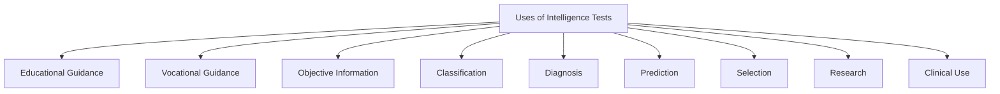
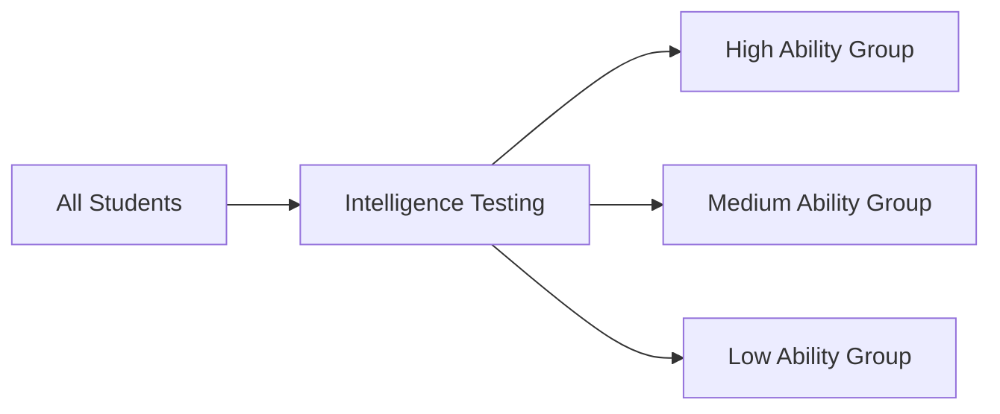

# 4:09 Uses of Intelligence Tests

!!! info "Information"
    Intelligence tests serve multiple purposes in educational, clinical, and organizational settings. Understanding these applications helps educators and psychologists utilize these tools effectively.

---

## Applications of Intelligence Tests

---

## Detailed Uses

### 1. Educational and Vocational Guidance

!!! note "Key Points 📌"
    Intelligence tests help in providing **educational and vocational guidance** to students.

| Application | Description |
|-------------|-------------|
| **Educational Guidance** | Helping students choose appropriate courses and educational paths |
| **Vocational Guidance** | Assisting in career selection based on abilities |

---

### 2. Objective Information

!!! note "Key Points 📌"
    They give the **most valuable objective information** regarding level and quality of mental abilities of children.

| Benefit | Description |
|---------|-------------|
| **Objectivity** | Unbiased assessment of abilities |
| **Quality Information** | Detailed insights into mental capabilities |
| **Level Assessment** | Understanding the degree of intelligence |

---

### 3. Classification of Students

!!! note "Key Points 📌"
    They help in **classifying students into homogeneous groups** of ability or performance.

| Purpose | Benefit |
|---------|---------|
| **Homogeneous Grouping** | Easier instruction planning |
| **Ability-based Classes** | Tailored teaching methods |
| **Performance Groups** | Appropriate challenge levels |

---

### 4. Diagnosing Causes of Backwardness

!!! note "Key Points 📌"
    They help in **diagnosing the causes for backwardness** in students.

| Application | Description |
|-------------|-------------|
| **Identification** | Finding students who are struggling |
| **Cause Analysis** | Understanding why students are behind |
| **Intervention Planning** | Developing appropriate remedial measures |

---

### 5. Predicting Future Progress

!!! note "Key Points 📌"
    They help in **predicting future progress** of students.

| Use | Description |
|-----|-------------|
| **Academic Forecasting** | Estimating future academic performance |
| **Potential Assessment** | Understanding student capabilities |
| **Planning** | Preparing appropriate educational programs |

---

### 6. Selection for Different Jobs

!!! note "Key Points 📌"
    They are useful in **selecting individuals for different jobs**.

| Application Area | Description |
|-----------------|-------------|
| **Employment Screening** | Assessing job candidates |
| **Role Matching** | Matching abilities to job requirements |
| **Promotion Decisions** | Identifying potential for advancement |

---

### 7. Research in Psychology and Education

!!! note "Key Points 📌"
    They are used in **research in Psychology and Education**.

| Research Area | Application |
|---------------|-------------|
| **Psychological Studies** | Understanding cognitive development |
| **Educational Research** | Studying learning and teaching effectiveness |
| **Comparative Studies** | Comparing groups across various parameters |

---

### 8. Clinical and Hospital Use

!!! note "Key Points 📌"
    They are used in **clinics and mental hospitals** in order to record the effectiveness of the treatment.

| Clinical Application | Description |
|---------------------|-------------|
| **Baseline Assessment** | Measuring initial cognitive status |
| **Treatment Monitoring** | Tracking changes during treatment |
| **Effectiveness Evaluation** | Recording treatment outcomes |

---

## Summary Table of Uses

| No. | Use | Setting | Purpose |
|-----|-----|---------|---------|
| 1 | Educational & Vocational Guidance | Schools, Career Centers | Guide students in course and career selection |
| 2 | Objective Information | Educational Institutions | Assess mental abilities accurately |
| 3 | Student Classification | Schools | Create homogeneous ability groups |
| 4 | Diagnosis of Backwardness | Schools, Clinics | Identify causes of learning difficulties |
| 5 | Predicting Progress | Schools | Forecast academic achievement |
| 6 | Job Selection | Organizations | Select appropriate candidates |
| 7 | Research | Universities, Institutes | Advance psychological and educational knowledge |
| 8 | Clinical Assessment | Hospitals, Clinics | Evaluate treatment effectiveness |

---

!!! tip "Exam Tip 📝"
    Remember **8 uses** of intelligence tests: **G-O-C-D-P-S-R-C**
    - **G**uidance (Educational & Vocational)
    - **O**bjective Information
    - **C**lassification
    - **D**iagnosis
    - **P**rediction
    - **S**election
    - **R**esearch
    - **C**linical

!!! success "Summary"
    Intelligence tests have diverse applications spanning **education** (guidance, classification, diagnosis, prediction), **employment** (selection), **research**, and **clinical settings** (treatment monitoring). They provide valuable objective information about mental abilities that aids decision-making in multiple contexts.

---

> **Bridge →** While intelligence tests have many uses, they also have significant **limitations** that users must be aware of. Let's examine these limitations next.
