# 4:10 Limitations of Intelligence Tests

!!! warning "Limitation"
    Despite their usefulness, intelligence tests have significant limitations that must be considered when interpreting results and making decisions based on test scores.

---

## Key Limitations

### 1. Validity Concerns

!!! quote "Definition"
    It is really difficult to say that intelligence tests have **cent per cent validity** and they measure only **native mental capacity**.

| Issue | Description |
|-------|-------------|
| **Not 100% Valid** | Tests may not measure exactly what they claim to measure |
| **Native Capacity** | Unclear if they measure innate ability or learned skills |

---

### 2. Factors Affecting IQ Scores

!!! note "Key Points 📌"
    Several factors make us careful in **not fully accepting the computed IQ** as a true indication of pupil's mental worth.

| Factor | Description |
|--------|-------------|
| **Socio-cultural Differences** | Background variations affect performance |
| **Lack of Interest** | Motivation impacts test-taking |
| **Coaching** | Prior preparation can inflate scores |
| **Test Unreliability** | Tests may not give consistent results |
| **Testing Climate** | Environmental conditions affect performance |
| **Item Familiarity** | Previous exposure to similar items helps |
| **Emotional Interference** | Anxiety, stress affect performance |

---

### 3. Culture-Specificity

!!! warning "Limitation"
    Intelligence tests are also **culture-specific** and **not completely culture-fair**.

| Issue | Impact |
|-------|--------|
| **Cultural Bias** | Tests favor certain cultural groups |
| **Not Universal** | Items may not be equally relevant across cultures |
| **Socioeconomic Influence** | Higher groups may have advantages |

---

### 4. Measurement Scale Limitations

!!! note "Key Points 📌"
    Intelligence tests **cannot use scales which have a known zero point and equal intervals**.

```mermaid
flowchart LR
    subgraph PHYSICAL["Physical Measurement ✓"]
        A["Temperature Scale
        Known Zero Point
        Equal Intervals"]
    end
    
    subgraph INTELLIGENCE["Intelligence Tests ✗"]
        B["No True Zero Point
        Unequal Intervals"]
    end
```

### Implications of Scale Limitations

| Issue | Explanation |
|-------|-------------|
| **Zero Score ≠ Zero Intelligence** | A person who doesn't answer any item correctly is not necessarily totally lacking in intelligence |
| **Scores Not Proportional** | IQ of 140 does NOT represent twice the intelligence of IQ 70 |
| **Non-ratio Scale** | Only indicates relative position, not absolute amounts |

!!! example "Example"
    A derived score of **140 does not represent twice the intelligence** of a derived score of **70**; it simply represents **more intelligence**, not proportionally double.

---

### 5. External Factors Affecting Measured IQ

| Factor | Impact |
|--------|--------|
| **Testing Climate** | Room conditions, time of day, atmosphere |
| **Item Familiarity** | Previous exposure to test format or content |
| **Emotional State** | Anxiety, excitement, depression |

---

## Summary of All Limitations

| No. | Limitation | Key Concern |
|-----|------------|-------------|
| 1 | **Validity Issues** | Not 100% valid; may not measure native capacity |
| 2 | **Socio-cultural Differences** | Background affects scores |
| 3 | **Lack of Interest/Coaching** | Motivation and preparation bias |
| 4 | **Test Unreliability** | Inconsistent results possible |
| 5 | **Culture-Specific** | Not completely culture-fair |
| 6 | **No True Zero Point** | Zero score ≠ zero intelligence |
| 7 | **Non-proportional Scores** | 140 IQ ≠ twice of 70 IQ |
| 8 | **Testing Climate Effects** | Environment affects performance |
| 9 | **Emotional Interference** | Feelings impact test-taking |

---

## Visual Summary

```mermaid
flowchart TB
    subgraph LIMITATIONS["⚠️ Limitations of Intelligence Tests"]
        subgraph VALIDITY["Validity Issues"]
            V1[Not 100% Valid]
            V2[May Not Measure Native Capacity]
        end
        
        subgraph FACTORS["Affecting Factors"]
            F1[Socio-cultural]
            F2[Interest/Motivation]
            F3[Coaching]
            F4[Testing Climate]
            F5[Emotional State]
        end
        
        subgraph SCALE["Scale Problems"]
            S1[No True Zero]
            S2[Non-proportional]
            S3[Culture-Specific]
        end
    end
    
    LIMITATIONS --> CAUTION["⚠️ Use with Caution
    Do not fully accept IQ as
    true mental worth"]
```

---

!!! tip "Exam Tip 📝"
    Remember the **5 key limitation categories**:
    1. **Validity** concerns
    2. **Cultural** specificity
    3. **Scale** limitations (no zero, non-proportional)
    4. **External factors** (climate, emotions, familiarity)
    5. **Individual factors** (interest, coaching, socio-cultural background)

!!! success "Summary"
    Intelligence tests, while useful, have significant limitations including questionable validity, cultural bias, scale measurement issues, and susceptibility to external factors. Educators and psychologists should interpret IQ scores cautiously and consider them as **one indicator among many**, not as definitive measures of mental worth.

---

> **Bridge →** To address the cultural bias in intelligence tests, researchers have developed **Culture-Fair Tests**. Let's explore these in the next section.
