# 4:11 Culture-Fair Tests

!!! info "Information"
    To address the cultural bias inherent in most intelligence tests, researchers have attempted to construct tests that are equally fair to individuals from different cultural backgrounds.

---

## The Problem of Cultural Bias

!!! warning "Limitation"
    Most intelligence tests are **culture-specific** and the items often **favor socio-economic groups** which the test conductor is linked to. This bias may not be conscious but is present.

### Key Issues with Traditional Tests

| Issue | Description |
|-------|-------------|
| **Cultural Specificity** | Tests designed for one culture may not be valid for others |
| **Unconscious Bias** | Test creators unknowingly include culturally specific content |
| **Assumed Knowledge** | Matters taken for granted in one culture cannot be taken for granted in another |
| **Sub-culture Issues** | Applies equally to deprived sub-cultures within advanced cultures in the same society |
| **Speed Emphasis** | Mental tests emphasize speed, but in non-competitive cultures, **speed is not valued as much as slowness** |

---

## What Are Culture-Fair Tests?

!!! quote "Definition"
    **Culture-fair tests** (also called "culture-free" tests) are intelligence tests that are designed to be **equally applicable to children of different cultures** as well as socio-economic levels, minimizing the influence of cultural background on test performance.

```mermaid
flowchart TB
    subgraph PROBLEM["❌ Traditional Tests"]
        T1[Cultural Bias]
        T2[Language Dependent]
        T3[Culture-Specific Content]
        T4[Speed Emphasis]
    end
    
    subgraph SOLUTION["✅ Culture-Fair Tests"]
        C1[Minimal Cultural Bias]
        C2[Non-Verbal Items]
        C3[Universal Patterns]
        C4[Fair Across Groups]
    end
    
    PROBLEM -->|"Attempt to Address"| SOLUTION
```

---

## Examples of Culture-Fair Tests

### 1. Cattell's Culture-Fair Intelligence Tests

!!! note "Key Points 📌"
    Tests devised by **Cattell** consist of items that minimize cultural influence.

| Item Type | Description |
|-----------|-------------|
| **Classification** | Grouping items based on common features |
| **Completion of Series** | Identifying patterns and completing sequences |
| **Matrices** | Finding relationships in visual patterns |
| **Spatial Perception** | Understanding spatial relationships |

---

### 2. Raven's Progressive Matrices

!!! note "Key Points 📌"
    **Raven's Progressive Matrices** is one of the most widely recognized culture-fair tests.

| Feature | Description |
|---------|-------------|
| **Content** | Figures and designs only (no words) |
| **Task** | Subject apprehends relationship between figures |
| **Selection** | Selects appropriate part for completion of each pattern |
| **Principle** | Based on system of relations, not cultural knowledge |

### How Raven's Matrices Work

---

## Features of Culture-Fair Tests

| Feature | Purpose |
|---------|---------|
| **Non-verbal Content** | Eliminates language barriers |
| **Abstract Patterns** | Avoids culturally specific knowledge |
| **Universal Stimuli** | Uses figures, shapes, designs accessible to all |
| **Minimal Speed Emphasis** | Reduces bias against non-competitive cultures |
| **No Reading Required** | Accessible to illiterate individuals |

---

## Comparison: Traditional vs Culture-Fair Tests

| Aspect | Traditional Tests | Culture-Fair Tests |
|--------|------------------|-------------------|
| **Language** | Language-dependent | Non-verbal |
| **Content** | Culture-specific items | Abstract patterns |
| **Knowledge Base** | Assumes certain background | Universal patterns |
| **Speed Emphasis** | High | Reduced |
| **Applicability** | Specific cultural group | Multiple cultures |
| **Examples** | Stanford-Binet, WAIS | Cattell's Tests, Raven's Matrices |

---

## Limitations of Culture-Fair Tests

!!! warning "Limitation"
    While culture-fair tests attempt to minimize bias, they are **not completely free from cultural influence**.

| Limitation | Description |
|------------|-------------|
| **Not Truly Culture-Free** | Some cultural influence remains |
| **Test-Taking Experience** | Familiarity with testing situations varies |
| **Motivation** | Cultural attitudes toward testing differ |
| **Abstract Thinking** | May still favor certain cognitive styles |

---

## Summary

```mermaid
flowchart TB
    subgraph CULTUREFAIR["Culture-Fair Tests"]
        PURPOSE["Purpose: Minimize Cultural Bias"]
        
        CATTELL["Cattell's Tests
        • Classification
        • Series Completion
        • Matrices
        • Spatial Perception"]
        
        RAVEN["Raven's Progressive Matrices
        • Figures & Designs
        • Relationship Recognition
        • Pattern Completion"]
    end
    
    PURPOSE --> CATTELL
    PURPOSE --> RAVEN
    
    CATTELL --> FAIR["More Fair Across
    Cultures & SES Levels"]
    RAVEN --> FAIR
```

!!! tip "Exam Tip 📝"
    Remember the **two main culture-fair tests**:
    1. **Cattell's Tests** - Classification, Series, Matrices, Spatial
    2. **Raven's Progressive Matrices** - Figures and designs, relationship apprehension

!!! success "Summary"
    - Traditional tests are **culture-specific** with unconscious bias
    - **Culture-fair tests** attempt to minimize cultural influence
    - **Cattell's tests** use classification, series completion, matrices, and spatial perception
    - **Raven's Progressive Matrices** uses figures and designs requiring relationship recognition
    - These tests are **applicable across different cultures and socio-economic levels**
    - No test is completely "culture-free" but these minimize bias significantly

---

> **Bridge →** Having completed our exploration of intelligence, let's now shift our focus to **Creativity** - another crucial cognitive construct in educational psychology.
