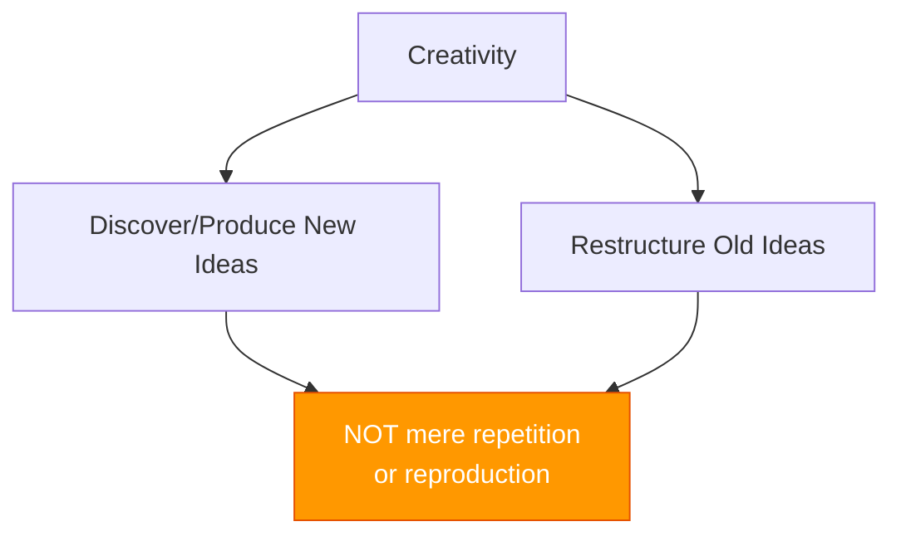
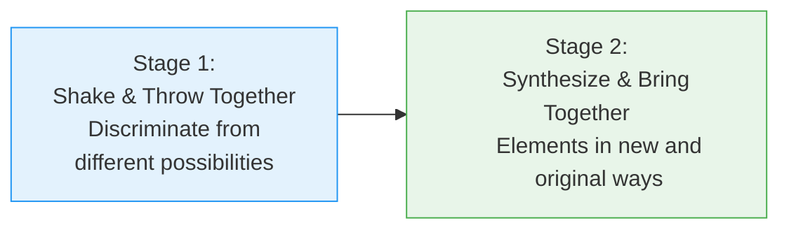
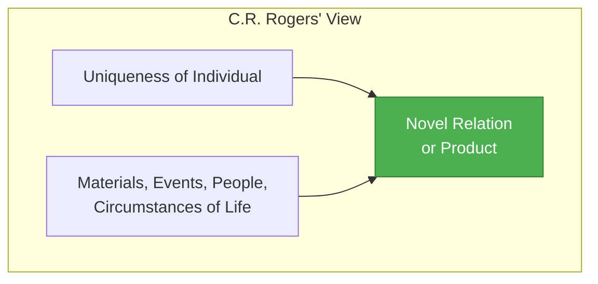
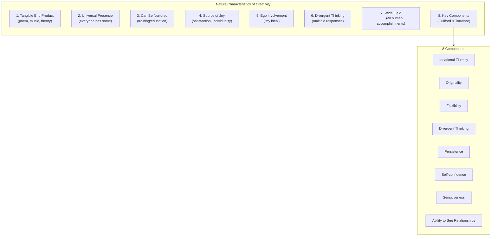

# 4:12 Meaning of 'Creativity'

!!! info "Information"
    Creativity is a fundamental cognitive ability that distinguishes humans from other beings. Understanding creativity is essential for educators to foster innovative thinking in students.

---

## Basic Definition

!!! quote "Definition"
    **Creativity** is the **capacity of the individual to discover or produce new ideas**. It may also include **restructuring or rearranging the old idea**. The only precaution for renaming an expression as creative is that it should **not be a mere repetition or reproduction** of what has already been experienced or learned.

---

## Definitions by Prominent Psychologists

### 1. Ausubel's Definition

!!! quote "Definition"
    **Ausubel** defines creativity as "a **rare capacity for developing insights, sensitivities and appreciations** in a circumscribed content area of intellectual or artistic activities".

| Element | Meaning |
|---------|---------|
| **Rare Capacity** | Not common to everyone |
| **Insights** | Deep understanding |
| **Sensitivities** | Awareness of nuances |
| **Appreciations** | Valuing ideas and forms |
| **Circumscribed Area** | Specific domain of activity |

---

### 2. Torrance's Definition

!!! quote "Definition"
    **Torrance** speaks of creativity as "a **mental process of seeing or creating most unforeseen and novel relationships** between two or more things or ideas".

### Torrance's Two-Stage Process

| Stage | Description |
|-------|-------------|
| **Stage 1** | Shake and throw things together; discriminate from a variety of different possibilities |
| **Stage 2** | Synthesize and bring together elements in new and original ways |

---

### 3. Bruner's Definition

!!! quote "Definition"
    **Bruner** states that "all forms of creativity grow out of a **combinational activity**, a placing of things in **new perspective**".

| Key Concept | Meaning |
|-------------|---------|
| **Combinational Activity** | Bringing different elements together |
| **New Perspective** | Viewing things differently |

---

### 4. Drevdahl's Definition

!!! quote "Definition"
    **Drevdahl** defines creativity as "the **capacity of a person to produce compositions, products or ideas** which are essentially **new or novel** and **previously unknown to the producer**".

| Element | Meaning |
|---------|---------|
| **Compositions** | Literary, musical, artistic works |
| **Products** | Physical creations |
| **Ideas** | Mental constructs |
| **New/Novel** | Original, unprecedented |
| **Previously Unknown** | Not known to the creator before |

---

### 5. C.R. Rogers' Definition

!!! quote "Definition"
    **C.R. Rogers** states: "Creative process is the **emergence in action of a novel relation or product**, growing out of the **uniqueness of the individual** on the one hand, and the **materials, events, people or circumstances** of his life on the other".

---

## Summary of Definitions

| Psychologist | Key Focus | Definition Emphasis |
|--------------|-----------|---------------------|
| **Ausubel** | Rare capacity | Insights, sensitivities, appreciations |
| **Torrance** | Mental process | Novel relationships, two-stage process |
| **Bruner** | Combinational activity | New perspective |
| **Drevdahl** | Capacity to produce | New compositions, products, ideas |
| **C.R. Rogers** | Emergence in action | Individual uniqueness + life circumstances |

---

## 4:12:1 Nature (Characteristics) of Creativity

### 1. Tangible End Product

!!! note "Key Points 📌"
    The end product of creative thinking should be **something tangible** such as a poem, a piece of music, a scientific theory, or a new mechanical or electrical contrivance.

---

### 2. Universal Presence

!!! note "Key Points 📌"
    **Everyone possesses creative powers to some degree**. Creativity is not limited to geniuses.

---

### 3. Can Be Nurtured

!!! note "Key Points 📌"
    Although creative abilities are **natural endowments**, yet they are capable of being **nourished or nurtured by training or education**.

---

### 4. Source of Joy and Satisfaction

!!! note "Key Points 📌"
    Any creative expression is a **source of joy and satisfaction** to the creator. There is **perfect individuality** in one's creative expression.

---

### 5. Complete Ego Involvement

!!! note "Key Points 📌"
    The creator makes **ego-involved statements** like "It is my idea", "I have solved the problem". In creative expression, there is **complete ego involvement**.

---

### 6. Divergent Thinking

!!! note "Key Points 📌"
    Creativity involves **divergent thinking**, having **freedom for multiplicity of responses**, choices, and lines of action. By travelling on the routine, beaten track one cannot create but only reproduce or repeat.

---

### 7. Wide Field of Expression

!!! note "Key Points 📌"
    The field of creative expression is **very wide**, covering all aspects of human accomplishments.

| Domain | Examples |
|--------|----------|
| **Science** | Inventions and discoveries |
| **Literature** | Poems, stories, dramas |
| **Arts** | Dance, music, painting, sculpture |
| **Leadership** | Political and social innovation |
| **Professions** | Business, teaching, and other fields |

---

### 8. Components of Creativity (Guilford & Torrance)

!!! tip "Exam Tip 📝"
    **Important components of creativity** as identified by **J.P. Guilford and Torrance**:

| Component | Description |
|-----------|-------------|
| **i) Ideational Fluency** | Generating many ideas |
| **ii) Originality** | Producing unique ideas |
| **iii) Flexibility** | Shifting between different approaches |
| **iv) Divergent Thinking** | Exploring multiple possibilities |
| **v) Persistence** | Continuing despite obstacles |
| **vi) Self-confidence** | Believing in one's abilities |
| **vii) Sensitiveness** | Awareness of problems and nuances |
| **viii) Ability to see relationships** | Making associations between ideas |

---

## Visual Summary of Creativity Characteristics

---

## Creativity vs Reproduction

| Aspect | Creativity | Reproduction |
|--------|------------|--------------|
| **Nature** | Novel, original | Repetition of known |
| **Thinking** | Divergent | Convergent |
| **Process** | New combinations | Following patterns |
| **Output** | Something new | Copy of existing |
| **Approach** | Multiple possibilities | Single correct answer |

---

!!! success "Summary"
    - **Creativity** is the capacity to discover or produce new ideas, or restructure old ones
    - Multiple psychologists (**Ausubel, Torrance, Bruner, Drevdahl, Rogers**) have defined creativity
    - **8 characteristics** define creative expression: tangible output, universal presence, can be nurtured, source of joy, ego involvement, divergent thinking, wide field, key components
    - **8 components** of creativity by Guilford & Torrance: fluency, originality, flexibility, divergent thinking, persistence, self-confidence, sensitiveness, relationship recognition

---

> **Bridge →** Understanding what creativity is leads us to examine the **stages in the creative process** - how creative ideas actually develop.
