# 4:13 Stages in the Process of Creative Thinking

!!! info "Information"
    **Graham Wallas** and **Patrick** (independently) have identified **four stages of creativity**. Understanding these stages helps educators and individuals nurture the creative process.

---

## The Four Stages of Creativity

```mermaid
flowchart LR
    A["1. PREPARATION
    📚"] --> B["2. INCUBATION
    💭"]
    B --> C["3. ILLUMINATION
    💡"]
    C --> D["4. VERIFICATION
    ✓"]
    
    style A fill:#e3f2fd,stroke:#2196f3
    style B fill:#fff3e0,stroke:#ff9800
    style C fill:#c8e6c9,stroke:#4caf50
    style D fill:#f3e5f5,stroke:#9c27b0
```

| Stage | Key Process | Characteristic |
|-------|-------------|----------------|
| **Preparation** | Problem definition, gathering materials | Purposeful study and hard work |
| **Incubation** | Subconscious processing | Rest, no active work on problem |
| **Illumination** | Sudden insight | "Aha!" moment |
| **Verification** | Testing and revision | Evaluation and refinement |

---

## Stage 1: Preparation

!!! note "Key Points 📌"
    In the preparation stage, the **problem is defined and explained**. It involves **purposeful study, discussion with others**, and **acquisition of facts**.

### Activities in Preparation Stage

| Activity | Description |
|----------|-------------|
| **Problem Definition** | Clearly stating what needs to be solved |
| **Orientation** | Understanding the problem context |
| **Purposeful Study** | Deliberate learning about the topic |
| **Discussion** | Consulting with others |
| **Fact Gathering** | Collecting relevant information |
| **Plan Formulation** | Developing an action plan |

### Key Insight

!!! tip "Exam Tip 📝"
    **"Perspiration, rather than inspiration is proper preparation"** - Creative work is largely work of diligence and industry.

!!! example "Example"
    No painter, poet, scientist, or novelist has reached great eminence overnight. Almost every creative thinker reports that he **worked laboriously during his early days**.

---

## Stage 2: Incubation

!!! note "Key Points 📌"
    This stage is characterized by **no overt behavior**. During this stage, one can **rest, sleep, or work on another problem**.

### Characteristics of Incubation

| Feature | Description |
|---------|-------------|
| **No Active Work** | Not consciously working on the problem |
| **Rest Period** | May involve sleep or relaxation |
| **No New Knowledge** | Nothing is added (like incubating an egg - only kept warm) |
| **No External Disturbance** | Mind is allowed to process freely |
| **Subconscious Processing** | Mind continues working unconsciously |

### The Egg Analogy

!!! example "Example"
    Just as **nothing is added to the egg but only it is kept warm**, so during incubation **no new knowledge or experience is added** to the existing stock.

### Common Experience

!!! info "Information"
    We sometimes forget an important name. If recalling is **postponed**, later on it comes to our mind spontaneously.

### Important Warnings

!!! warning "Limitation"
    - **Hurry and compulsion are fatal to creativity**
    - In incubation, **the mind is relaxed**
    - If incubation is **hastened**, it will result in **abortion** (failure of creative process)

---

## Stage 3: Illumination

!!! note "Key Points 📌"
    Incubation leads to illumination. During this stage, there is the **sudden appearance of the solution** to the problem.

### Characteristics of Illumination

| Feature | Description |
|---------|-------------|
| **Sudden Insight** | Solution appears unexpectedly |
| **"Aha!" Moment** | Flash of understanding |
| **Dawn of Insight** | Like light suddenly appearing |
| **Any Time** | May occur any time, even during dreams |

### Example from Kohler's Experiment

!!! example "Example"
    In **Kohler's chimpanzee experiments**, there was the **sudden dawn of insight**, resulting in the connection of the sticks with the fruit. This demonstrates illumination - the sudden appearance of the solution.

```mermaid
flowchart LR
    A["Incubation
    (Subconscious Processing)"] --> B["💡 ILLUMINATION
    Sudden Insight
    'Aha!' Moment"]
    B --> C["Solution Appears
    Problem Solved"]
    
    style B fill:#ffeb3b,stroke:#f57f17,color:#000
```

---

## Stage 4: Verification

!!! note "Key Points 📌"
    The final stage where we **determine whether the solution is correct** or not. Sometimes the solution needs **modification**.

### Activities in Verification

| Activity | Description |
|----------|-------------|
| **Evaluation** | Assessing the solution's correctness |
| **Testing** | Checking if the solution works |
| **Modification** | Making necessary changes |
| **Revision** | Refining until solution is workable |

### Process Flow

```mermaid
flowchart TB
    V["VERIFICATION"] --> E["Evaluate Solution"]
    E --> Q{"Is Solution
    Correct?"}
    Q -->|Yes| W["Workable Solution ✓"]
    Q -->|No| M["Modify/Revise"]
    M --> E
```

---

## Important Notes About the Stages

!!! warning "Limitation"
    These stages should **not be considered as rigid and fixed**.

| Variation | Description |
|-----------|-------------|
| **Skipping Stages** | One may get illumination without passing through incubation |
| **Repetition** | In certain cases, the cycle has to be repeated till the solution is found |
| **Non-linear** | Process may not always follow the exact sequence |

### Key Principle

!!! tip "Exam Tip 📝"
    **Creativity as a natural endowment needs stimulation and nourishment** - it must be actively cultivated, not left to chance.

---

## Complete Creative Process Diagram

---

## Summary Table

| Stage | Key Activity | Mindset | Duration |
|-------|--------------|---------|----------|
| **1. Preparation** | Define, gather, study, plan | Active, deliberate | Variable - can be long |
| **2. Incubation** | Rest, relax, do other things | Passive, relaxed | Variable - should not be rushed |
| **3. Illumination** | Insight occurs | Receptive | Momentary - "flash" |
| **4. Verification** | Test, modify, refine | Critical, analytical | Variable - until workable |

!!! tip "Exam Tip 📝"
    **Mnemonic for 4 stages**: **P-I-I-V** = **P**reparation → **I**ncubation → **I**llumination → **V**erification
    
    Or remember: **"Prepare, Incubate (like an egg), Illuminate (light bulb moment), Verify (check)"**

!!! success "Summary"
    - **Four stages** of creative thinking: Preparation, Incubation, Illumination, Verification
    - **Preparation**: Hard work, fact gathering, problem definition
    - **Incubation**: Rest period, subconscious processing (don't rush!)
    - **Illumination**: Sudden insight, "Aha!" moment
    - **Verification**: Testing and refining the solution
    - Stages are **not rigid** - may skip, repeat, or vary

---

> **Bridge →** Now that we understand how creativity develops, let's examine the key **differences between intelligence and creativity**.
