# 4:14 Differences Between Intelligence and Creativity

!!! info "Information"
    While intelligence and creativity are related cognitive constructs, they have significant differences in their nature, measurement, and manifestation. Understanding these differences is crucial for educators.

---

## Key Differences

### 1. Type of Thinking

!!! note "Key Points 📌"
    **Convergent thinking** is the basis of intelligence, whereas **divergent thinking** forms the basis of creativity.

```mermaid
flowchart TB
    subgraph INTELLIGENCE["🧠 INTELLIGENCE"]
        I1["Convergent Thinking"]
        I2["Stimulus Bound"]
        I3["Limited to Data Given"]
        I4["One Most Appropriate Response"]
        I5["Follows Tradition & Rules of Logic"]
    end
    
    subgraph CREATIVITY["💡 CREATIVITY"]
        C1["Divergent Thinking"]
        C2["Stimulus Free"]
        C3["Goes Beyond Data"]
        C4["Many Possible Responses"]
        C5["Originality & Novel Approaches"]
    end
    
    INTELLIGENCE ---|vs| CREATIVITY
```

| Aspect | Intelligence (Convergent) | Creativity (Divergent) |
|--------|--------------------------|----------------------|
| **Thinking Type** | Convergent | Divergent |
| **Stimulus Relationship** | Stimulus bound | Stimulus free |
| **Data Handling** | Limited to data given | Goes beyond the data |
| **Response Pattern** | One most appropriate/socially approved response | Many possible responses |
| **Approach** | Follows tradition and rules of logic | Seeks originality |

### Definition of Thinking Types

!!! quote "Definition"
    - **Divergent thinking** is stimulus free and often goes beyond the data - searches for **many possible responses** for a given stimulus
    - **Convergent thinking** is stimulus bound and limited to data given - seeks the **one most appropriate** or socially approved response

---

### 2. Relationship Between Intelligence and Creativity

!!! note "Key Points 📌"
    It has been observed that:
    - **Highly creative persons** are usually found to possess **intelligence to a high degree**
    - But it is **not essential** for an intelligent person to be creative
    - An **adequate level of intelligence** is a **necessary condition** for being creative

```mermaid
flowchart TB
    subgraph RELATIONSHIP["Relationship"]
        A["High Creativity"] --> B["Usually High Intelligence ✓"]
        C["High Intelligence"] -.->|"NOT necessarily"| D["Creativity"]
        E["Adequate Intelligence"] --> F["Necessary for Creativity"]
        G["Mental Retardation"] --> H["Cannot be Creative ✗"]
    end
```

| Observation | Implication |
|-------------|-------------|
| Highly creative → usually highly intelligent | Creativity builds on intelligence |
| Highly intelligent ≠ necessarily creative | Intelligence alone insufficient |
| Adequate intelligence required for creativity | Minimum threshold needed |
| Mentally retarded cannot be creative | Basic cognitive ability essential |

!!! tip "Exam Tip 📝"
    **Key insight**: One may possess **high intelligence without creative abilities**, but one **cannot be creative without adequate intelligence**.

---

### 3. Measurement Emphasis

!!! note "Key Points 📌"
    The emphasis in measurement differs significantly between intelligence and creativity tests.

| Measurement Aspect | Intelligence Tests | Creativity Tests |
|-------------------|-------------------|-----------------|
| **Speed** | Emphasized | Not primary focus |
| **Accuracy** | Emphasized | Less important |
| **Novelty** | Not measured | Major criterion |
| **Flexibility** | Not measured | Key component |
| **Originality** | Not measured | Highly valued |
| **Fluency** | Limited scope | Essential measure |
| **Elaboration** | Not primary | Important criterion |

---

## Correlation Between Intelligence and Creativity

!!! note "Key Points 📌"
    Intelligence and creativity are **related (having low positive correlation)** but **not synonymous**.

---

## Comprehensive Comparison Table

| Aspect | Intelligence | Creativity |
|--------|--------------|------------|
| **Basis** | Convergent thinking | Divergent thinking |
| **Stimulus** | Bound to stimulus | Free from stimulus |
| **Data** | Limited to given data | Goes beyond data |
| **Response** | One correct answer | Multiple possibilities |
| **Approach** | Logic and tradition | Novelty and originality |
| **Test Focus** | Speed and accuracy | Novelty, flexibility, originality, fluency, elaboration |
| **Relationship** | Can exist without creativity | Requires adequate intelligence |
| **Correlation** | Low positive correlation | Low positive correlation |

---

## Visual Summary

---

## Key Takeaways

!!! success "Summary"
    1. **Thinking Basis**: Intelligence uses **convergent thinking** (one answer); Creativity uses **divergent thinking** (many possibilities)
    
    2. **Relationship**:
        - Highly creative → usually highly intelligent ✓
        - Highly intelligent → NOT necessarily creative ✗
        - Adequate intelligence → necessary for creativity ✓
        - Mentally retarded → cannot be creative ✗
    
    3. **Measurement**: Intelligence tests emphasize **speed and accuracy**; Creativity tests emphasize **novelty, flexibility, originality, fluency, elaboration**
    
    4. **Correlation**: Intelligence and creativity have a **low positive correlation** - they are **related but not synonymous**

!!! tip "Exam Tip 📝"
    **Quick Memory Points**:
    - **I**ntelligence = **C**onvergent = **O**ne answer (I-C-O)
    - **C**reativity = **D**ivergent = **M**any answers (C-D-M)
    - **Relationship**: Creative→Intelligent (Yes), Intelligent→Creative (Not necessarily)

---

> **Bridge →** Understanding these differences helps us in **identifying creative children** through appropriate methods. Let's explore identification techniques next.
