# 4:15 Identification of the Creative Children

!!! info "Information"
    The term **'creativity' cannot be used synonymously with giftedness**. Creativity in all its shapes and forms is the **highest expression of giftedness** that may or may not be found in a particular gifted child.

---

## Two Approaches to Identification

Creative children can be identified by employing either of two approaches:

| Approach | Methods Used |
|----------|--------------|
| **Testing** | Standardized creativity tests |
| **Non-Testing** | Observation, interview, rating scale, personality inventory, check lists |

---

## 4:15:1 Use of Tests of Creativity

!!! note "Key Points 📌"
    Today there are many **specific tests available for assessing creativity**.

### Notable Creativity Tests

| Test | Developer |
|------|-----------|
| **Minnesota Tests of Creative Thinking** | Paul Torrance |
| **Remote Associative Test** | Various |
| **Wallach and Kogan's Creativity Instruments** | Wallach & Kogan |
| **Guilford's Test of Creativity** | J.P. Guilford |
| **Test of Creative Thinking** | Baquer Mehdi |

---

### Types of Test Items

Creativity tests generally employ **verbal and non-verbal items**.

#### Verbal Items

| No. | Item Type | Example |
|-----|-----------|---------|
| 1 | **Unusual Uses** | Unusual uses of ordinary things like a tin can or a cardboard box |
| 2 | **Possible Consequences** | Possible consequences of an impossible event (e.g., if sunlight is a liquid) |
| 3 | **Improvement Ideas** | Producing ideas for improving a toy to increase the fun for children |

#### Non-Verbal Items

| No. | Item Type | Description |
|-----|-----------|-------------|
| a | **Picture Construction Test** | Creating pictures from given materials |
| b | **Incomplete Figures** | Incomplete figures to be completed creatively |
| c | **Cut-outs** | Using cut-outs repeatedly to produce new figures |

---

### Sample Creativity Test Structure

```mermaid
flowchart TB
    subgraph VERBAL["📝 Verbal Items"]
        V1["Unusual Uses
        (tin can, cardboard box)"]
        V2["Impossible Events
        (if sunlight were liquid)"]
        V3["Improvement Ideas
        (making toys more fun)"]
    end
    
    subgraph NONVERBAL["🎨 Non-Verbal Items"]
        N1["Picture Construction"]
        N2["Incomplete Figures
        to Complete"]
        N3["Cut-outs for
        New Figures"]
    end
    
    VERBAL --> TEST["Creativity Test"]
    NONVERBAL --> TEST
```

---

## 4:15:2 Use of Non-Testing Techniques

!!! note "Key Points 📌"
    The following **external characteristics** are spotted in creative individuals:

### External Characteristics of Creative Individuals

| No. | Characteristic | Description |
|-----|----------------|-------------|
| i | **Keen Observation** | Sharp attention to details in environment |
| ii | **Total Devotion** | Indulge in activities with complete dedication |
| iii | **Desire to Listen** | Keen desire to listen to others |
| iv | **Using Analogies** | Use analogies much in their speech |
| v | **Energetic & Enthusiastic** | Spend a lot of time in reading, writing, drawing, etc. |
| vi | **Critical Acceptance** | Not readily accepting what others say |
| vii | **Multiple Perspectives** | Examining presented ideas from different angles |
| viii | **Verbal Fluency** | Ease in expressing ideas verbally |
| ix | **Richness of Ideas** | Flow of ideas and speed in associating disconnected ideas |
| x | **Flexible & Adaptive** | Flexible in free atmosphere but restive under rigid conditions |
| xi | **Open Expression** | Exhibiting feelings and emotions openly; expressing ideas however bizarre |
| xii | **Low Distractibility** | Maintain focus despite distractions |
| xiii | **Always Puzzled** | Always puzzled about something and absorbed in thinking |
| xiv | **Unconventional Acceptance** | Never cast aside a solution merely because it looks unconventional or foolish |
| xv | **Seek Multiple Solutions** | Not satisfied with a single solution; seek other possibilities |

---

### Visual Map of Creative Characteristics

---

### Categorized Characteristics Table

| Category | Characteristics |
|----------|-----------------|
| **Observation & Perception** | Keen observation, examines from different angles |
| **Engagement** | Total devotion, energetic, enthusiastic |
| **Communication** | Verbal fluency, uses analogies, desire to listen |
| **Thinking Style** | Always puzzled, richness of ideas, associating disconnected ideas |
| **Openness** | Open expression, accepts unconventional ideas |
| **Critical Thinking** | Not readily accepting, seeks multiple solutions |
| **Focus** | Low distractibility, absorbed in thinking |
| **Adaptability** | Flexible in free atmosphere, restive under rigidity |

---

## Comparison: Testing vs Non-Testing Methods

| Aspect | Testing Methods | Non-Testing Methods |
|--------|----------------|---------------------|
| **Type** | Standardized tests | Observation, interviews, checklists |
| **Format** | Verbal and non-verbal items | Behavioral indicators |
| **Administration** | Formal setting | Natural settings |
| **Objectivity** | More objective | More subjective |
| **Time** | Fixed duration | Ongoing observation |
| **Examples** | Torrance's MTCT, Guilford's tests | Rating scales, personality inventories |

---

## Summary of 15 External Characteristics

!!! tip "Exam Tip 📝"
    **Mnemonic for remembering characteristics**: 
    **"KATE NEVER FAILS"**
    - **K**een observation
    - **A**nalogies in speech
    - **T**otal devotion
    - **E**nergetic & enthusiastic
    - **N**ot readily accepting (critical)
    - **E**xamining from different angles
    - **V**erbal fluency
    - **E**xpressions (open, even bizarre)
    - **R**ichness of ideas
    - **F**lexible & adaptive
    - **A**lways puzzled
    - **I**deal (unconventional) not rejected
    - **L**ow distractibility
    - **S**eek multiple solutions
    (Plus: Desire to listen)

---

!!! success "Summary"
    - **Creativity ≠ Giftedness**; creativity is the highest expression of giftedness
    - **Two approaches** to identify creative children:
        1. **Testing**: Torrance's MTCT, Wallach-Kogan, Guilford's tests, Baquer Mehdi's test
        2. **Non-Testing**: Observation of 15 external characteristics
    - **Verbal test items**: Unusual uses, impossible consequences, improvement ideas
    - **Non-verbal items**: Picture construction, incomplete figures, cut-outs
    - **15 observable characteristics** help identify creative individuals in natural settings

---

> **Bridge →** Once creative children are identified, the next step is to **foster and nurture their creativity**. Let's explore strategies for this in the final section.
