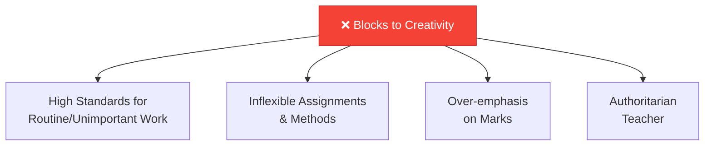
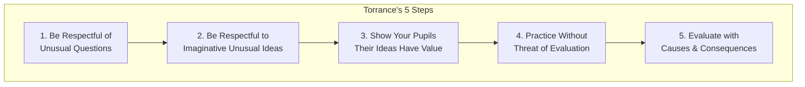
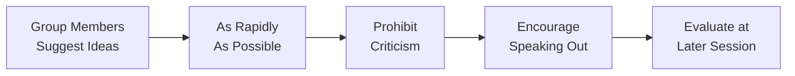
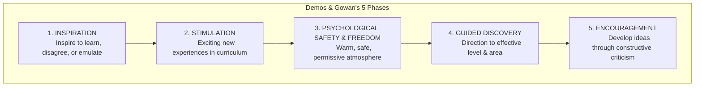
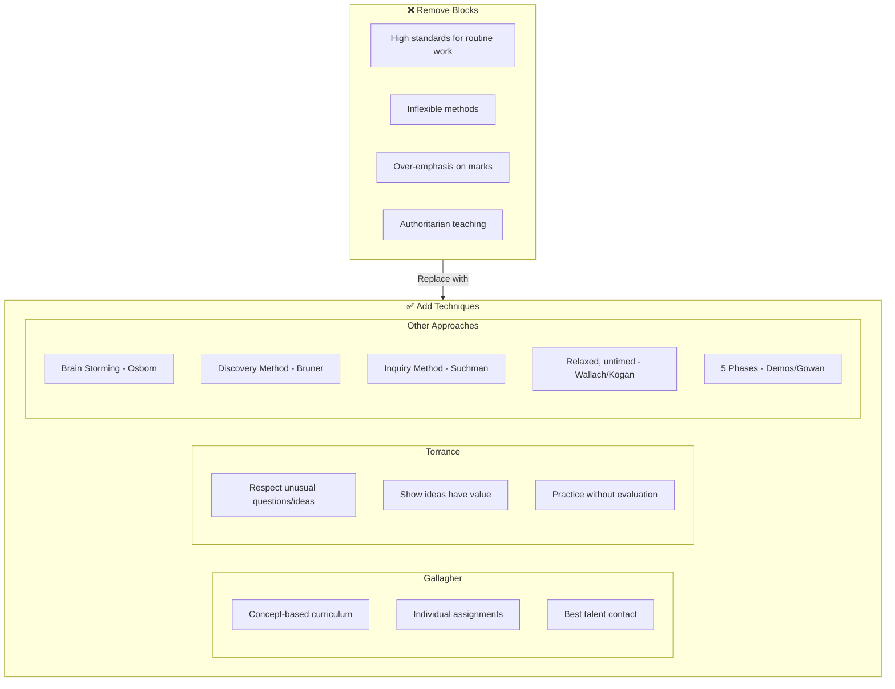

# 4:16 Fostering Creativity among Children

!!! info "Information"
    Creativity is an attribute that leads to solving problems in new ways. Therefore, educational objectives, methodology of learning, stimulating environment, and evaluative techniques all need to be reconstructed to develop creative abilities in students.

---

## Blocks to Creative Thinking

!!! warning "Limitation"
    The following are the **blocks to creative thinking** which have to be removed:

| Block | Description |
|-------|-------------|
| **a. High Standards for Routine Skills** | High standards of achievement for low levels of work such as routine skills or unimportant material |
| **b. Inflexibility** | Inflexibility of assignments and methods of work |
| **c. Over-emphasis on Marks** | Over-emphasis on school marks |
| **d. Authoritarian Teacher** | The authoritarian teacher who does not allow freedom |

---

## Gallagher's Suggestions for Developing Creativity

!!! note "Key Points 📌"
    **Gallagher** makes the following suggestions for the development of creativity of pupils:

| No. | Suggestion | Description |
|-----|------------|-------------|
| i | **Concept-based Curriculum** | Organize curriculum primarily on the basis of **concepts rather than facts** |
| ii | **Individual Assignments** | Allow more **individual assignments under competent supervision** |
| iii | **Best Talent Contact** | Bring students in contact with the **best talent and knowledge** from teaching staff |
| iv | **Truth-Seeking Philosophy** | Follow the philosophy that **truth is something to be sought for rather than revealed** |
| v | **Teacher Training** | Provide **in-service teacher education** for competence in subject mastery and teaching methods |

---

## Torrance's Five Steps for Fostering Creativity

!!! note "Key Points 📌"
    **Torrance** suggests **five steps** for fostering creativity among pupils:

### Detailed Explanation of Torrance's Steps

| Step | Action | Description |
|------|--------|-------------|
| **1** | Respect unusual questions | Welcome and encourage questions that seem odd |
| **2** | Respect unusual ideas | Value imaginative ideas even if unconventional |
| **3** | Show ideas have value | Demonstrate that student ideas are worthwhile |
| **4** | Practice without evaluation | Occasionally allow practice without grading pressure |
| **5** | Evaluate with consequences | Instead of "good/bad", point out what results follow; let children evaluate |

!!! tip "Exam Tip 📝"
    **Torrance's advice on evaluation**: Instead of saying "this is good" and "that is bad", **point out the consequences** that this and that lead to, and **let children evaluate** the goodness or badness of various results.

---

## Brain Storming Technique

!!! note "Key Points 📌"
    **Osborn (1963)** suggested the use of special technique called **"Brain Storming"** for facilitating the production of novel ideas.

### Brain Storming Process

| Feature | Description |
|---------|-------------|
| **Group Activity** | Members suggest ideas in a group setting |
| **Rapid Suggestions** | Ideas generated as quickly as possible |
| **No Criticism** | Criticism is prohibited during brainstorming |
| **Encouragement** | Speaking out is encouraged |
| **Delayed Evaluation** | Evaluation happens at a later session |

---

## Discovery and Inquiry Methods

!!! note "Key Points 📌"
    **Bruner** and **Suchman** suggest the use of **discovery and inquiry methods** in teaching to foster creativity.

| Approach | Proponent | Focus |
|----------|-----------|-------|
| **Discovery Method** | Bruner | Students discover knowledge themselves |
| **Inquiry Method** | Suchman | Students ask questions and investigate |

---

## Wallach and Nathan Kogan's View

!!! note "Key Points 📌"
    **Wallach and Nathan Kogan** believe that the **gamelike, relaxed, untimed and non-evaluative situation** is necessary for the fullest expression of creativity.

| Condition | Benefit |
|-----------|---------|
| **Gamelike** | Reduces stress, increases enjoyment |
| **Relaxed** | Allows free thinking |
| **Untimed** | Removes pressure |
| **Non-evaluative** | Eliminates fear of judgment |

---

## Demos and Gowan's Five-Phase Approach

!!! note "Key Points 📌"
    **Demos and Gowan** held that the instructor's role in furthering student's creativity is a **protective and nurturing one** consisting of five phases:

### Detailed Phases

| Phase | Name | Description |
|-------|------|-------------|
| **1** | **Inspiration** | Inspire the student to learn, disagree, or emulate |
| **2** | **Stimulation** | Provide exciting and new experiences in curriculum |
| **3** | **Psychological Safety & Freedom** | Provide warm, safe, permissive atmosphere where creative students feel accepted |
| **4** | **Guided Discovery** | Provide direction to level and area most effective for learning by independent discovery |
| **5** | **Encouragement** | Develop child's ideas through constructive criticism; refer to competent authorities, books, and other sources |

---

## Summary of Techniques for Promoting Creativity

!!! success "Summary"
    The following are the **comprehensive techniques** for promoting creativity among children:

| No. | Technique | Description |
|-----|-----------|-------------|
| i | **Freedom to Express** | Freedom to express without hesitation or fear |
| ii | **Encourage Originality** | Encourage originality and flexibility; welcome unusual ideas however silly |
| iii | **Encourage Enquiry Spirit** | Foster questioning and investigation |
| iv | **Divergent Test Items** | Exams should not test only memory; should challenge divergent thinking |
| v | **Unthreatening Atmosphere** | No punishment, scolding, or ridiculing in classroom |
| vi | **Healthy Study Habits** | Develop self-learning; use library and laboratory |

### Example of Divergent Exam Questions

!!! example "Example"
    - **Traditional (Memory)**: "What are the advantages to India due to the Himalayas?"
    - **Creative (Divergent)**: "If the Himalayas were not there, what would have happened to India?"
    
    This develops **lateral thinking** in students!

---

## Complete Framework for Fostering Creativity

---

## Quick Reference Table

| Expert/Approach | Key Contribution |
|-----------------|------------------|
| **Gallagher** | 5 suggestions: concepts, individual work, best talent, truth-seeking, teacher training |
| **Torrance** | 5 steps: respect unusual Q&A, show value, practice without evaluation, consequences-based evaluation |
| **Osborn** | Brain Storming technique (1963) |
| **Bruner** | Discovery method |
| **Suchman** | Inquiry method |
| **Wallach & Kogan** | Gamelike, relaxed, untimed, non-evaluative situation |
| **Demos & Gowan** | 5 phases: Inspiration, Stimulation, Safety, Guided Discovery, Encouragement |

---

!!! tip "Exam Tip 📝"
    **Key points to remember**:
    - **4 Blocks** to remove: High standards for routine, Inflexibility, Over-emphasis on marks, Authoritarian teacher
    - **Torrance's 5 Steps**: Respect, Respect, Value, Practice, Consequences
    - **Demos & Gowan's 5 Phases**: Inspire, Stimulate, Safety, Guide, Encourage
    - **Brain Storming (Osborn)**: Rapid ideas, no criticism, evaluate later

!!! success "Summary"
    - **Remove blocks**: Inflexibility, over-emphasis on marks, authoritarian teaching
    - **Gallagher**: Concept-based curriculum, individual assignments, best talent exposure
    - **Torrance**: Respect unusual ideas, show value, practice without evaluation
    - **Osborn**: Brain Storming technique
    - **Bruner/Suchman**: Discovery and Inquiry methods
    - **Wallach/Kogan**: Relaxed, untimed, non-evaluative environment
    - **Demos/Gowan**: 5-phase protective and nurturing approach
    - Create an **unthreatening, free atmosphere** for expression

---

> **Bridge →** This completes our exploration of creativity and intelligence. Let's now review the entire unit with quick revision materials.
