# Unit IV: Summary and Review

---

## 📝 Quick Revision Table

| Section | Topic | Key Points |
|---------|-------|------------|
| **4:01** | Meaning of Intelligence | Three viewpoints: Adaptation, Learning ability, Abstract thinking |
| **4:02** | Definitions | Studdard (novel+economical), Wechsler (comprehensive), Binet (understanding+originality) |
| **4:03** | Characteristics | 10 characteristics + 2 British aspects (perceive relations, apply to new situations) |
| **4:04** | Types | Thorndike: Social, Mechanical, Abstract |
| **4:05:1** | Unitary Theory | Binet, Terman - Single pervasive capacity (too simple) |
| **4:05:2** | Two-Factor Theory | Spearman (1904) - G factor (innate) + S factors (learned) |
| **4:05:3** | Multifactor Theory | Thorndike - Infinite S-R connections; 4 attributes (Level, Range, Area, Speed) |
| **4:05:4** | Group-Factor Theory | Thurstone - 7 Primary Mental Abilities (PMAs) |
| **4:05:5** | Structure of Intellect | Guilford - 6 Operations × 5 Contents × 6 Products = 180 abilities |
| **4:06** | Multiple Intelligence | Gardner (1983) - 8 types of intelligence |
| **4:07:1** | Difficulty in Measuring | Cannot measure directly; use behavior indicators |
| **4:07:2** | Stanford-Binet | Binet (father of IQ testing) - 1905, 1908 scales |
| **4:07:2:02** | Mental Age | MA = performance level regardless of actual age |
| **4:07:3** | IQ | IQ = (MA/CA) × 100; 100 = average |
| **4:07:3:01** | WAIS | Wechsler (1939/1955) - 11 subtests (6 verbal + 5 performance); reliability 0.97 |
| **4:08:1** | Individual vs Group Tests | Individual: one at a time; Group: economical, quick |
| **4:08:2** | Verbal vs Performance | Verbal: language-based; Performance: concrete objects |
| **4:09** | Uses | 8 uses: Guidance, Objective info, Classification, Diagnosis, Prediction, Selection, Research, Clinical |
| **4:10** | Limitations | Validity, cultural bias, scale limitations, external factors |
| **4:11** | Culture-Fair Tests | Cattell's tests, Raven's Progressive Matrices |
| **4:12** | Meaning of Creativity | Capacity to discover/produce new ideas; 8 characteristics |
| **4:13** | Creative Process Stages | 4 stages: Preparation, Incubation, Illumination, Verification (PIIV) |
| **4:14** | Intelligence vs Creativity | Convergent vs Divergent; low positive correlation |
| **4:15** | Identification | Testing: Torrance's MTCT; Non-testing: 15 characteristics |
| **4:16** | Fostering Creativity | Remove blocks; Gallagher, Torrance, Brain Storming techniques |

---

## 🧠 Memory Mnemonics

### Intelligence Theories Sequence

**"U-T-M-G-S Makes Intelligence"**

- **U** = Unitary (Binet, Terman)
- **T** = Two-factor (Spearman)
- **M** = Multifactor (Thorndike)
- **G** = Group-factor (Thurstone)
- **S** = Structure of Intellect (Guilford)

---

### Thorndike's 4 Attributes

**"LARS Tests Intelligence"**

- **L**evel (difficulty)
- **A**rea (total responses)
- **R**ange (breadth)
- **S**peed (rapidity)

---

### Thurstone's 7 PMAs

**"SPN-VW-RR"**

- **S**pace visualization
- **P**erceptual speed
- **N**umerical ability
- **V**erbal comprehension
- **W**ord fluency
- **R**ote memory
- **R**easoning

---

### Guilford's SI Model

**"6-5-6 = 180"**

- 6 **O**perations × 5 **C**ontents × 6 **P**roducts = 180 abilities

---

### Gardner's 8 Intelligences

**"2 L's + SKMI + IN"**

- **L**inguistic, **L**ogical-Mathematical (measured by IQ)
- **S**patial, **K**inesthetic, **M**usical, **I**nterpersonal
- **I**ntrapersonal, **N**aturalist

---

### 8 Uses of Intelligence Tests

**"G-O-C-D-P-S-R-C"**

- **G**uidance (Educational & Vocational)
- **O**bjective Information
- **C**lassification
- **D**iagnosis
- **P**rediction
- **S**election
- **R**esearch
- **C**linical

---

### 4 Stages of Creative Process

**"PIIV Creates"**

- **P**reparation
- **I**ncubation
- **I**llumination
- **V**erification

---

### Creativity Components (Guilford & Torrance)

**"FO-FD-PS-SR"**

- **F**luency (ideational)
- **O**riginality
- **F**lexibility
- **D**ivergent thinking
- **P**ersistence
- **S**elf-confidence
- **S**ensitiveness
- **R**elationships (ability to see)

---

## Key Formulas

### IQ Formula

$$IQ = \frac{Mental\ Age\ (MA)}{Chronological\ Age\ (CA)} × 100$$

### Mental Age Computation

$$MA = Basal\ Age + Additional\ Months\ (for\ higher\ level\ correct\ answers)$$

### Guilford's 180 Abilities

$$6\ Operations × 5\ Contents × 6\ Products = 180\ Mental\ Abilities$$

---

## ❓ Review Questions

### Category A (Comprehensive/Application)

| Q.No | Question | Answer Section |
|------|----------|----------------|
| 7 | Briefly describe the model of intellectual structure conceived by Guilford and bring out its educational implications | 4:05:5 + 4:05:5:01 |
| 9 | Explain how will you assess the intelligence quotient of a child | 4:07:1 + 4:07:2 + 4:07:3 + 4:07:4 |
| 13 | Distinguish between individual and group tests of intelligence indicating merits and limitations | 4:08:1 + 4:08:1:01 + 4:08:1:02 |
| 21 | Discuss the methods of identifying creative children and fostering creativity in school children | 4:12 + 4:15 + 4:15:1 + 4:15:2 + 4:16 |

### Category B (Analysis/Understanding)

| Q.No | Question | Answer Section |
|------|----------|----------------|
| 3 | Mention the characteristics of an Intelligent person | 4:03 |
| 4 | Explain the types of intelligence | 4:04 + 4:06:1 |
| 5 | Explain Spearman's two factor theory of intelligence and mention its significance | 4:05:2 |
| 6 | Describe Thurstone's group factor theory and its contribution | 4:05:4 + 4:05:4:01 |
| 12(ii) | Wechsler's Adult Intelligence Scale | 4:07:3:01 |
| 12(iii) | Uses and Limitations of Intelligence Tests | 4:09 + 4:10 |
| 15 | Explain Gardner's Theory of Multiple Intelligence | 4:06 |
| 17 | Explain the meaning and nature of 'Creativity' | 4:12:1 |
| 19 | Discuss the different stages of the creative process | 4:12 + 4:12:1 + 4:13 |
| 20 | Explain the difference Between Intelligence and Creativity | 4:14 |

### Category C (Knowledge/Recall)

| Q.No | Question | Answer Section |
|------|----------|----------------|
| 1 | What do you mean by intelligence? | 4:01 |
| 2 | Give a suitable operational definition of intelligence | 4:02 |
| 8 | Write a short note on Unifactor theory of intelligence | 4:05:1 |
| 10 | Define Mental Age | 4:07:2:02 |
| 11 | Define Intelligence Quotient | 4:07:3 |
| 12(i) | Stanford-Binet Test of Intelligence | 4:07:2:01 |
| 12(iv) | Culture-Fair Tests | 4:11 |
| 12(v) | Verbal and Performance Tests | 4:08:2 |
| 14 | What are the disadvantages of Performance Tests of Intelligence? | 4:08:2:02 |
| 16 | Give a suitable definition of 'Creativity' | 4:12 |
| 18 | Mention the dimensions of creativity | 4:12:1 (Point 8 only) |

---

## ✅ Unit Complete

!!! success "Summary"
    **Congratulations!** You have completed **Unit IV: Intelligence and Creativity**.
    
    ### What You've Learned:
    
    **Intelligence Section:**
    - ✅ Meaning and definitions of intelligence (3 viewpoints, key psychologists)
    - ✅ Characteristics of an intelligent person (12 key points)
    - ✅ Types of intelligence (Thorndike's 3 types + Gardner's 8 types)
    - ✅ Five major theories of intelligence (Unitary → SI Model)
    - ✅ Measurement concepts (MA, IQ, Basal Age)
    - ✅ Types of intelligence tests (Individual/Group, Verbal/Performance)
    - ✅ Uses and limitations of intelligence tests
    - ✅ Culture-fair tests (Cattell, Raven)
    
    **Creativity Section:**
    - ✅ Meaning and definitions of creativity (5 psychologists)
    - ✅ Nature/characteristics of creativity (8 characteristics + 8 components)
    - ✅ Four stages of creative process (PIIV)
    - ✅ Differences between intelligence and creativity
    - ✅ Methods for identifying creative children
    - ✅ Techniques for fostering creativity (multiple approaches)
    
    ### Key Takeaways:
    1. Intelligence is multifaceted - from single factor to 180 abilities
    2. IQ tests have uses but also significant limitations
    3. Creativity involves divergent thinking, different from convergent intelligence
    4. Both intelligence and creativity can be nurtured through appropriate education
    5. Traditional education focuses too narrowly on linguistic and logical abilities

---

## 📊 Theory Comparison Chart

```mermaid
flowchart TB
    subgraph THEORIES["Evolution of Intelligence Theories"]
        direction TB
        U["UNITARY (1900s)
        Binet, Terman
        Single capacity
        ❌ Too simple"]
        
        TF["TWO-FACTOR (1904)
        Spearman
        G + S factors
        ✓ Better but limited"]
        
        MF["MULTIFACTOR (1920s)
        Thorndike
        Infinite S-R bonds
        4 attributes: LARS"]
        
        GF["GROUP-FACTOR (1930s)
        Thurstone
        7 PMAs
        ✓ Practical applications"]
        
        SI["STRUCTURE OF INTELLECT (1966)
        Guilford
        6×5×6 = 180 abilities
        ✓ Most comprehensive"]
        
        MI["MULTIPLE INTELLIGENCE (1983)
        Gardner
        8 types
        ✓ Educational revolution"]
    end
    
    U --> TF --> MF --> GF --> SI --> MI
```

---

!!! tip "Final Exam Tips 📝"
    1. **Know formulas**: IQ = (MA/CA) × 100, Guilford's 6×5×6=180
    2. **Remember theorists**: Associate each theory with its proponent
    3. **Understand differences**: Convergent vs Divergent thinking
    4. **Know the numbers**: 3 viewpoints, 7 PMAs, 8 Gardner intelligences, 4 creative stages
    5. **Apply concepts**: Be ready to explain practical applications
    6. **Compare and contrast**: Individual vs Group tests, Verbal vs Performance, Intelligence vs Creativity
