# Unit V: PERSONALITY

---

## 📋 Abstract

!!! abstract "Unit Overview"
    This unit explores the comprehensive study of **personality** in educational psychology, covering its meaning, definitions, and characteristics. It examines the three major approaches to describing personality—**Type Approach**, **Trait Approach**, and **Type cum Trait Approach**—along with their merits and limitations. The unit delves into **Freud's Psycho-analytic Theory**, the concept of **Integrated Personality**, and various **personality assessment methods** including subjective methods, objective methods, and projective techniques such as the Rorschach Ink Blot Test and Thematic Apperception Test (TAT).

---

## 🎯 Introduction

Understanding personality is essential for educators as it directly impacts teaching effectiveness and student development.

**Key Learnings in this Unit:**

- Meaning and definitions of personality from various psychologists
- Biological, social, and psychological factors influencing personality
- Type, Trait, and Type-cum-Trait approaches to personality
- Characteristics of Extroverts and Introverts
- Freud's Psycho-analytic Theory and stages of personality development
- Concept of Integrated Personality
- Various methods of personality assessment

---

## 🔗 Connection to Other Units

| Previous Unit | Connection | Current Unit |
|---------------|------------|--------------|
| **Unit IV: Intelligence & Creativity** | Individual differences in cognitive abilities | **Unit V: Personality** |
| **Unit III: Motivation & Learning** | Motivation influences personality development | **Unit V: Personality** |
| **Unit I: Growth & Development** | Developmental stages affect personality | **Unit V: Personality** |

---

## 📚 Unit Overview

### Topics at a Glance

| Section | Topic | Focus |
|---------|-------|-------|
| 5:00 | **Introduction** | Overview of unit content |
| 5:01 | **Meaning of Personality** | Etymology and psychological meaning |
| 5:02 | **Definitions of Personality** | Definitions by Freeman, Guilford, Allport |
| 5:03 | **Characteristics of Personality** | Key features of personality |
| 5:04 | **Uses of Knowledge of Personality to Teachers** | Educational applications |
| 5:05 | **Factors Influencing Personality Development** | Biological, Social, Psychological |
| 5:06 | **Theories of Personality** | Type, Trait, and Type-cum-Trait approaches |
| 5:07 | **Trait Approach to Personality** | Cattell's and Eysenck's theories |
| 5:08 | **Freud's Psycho-analytic Theory** | Id, Ego, Super-Ego |
| 5:09 | **Integrated Personality** | Characteristics of a balanced personality |
| 5:10 | **Personality Assessment** | Overview of assessment methods |
| 5:11 | **Approaches and Methods of Assessing Personality** | Subjective, Objective, Projective |

### Learning Outcomes

By the end of this unit, you will be able to:

1. **Define** personality and explain its characteristics
2. **Explain** the biological, social, and psychological factors influencing personality
3. **Compare** Type, Trait, and Type-cum-Trait approaches to personality
4. **Describe** Freud's Psycho-analytic Theory and stages of personality development
5. **Apply** various personality assessment techniques
6. **Analyze** the merits and limitations of different personality assessment methods

---

## 🗺️ Topic Connection Map

```mermaid
flowchart TB
    subgraph FOUNDATIONS["📚 Foundations"]
        A[5:00 Introduction] --> B[5:01 Meaning of Personality]
        B --> C[5:02 Definitions]
        C --> D[5:03 Characteristics]
        D --> E[5:04 Uses for Teachers]
    end
    
    subgraph FACTORS["🔬 Factors"]
        F[5:05 Factors Influencing Personality]
        F --> F1[5:05:1 Biological Factors]
        F --> F2[5:05:2 Social Factors]
        F --> F3[5:05:3 Psychological Factors]
    end
    
    subgraph THEORIES["📖 Theories"]
        G[5:06 Theories of Personality]
        G --> G1[Type Approach]
        G --> G2[Trait Approach]
        G --> G3[Type-cum-Trait Approach]
    end
    
    subgraph ASSESSMENT["📝 Assessment"]
        H[5:10 Personality Assessment]
        H --> H1[Subjective Methods]
        H --> H2[Objective Methods]
        H --> H3[Projective Techniques]
    end
    
    FOUNDATIONS --> FACTORS
    FACTORS --> THEORIES
    THEORIES --> I[5:08 Freud's Theory]
    I --> J[5:09 Integrated Personality]
    J --> ASSESSMENT
```

---

## 5:00 Introduction

This Unit attempts to explain the meaning of the term **'personality'**, its determinants, the three approaches followed in describing human personality and their merits and demerits, characteristics of **'Extroverts'** and **'Introverts'**, **Freud's Psycho-analytic theory** of personality, concept of **'Integrated Personality'**, three Important Approaches in the Assessment of Personality viz. **Subjective Methods**, **Objective Methods**, **Projective Technique**, Various Assessment Methods under each of them and their merits and limitations are to be discussed in detail.

---

## 5:01 Meaning of the term 'Personality'

!!! quote "Definition"
    The term **'personality'** has been derived from the Latin root **'persona'** which referred to the facial mask worn by Roman actors on the stage.

It was the masked face that the actor presented to the audience and perhaps this mask determined how a person is perceived by others and how he affects other people. But the term 'personality' today means many things to many people. Many people look upon personality in a narrow sense as implying bodily or physical attractiveness. Also, anyone who displays in a superlative degree certain commendable traits is designated as a great personality, indirectly implying that ordinary and average men and women do not have personalities. 

!!! note "Key Points 📌"
    **Psychologically**, every individual, whatever be his status in society, is a personality or has a distinct personality.

Each person has a **unique** and **relatively stable**, persisting organisation of characteristics that go to make up his individual personality. Personality refers to the **"totality of what a person is"**, which includes all traits (physical, psychological as well as a variety of acquired habitual traits) blended or organised within him in a characteristically unique manner that determines his modes of behaviour and his adjustments to the environment.

> **Bridge →** Having understood the meaning of personality, let us explore how various psychologists have defined this concept.

---

## 5:02 Definitions of Personality

!!! quote "Definition by F.S. Freeman"
    "An individual's personality is the resulting individuality arising out of the interaction of a **self-conscious** and **intelligent person** and the **environment** in which he lives."

!!! quote "Definition by J.P. Guilford"
    "The fact that a man eats, sleeps and works does not define his personality, rather his personality is defined by **what he eats**, **how he sleeps** and **what is distinctive about his work pattern**." "**Individuality or uniqueness** characterises one's personality. The consistent and characteristic ways of functioning of an individual reveals his personality."

!!! quote "Definition by G.W. Allport"
    "Personality is a **dynamic organisation** within the individual of those **psycho-physical systems** that determine his characteristic behaviour and thought."

| Psychologist | Key Emphasis |
|--------------|--------------|
| **F.S. Freeman** | Interaction of self-conscious person with environment |
| **J.P. Guilford** | Individuality and uniqueness |
| **G.W. Allport** | Dynamic organisation of psycho-physical systems |

!!! tip "Exam Tip 📝"
    Allport's definition is considered the most comprehensive as it recognises the value of **wholeness**, **adjustment**, and **distinctiveness** of man's personality.

---

## 5:03 Characteristics of Personality

From the various definitions of the term 'personality', the following facts regarding personality could be arrived at:

| # | Characteristic | Description |
|---|----------------|-------------|
| i | **Self-consciousness** | Personality involves awareness of self |
| ii | **Social** | It is through and through social |
| iii | **Dynamic** | Constantly changing and evolving |
| iv | **Product of heredity and environment** | Influenced by both nature and nurture |
| v | **Adjustable or modifiable** | Can be changed over time |
| vi | **Unique** | Each individual's personality is distinct |
| vii | **Integrated** | Functions as a whole |
| viii | **Assessable** | Can be measured and evaluated |

!!! note "Key Points 📌"
    Remember the 8 characteristics: **S**elf-consciousness, **S**ocial, **D**ynamic, **P**roduct of heredity & environment, **A**djustable, **U**nique, **I**ntegrated, **A**ssessable (**SSDPAUIA**)

---

## 5:04 Uses of the Knowledge of Personality to Teachers

| # | Use | Explanation |
|---|-----|-------------|
| i | **Student Guidance** | The personality factors of pupils affect their learning and performance in classes and knowledge of personality characteristics of pupils is needed to give them proper guidance |
| ii | **Early Intervention** | Recognition of disturbed personalities of some people will help teachers to have immediate recourse to professional assistance so that serious difficulties may be averted |
| iii | **Personal Development** | Much of our time is spent in trying to weigh up the personalities of those around us and trying to influence them or adjusting to them. Knowledge of ourselves, our personality traits and attitudes are essential |

> **Bridge →** Now let us examine the various factors that influence personality development.

---

## 5:05 Factors Influencing Personality Development

Man, the social animal has both a body and mind. His Personality is influenced by **biological**, **psychological** and **social factors**.

!!! info "Information"
    Among these factors some are due to **heredity** and others arise due to **environmental influences**. Among the heredity factors most important are biological factors and some of the psychological factors like intelligence. The individual's biological constitution is a predisposing factor that determines the general direction in which his personality is likely to develop.

---

### 5:05:1 Biological Factors

There are three biological factors in development:

#### i) Physique

**Height**, **weight**, **physical appearance**, **physical strength**, **general health**, **physical deformities** and **abnormalities** influence the personality of an individual not directly but indirectly.

| Physical Characteristic | Impact on Personality |
|------------------------|----------------------|
| Short stature/Physical handicap | May develop feeling of inferiority |
| Crippled persons | Emotionally unbalanced |
| Fat person | Somewhat lethargic |
| Lean and thin person | More active |
| Ugly appearance | Affects self-concept negatively |

!!! note "Key Points 📌"
    All these things greatly affect one's **self-estimation** or **self-concept** which is intimately related to the development of personality.

#### ii) Chemique

By **chemique** is meant the possible effects of the **ductless glands** on the personality development.

| Gland | Secretion | Underactive Effect | Overactive Effect |
|-------|-----------|-------------------|-------------------|
| **Thyroid** | Thyroxine (controls growth rate) | Lethargic and despondent | Restless, irritable, unstable |
| **Parathyroid** | Calcium salts | Excessively high activity level | Quiet and slow in activities |
| **Pituitary** | Various hormones | Affects behaviour | Affects behaviour |
| **Sex gland** | Sex hormones | Affects behaviour | Affects behaviour |
| **Adrenal** | Adrenaline | Affects behaviour | Affects behaviour |

!!! info "Information"
    These ductless glands do **interlocking activities**; they are stimulating one another, inhibiting one another and compensating one another. They play an important role in bodily, mental, and emotional development.

#### iii) Nervous System

The efficiency of the sensory organs depends upon the well-developed quality of the nervous system and the sensory organs are the **gateways of knowledge**.

**Dependent on Nervous System:**
- Intellectual efficiency
- Physical power
- Patience
- Quickness of adjustment
- Readiness of acquiring new modes of responses
- Reasoning and thinking

!!! warning "Limitation"
    Any injury to the nervous system will affect the personality of the individual.

---

### 5:05:2 Social Factors

**Home**, **school**, **language** and **culture** are the most important sociological factors in influencing one's personality.

#### I) Home

The different forces which influence the personality in a home are:

| Factor | Impact |
|--------|--------|
| **i) Parental attitudes towards children** | Parental rejection, over-protection, only child, children in care of servants lead to distorted personality. Broken home, separated/divorced parents, alcoholic parents, quarrelsome parents affect personality make up |
| **ii) Over-ambitious parents** | Want children to achieve beyond capacities → failure, loss of self-respect, feeling of guilt and shame |
| **iii) Parental preference on sex of child** | Preference for boys → pampering of male children, neglect of female children → unhealthy for optimum personality development |
| **iv) Step parents** | Loss of parents, care of step parents, living in orphanages → stunted growth and personality |
| **v) Number of children in family** | Only child or over-crowded homes have undesirable impact on personality |
| **vi) Educational and socio-economic status** | Has telling effect on personality development |
| **vii) Child-rearing practices** | Breast-feeding vs bottle-feeding, early vs late weaning, severe vs permissive toilet training, authoritarian vs democratic treatment |

#### II) School

Various factors in the school responsible for shaping personality:

- **Personality of the teachers**
- **Discipline of the school**
- **Opportunity available for curricular and co-curricular activities**
- **Size of the school and organisational climate**

#### III) Culture

The culture in which a child is reared exerts the broadest kind of social influence on him. Each individual wants to succeed in his cultural group in three important components:
- **Occupation**
- **Marriage**
- **Interpersonal relationships**

Cultural differences in living habits like mode of dressing, eating, attitudes to marriage, methods of bringing up children, family life, value system, beliefs, etc. affect the moulding of personality pattern.

!!! info "Information"
    Geographical differences also contribute to cultural differences and hence geographical environment also indirectly plays a role in shaping the personality of an individual.

---

### 5:05:3 Psychological Factors

One's **intelligence**, **motivation**, **attitude**, **emotion**, **interest** and **sentiment** are the important psychological factors that affect the personality development.

> **Bridge →** Let us now explore the various theories of personality.

---

## 5:06 Theories of Personality

Psychologists adopt the following three major approaches to describe personality:

| Approach | Description |
|----------|-------------|
| **(i) Type Approach** | Attempts to classify people according to their psycho-somatic types or some central themes like leadership style, value etc. |
| **(ii) Trait Approach** | Attempts to list a number of basic personality traits; personality described by position on a 7 or 9 point scale |
| **(iii) Type cum Trait Approach** | Integrates type and trait approaches; hierarchical approach starting with basic categories, corresponding traits, ending with specific behavioural responses (e.g., **Eysenck's theory**) |

---

### 5:06:1 Type Approach to Personality

Type approach to personality attempts to classify people into a few types, each characterising certain styles of life, which gives it a separate identity.

---

#### 5:06:1:01 Galen's Classification

**Galen** classified people into **four types** according to their temperament:

| Type | Characteristic |
|------|----------------|
| **(i) Choleric** | Irritable |
| **(ii) Melancholic** | Sad |
| **(iii) Phlegmatic** | Sleepy |
| **(iv) Sanguine** | Smiling |

---

#### 5:06:1:02 Kretchmer's Classification

**Earnest Kretchmer**, a German Psychiatrist, refers to three broad types of human personality based on **bodily build**:

| Body Type | Physical Characteristics | Personality Traits | Personality Type |
|-----------|-------------------------|-------------------|------------------|
| **(i) Aesthenic** | Thin, long limbed, narrow chested | Shy, sensitive, aloof, withdrawing | **Schizothyme** (Introverted) |
| **(ii) Pyknic** | Short, fat, barrel chested | Jovial, lively, outgoing, fluctuating moods | **Cyclothyme** (Extroverted) |
| **(iii) Athletic** | Strong and sturdy limbs and bones | - | **Schizothyme** |

!!! note "Key Points 📌"
    These personality types are each prone to a distinct type of mental disorder.

---

#### 5:06:1:03 Spranger's Classification

**Edward Spranger**, a German philosopher, divided human beings on the basis of **values or interest** into six categories:

| Type | Characteristics |
|------|-----------------|
| **(i) Theoretical** | Persons who are theoretical in nature, neglect social and political participation |
| **(ii) Economic** | Those persons who are interested in money-hoarding |
| **(iii) Aesthetic** | Those persons who love beauty and are busy in sensuous gratification |
| **(iv) Social** | Persons who are interested in social activities |
| **(v) Political** | Dominating and desirous of power |
| **(vi) Religious** | Persons who devote themselves to religious activities and mysticism |

!!! tip "Exam Tip 📝"
    **Allport, Vernon and Lindzey** have constructed an inventory to study the above six values.

---

#### 5:06:1:04 Sheldon's Classification

**Dr. William H. Sheldon**, an American Surgeon, classified human beings into three broad categories of physical dimensions and their corresponding temperamental characteristics:

| Body Type | Physical Characteristics | Personality Type | Typical Traits |
|-----------|-------------------------|------------------|----------------|
| **(a) Endomorphic** | Round, fat and soft | **Viscerotonia** | Fond of food, inclined to eat too much, apprehensive, insecure, amiable, sleeps well, conforms to social conventions |
| **(b) Ectomorphic** | Delicate, lean and linear body build | **Cerebrotonia** | Asocial, unamiable, lacks desire for exercise, non-adventurous, does not withstand pain easily |
| **(c) Mesomorphy** | Hard and muscular | **Somatotonia** | Adventurous, likes strenuous exercise, dresses informally, withstands pain easily and willingly |

!!! info "Information"
    - **Viscerotonia** implies love of leisure, desire for enjoyment, desire for food and sleep, interest in childhood experiences
    - **Cerebrotonia** implies disciplined behaviour, ready response to stimulation, lack of interest in social interactions, hypersensitivity to pain
    - **Somatotonic** personalities exhibit persistence in behaviour, desire for adventure, courage, indifference to pain, involvement in actions
    
    Sheldon points out that each type of body dimension may be rated on a **7 point scale** and the normal physique will be **4-4-4**.

---

#### 5:06:1:05 Lippitt's Classification

**Lippitt and White** identified three types of personality based on **leadership styles**:

| Leadership Style | Characteristics |
|-----------------|-----------------|
| **(a) Authoritarian** | Forces his decisions ruthlessly with power on others |
| **(b) Democratic** | Seeks consensus while taking decisions |
| **(c) Laissez-faire** | Everyone acts on his own; the leader has no power or control over others |

---

#### 5:06:1:06 Ogburn's Classification

Sociologists like **Ogburn** classify human personality as:

1. **Revolutionist**
2. **Leader**
3. **Proud**
4. **Gambler**
5. **Exhibitionist**

---

#### 5:06:1:07 Jung's Classification

The most popular personality types are those introduced by **Carl Jung** - **Extroversion** and **Introversion**.

| Characteristic | Extrovert | Introvert |
|---------------|-----------|-----------|
| **Response to stimulation** | Readily susceptible to external stimulation | Immersed in own thoughts, memories, imaginations |
| **Social involvement** | Deeply involved in social activities | Indifferent to social situations |
| **Response to criticism** | Not bothered by outside criticisms | Highly sensitive to criticisms |
| **Emotional display** | Displays emotions openly | Tends to conceal emotions |
| **Response to failure** | Less worried about failure | Deeply upset by failure |
| **Self-criticism** | Lacks power of self-criticism | Invariably self-centred |

!!! warning "Limitation"
    This classification has been criticised on the ground that in general people have characteristics of extroversion and introversion mixed in them at different levels and exhibit one type of characteristics dominantly in one situation and the other set of characteristics in yet another situation. **Nobody is a perfect extrovert or an introvert.**

---

### 5:06:2 Limitations of the Type-Approach

!!! warning "Limitation"
    1. One serious objection is that changes of physique often occur for individuals at middle age but this is not often accompanied by any changes in personality characteristics.
    2. Few people fit into such distinct types easily.
    3. Jung himself says that most persons appear to be **atypical or ambiverts**.
    4. Even introversion-extroversion now appear to have aspects and one who is introverted in social activity may not be equally so in his thinking.
    5. Human personality is too rich and often too unusual to be described in one or two general types.

!!! note "Key Points 📌"
    Type approach tries to describe practically useful distinctions among persons but such distinctions are **only relative**.

> **Bridge →** Let us now examine the Trait Approach to personality.

---

## 5:07 Trait-Approach to Personality

### 5:07:1 Meaning of the term 'Trait'

!!! quote "Definition"
    A **personality trait** is an enduring and consistent characteristic of a person that is observed in a wide variety of situations. Such terms as **intelligence**, **emotional sensitivity**, **ascendence**, **submission**, **irritability**, **warm**, etc. are personality traits.

---

### 5:07:2 Cattell's Trait Approach to Personality

**Cattell** has identified **12 independent** and **4 secondary traits** that describe the complete personality of an individual. These **16 personality factors** are **bipolar** (referring to the opposite or extreme degrees):

| Trait Pole | ↔ | Opposite Pole |
|------------|---|---------------|
| Genial | ↔ | Hostile |
| Intelligence | ↔ | Stupid |
| Emotionally stable | ↔ | Changeable |
| Dominant | ↔ | Submissive |
| Cheerful | ↔ | Unhappy |
| Sensitive | ↔ | Hard boiled |
| Thoughtful and aesthetic | ↔ | Boorish and coarse |
| Conscientious | ↔ | Slipshod |
| Cooperative | ↔ | Reserved |
| Vigorous | ↔ | Slack |
| Hypersensitive | ↔ | Phlegmatic |
| Friendly | ↔ | Suspicious |

!!! info "Information"
    Cattell named these 16 personality traits as **'Source traits'**, differentiating them from **'Surface traits'**. Surface traits are easily observable, but the real traits are source traits which represent a deeper unity than that revealed by surface traits.

---

### 5:07:3 Eysenck's Type cum Trait Approach to Personality

**Eysenck** provides a **hierarchical type approach** to personality combining both the type and trait approaches. He describes **three basic categories** of personality at the top of the hierarchy:

| Dimension | ↔ | Opposite |
|-----------|---|----------|
| **Extroversion** | ↔ | Introversion |
| **Neuroticism** | ↔ | Stability |
| **Psychotism** | ↔ | Normality |

These have been ultimately reduced to **two dimensions**:
- **Stable ↔ Unstable**
- **Introversion ↔ Extroversion**

!!! example "Example"
    The traits of an introvert would include such qualities as **persistence**, **rigidity of approach**, **subjectivity**, etc. These traits in turn are associated with the next habitual response level. For example, we may expect an introvert to be persistent in tasks like problem solving, etc. generally. The last is the specific response level which applies to specific tasks in which also the traits involved in the categories would be expressed in diverse degrees.

---

#### 5:07:3:01 Characteristics of 'Extroverts' and 'Introverts'

| Characteristic | Extroverts | Introverts |
|---------------|------------|------------|
| **Orientation** | Outgoing | Inward |
| **Inhibition** | Relatively uninhibited | Highly reserved |
| **Social behavior** | Fond of activities bringing contact with people | Shy, like to be aloof |
| **Pursuits** | Not attracted by solitary pursuits like study | Attracted by solitary pursuits like study |
| **Excitement** | Crave for excitement | Rigid |
| **Reliability** | Unreliable | Highly reliable |
| **Persistence** | Easy going | Persistent |
| **Outlook** | Optimistic | Realistic |
| **Aggression** | Aggressive | - |

!!! tip "Exam Tip 📝"
    Eysenck's research findings lend support to the existence of extroverts and introverts.

---

### 5:07:4 Merits and Limitations of Trait Approach

#### 5:07:4:01 Usefulness of Trait Approach

!!! success "Summary"
    **Merits:**
    
    i) Trait ratings are useful in the **selection and placement** of persons in courses, jobs, etc.
    
    ii) Any **cumulative record** listing important personality traits is of value in the academic evaluation as well as educational and vocational guidance.

#### 5:07:4:02 Limitations of Trait Approach

!!! warning "Limitation"
    1. It does not describe **how the traits are organised** (or coordinated) within the individual.
    2. There may be **interaction of different types of traits** and further any trait has to be appraised according to a range of situations and circumstances. These are not accounted for in the trait approach. For example, boys rated high in "aggressiveness" were not found aggressive under all types of provocations.

> **Bridge →** Let us now explore Freud's Psycho-analytic Theory of Personality.

---

## 5:08 Freud's Psycho-analytic Theory of Personality

**Freud's theory** of personality is based on the following two fundamental principles:

### Fundamental Principles

**i) Structure of Personality** consists of three components which function independently and at the same time affect each other by their mutual interactions:

- **(i) 'Id'** - the unconscious mind
- **(ii) 'Ego'** - the conscious mind which corresponds to the self
- **(iii) 'Super ego'** - which gets developed by the parental standards and the moral standards of the society

**ii) Levels of Human Mind** operates at three levels:

- **(a) Conscious**
- **(b) Unconscious**
- **(c) Preconscious or sub-conscious** - lies in between the conscious and unconscious

### The Three Components

#### 1. Id

!!! quote "Definition"
    **Id** is the inborn reservoir of primitive psychic energy called **'Libido'** which is completely unconscious and which demands immediate satisfaction of its unfulfilled desires (mostly sexual in nature) and instincts, on the basis of what is known as **'pleasure principle'** regardless of external reality.

- Id is the **original source** of personality from which ego and Super-ego develop
- All the energy of human behaviour is provided by inborn Id instincts: **sex** and **aggression**
- Freud later called these as **'Life Instincts' (Eros)** and **'Death Instincts' (Thanatos)**
- Personality is moulded by the way in which a person attempts to resolve the conflicts between the Id's demands for immediate gratification and **Social Constraints**

#### 2. Ego

!!! quote "Definition"
    **Ego** develops out of the Id because of the need of dealing with the real world around the individual. Ego corresponds to the **'self'** and represents reason in keeping the demands of the Id in check.

- It **mediates between** the unreasonable demands of Id and the restrictions laid down by the Super Ego
- It is the **executive agency of personality**, deciding what actions are appropriate

#### 3. Super-Ego

!!! quote "Definition"
    **Super-Ego** is the system developed in the individual by incorporating parental standards and the moral standards of the society as perceived by the ego. It is the internalised representation of social and moral values and most nearly corresponds to what is known as **'conscience'**.

### Summary of Freud's Theory

| Component | Function | Principle |
|-----------|----------|-----------|
| **Id** | What the person wants to do (instinct) | Pleasure Principle |
| **Super-Ego** | What he has learnt he should do (morality) | Moral Principle |
| **Ego** | Reconciliation and compromise | Reality Principle |

### Personality Development Based on Ego Strength

| Ego Strength | Result |
|--------------|--------|
| **Strong Ego** (successfully balances Id and Super-Ego) | Healthy and balanced personality |
| **Weak Ego** (struggles to balance) | Tension, conflicts, adoption of **defense mechanisms**, danger of maladjustment |

#### Types of Maladjustment:

| Condition | Result |
|-----------|--------|
| **Super-Ego more powerful than Id** | Unconscious desires suppressed → **Neurotic behaviour** |
| **Id more dominant than Ego** | May indulge in unlawful activities → become a **delinquent** |

!!! note "Key Points 📌"
    Freud emphasized the importance of the fulfillment of the **sex instinct**. He considered sex as **life energy** and the fulfillment of sex instinct is one of the primary needs of man. How far one's sex instinct is satisfied determines the status of personality development.

---

### 5:08:1 Freudian Stages of Personality Development

Freud postulated that since birth an individual passes through **four stages of psychosexual development**:

| Stage | Age Period | Pleasure Source | Key Features |
|-------|------------|-----------------|--------------|
| **1. Oral Stage** | First year of life | Mouth | Child derives pleasure through sucking, biting, etc. |
| **2. Anal Stage** | 2nd and 3rd year | Anal region | Period of toilet training; anxieties may lead to anal syndrome (excessive conformity and compulsiveness) |
| **3. Phallic Stage** | 4-5 years | Genitals | Boys develop **Oedipus complex** (love for mother); Girls develop **Electra complex** (desire for father); Children learn sex roles |
| **4. Latency Period** | After phallic stage | - | Period of dormancy marked by lack of interest in sex |
| **5. Genital Stage** | Puberty and adolescence | Genitals | Physical and sexual maturity; establishment of stable, long-term sexual relationships |

!!! tip "Exam Tip 📝"
    Remember the stages: **O**ral → **A**nal → **P**hallic → **L**atency → **G**enital (**OAPLG**)

> **Bridge →** Let us now understand what constitutes an Integrated Personality.

---

## 5:09 Integrated Personality

!!! quote "Definition"
    **Self-actualised personality**, **emotionally and socially mature individual**, **well-adjusted personality**, and **integrated personality** are all almost synonymous.

Such a person has:
- Realistic assessment of himself, his strength and weakness
- Stable self-concept involving a higher level of self-esteem
- Fewer feelings of inadequacy
- Fewer evidences of compensatory behaviour
- Accepts himself, leading to being accepted by others

### Five Aspects of Harmony in Integrated Personality

| # | Harmony Between |
|---|-----------------|
| 1 | One's **abilities** and **capabilities** |
| 2 | Among one's **interests** |
| 3 | One's **abilities** and **interests** |
| 4 | One's **self-concept** and **social constraints** |
| 5 | One's **life goals** and **social codes of conduct** |

### Skinner's Characteristics of Integrated Personality

- Harmonious development of thoughts, feelings and intentions to activity, affection, sympathy and a desire to cooperate with others
- Confidence in one's abilities as well as awareness of one's weakness

### Allport's Characteristics of Integrated Personality

| Characteristic | Description |
|----------------|-------------|
| **i) Self extension** | Have clear life values and believe them personally and be involved in such values |
| **ii) Self objectification** | Able to evaluate oneself without any bias |

!!! success "Summary"
    These two characteristics will jointly generate a **good philosophy of life**. They believe and practise the dictum **'Be yourself and accept yourself'**.

> **Bridge →** Let us now explore how personality can be assessed.

---

## 5:10 Personality Assessment

From time immemorial attempts have been made to predict the personality pattern of individuals through:
- **Astrology**
- **Palmistry**
- **Physiognomy**
- **Phrenology** (predicting personality traits from bumps on the skull)
- **Graphology** (handwriting analysis)

!!! warning "Limitation"
    These are **pseudo-scientific techniques**.

Scientific and objective techniques of personality development involve collection of behaviour samples of various kinds.

!!! note "Key Points 📌"
    - Before trying to measure personality, it is necessary to draw up a list of personality traits which are to form the basis of assessment
    - Personality scores should be cautiously interpreted and must always be supplemented by data from other sources
    - Only trained and experienced persons should undertake personality tests

---

## 5:11 Approaches and Methods of Assessing Personality

Various methods employed in the assessment of personality could be grouped under three major heads:

| Category | Methods |
|----------|---------|
| **I. Subjective Methods** | Autobiography, Self-rating, Questionnaires, Attitude Scales, Inventories, Interview, Aptitude Tests, Interest Inventories |
| **II. Objective Methods** | Observation, Check list, Rating Scale, Performance and Situational Tests |
| **III. Projective Techniques** | Perceptive (Rorschach), Apperceptive (TAT), Productive |

---

### 5:11:1 Interview Method

!!! quote "Definition"
    **Interviews** involve direct interaction between the tester and the subject. The interviewer arrives at certain conclusions regarding an individual's standing in certain personality traits not only from the nature of his answers to questions asked but also from the way in which the subject conducts himself during the interview and answer questions.

#### Types of Interviews:

| Type | Purpose |
|------|---------|
| **Introductory** | Initial meeting |
| **Fact finding (Informative)** | Collecting information |
| **Diagnostic** | Identifying problems |
| **Prognostic** | Predicting future outcomes |

| Structure | Description |
|-----------|-------------|
| **Structured** | Following a standard pattern |
| **Unstructured** | Interviewee determines largely what is discussed |

#### Parts of an Interview:

| Part | Purpose |
|------|---------|
| **Beginning** | To establish rapport |
| **Middle** | To elicit information regarding personality traits |
| **End** | To terminate the interview on a cordial note by thanking the interviewee |

---

#### 5:11:1:01 Limitations of Interview Method

!!! warning "Limitation"
    1. Interviewing is an art and this skill is not present in all to the same degree
    2. The problem of **subjectivity** involved in this method is its biggest limitation
    3. The interviewer may dominate or humiliate the interviewee
    4. The interviewer may try to thrust his ideas on the interviewee

---

#### 5:11:1:02 Uses of Interview

!!! success "Summary"
    **Uses of Interview:**
    
    i) Best option to collect information from **children**, **senior citizens**, **patients**, **illiterate persons** and **very important persons** who are very busy
    
    ii) Used for routine activities like **student admission**, **filling vacant posts**, **student counselling**, **occupational guidance**, **medical counselling** and **judicial enquiry**
    
    iii) Used in research, particularly in **historical studies**, **clinical case studies** and **survey**
    
    iv) **Advantages of ably conducted interview:**
    
    - People are less cautious when talking compared to writing
    - Possible to clarify objectives of questions and their meaning
    - By cross questions, integrity of respondents can be confirmed
    - Informants cannot modify responses to suit later questions

---

### 5:11:2 Rating Scales

!!! quote "Definition"
    **Ratings** are simply the assignment of a numerical score that indicates the rater's judgement of the observed individual's standing on a given particular personality trait.

Generally rating is done on a **5 point scale**:

| Score | Rating |
|-------|--------|
| +2 | Very High |
| +1 | High |
| 0 | Average |
| -1 | Low |
| -2 | Very Low |

#### Types of Rating:

| Type | Description |
|------|-------------|
| **Self-rating** | Subject rates himself (susceptible to distortions due to self-interest) |
| **Experimenter rating** | Someone else observes and rates the subject (more objective and valid) |

#### Factors Affecting Rating Reliability and Validity:

- **Personal bias**
- **Generosity error** (rating all near the average)
- **Inaccuracies** due to ambiguity of the rating scale
- **Halo effect** (knowledge of rating in one trait influences rating in another unrelated trait)

!!! info "Information"
    A number of rating scales of the same individual in a variety of traits may be combined in the form of a **psychograph** or **personality profile**. By comparing the personality profile of an individual with those of successful men in a particular profession, we can predict whether the individual will succeed if he chooses that profession. This helps in **vocational counselling**.

---

### 5:11:3 Questionnaire

!!! quote "Definition by Good & Hatt"
    "**Questionnaire** refers to a device for securing answers to questions by using an inquiry form which the respondent fills in himself. In it, various important questions regarding the topic under investigation or personality traits will find a place."

The testee has to note down the answers for the series of questions found in a printed sheet. From the nature of the answers given by respondent, his personality could be judged very well.

!!! info "Information"
    Personality questionnaires and inventories were extensively used during **World War II** to identify soldiers with emotional disorders.

---

#### 5:11:3:01 Model Questions in a Questionnaire

**Sample questions from Woodworth's popular questionnaire:**

1. Do you generally sleep well? Yes / No
2. Do you walk in sleep without your knowing it? Yes / No
3. Do you often feel tired? Yes / No
4. Was your childhood happy? Yes / No
5. Could you mingle with your classmates easily, without being shy? Yes / No
6. Do you easily befriend others? Yes / No
7. Are you irritated even for small hindrances? Yes / No
8. Do you often worry what others will think of you? Yes / No
9. Are you frequently troubled with feelings of inferiority? Yes / No
10. Do you day-dream a lot? Yes / No

#### Standard Personality Questionnaires:

| Questionnaire | Developer/Features |
|---------------|-------------------|
| **Woodworth's Personal Data Sheet** | Woodworth |
| **Ascendence-Submission Reaction Study** | Allport |
| **Bell's Adjustment Inventory** | Bell |
| **Minnesota Multiphasic Personality Inventory (MMPI)** | 550 statements to evaluate 10 different personality traits |
| **Neymann Kohlsted Diagnostic Test** | - |
| **Cattell's Sixteen Personality Factor (16 PF) Questionnaire** | Highly useful in vocational guidance |

---

#### 5:11:3:02 Limitations of Questionnaire

!!! warning "Limitation"
    i) It is rare for any respondent to mark his real personality characteristics. No one wants to state negative personality traits.
    
    ii) This method is **subjective**; the results cannot be verified.
    
    iii) If anyone who does not know about himself fully gives some information regarding himself, then the questionnaire will lack **construct validity**.

---

#### 5:11:3:03 Merits of Questionnaire

!!! success "Summary"
    **Merits:**
    
    i) It is **economical** to use under various situations
    
    ii) It can be used by **teachers in their classrooms** without having any special training
    
    iii) It can be administered to a **number of people at a time**; hence it is less time consuming and highly inexpensive

---

### 5:11:4 Projective Techniques

!!! quote "Definition"
    **Projective techniques** strive to get at the fundamental organisation of personality. Relatively **ambiguous and unstructured stimuli** (like vague pictures, inkblots, incomplete sentences, drawings etc.) are presented to the subject and he is asked to structure them in any way he likes.

In doing so the subject quite unknowingly **projects** his own desires, hopes, fears, repressed wishes etc. and thus not only reveals his inner or private world but also gives indications on the basis of which his total personality may be assessed.

#### Three Types of Projective Techniques:

| Type | Description | Example |
|------|-------------|---------|
| **(i) Perceptive** | Subject reports what he perceives of the stimulus presented | **Rorschach Ink blot test** |
| **(ii) Apperceptive** | Subject goes beyond perception and offers an elaborate story | **TAT** |
| **(iii) Productive** | Rely on performance - what he draws, what object he makes of plastic clay, how he plays a role | Drawing tests |

---

#### 5:11:4:01 Salient Features of Projective Tests

!!! note "Key Points 📌"
    **Features:**
    
    i) Test items are quite **unfamiliar** to testees. Responses are unique, revealing personality makeup.
    
    ii) Test items are presented in the guise of testing aesthetic sense and imagination ability, so there is **no chance for fake responses**.
    
    iii) Test items are generally **ambiguous, unstructured and vague** - no room for learning, memory or intellectual skills.
    
    iv) Projective tests do not demand elaborate answers - **no need for skill of explaining**.
    
    v) Interpretation is made not on the basis of one's response alone but rather in relation to the **total configuration of responses**.

---

#### 5:11:4:02 Rorschach Ink Blot Test

This technique was developed by **Harmann Rorschach**, the Swiss psychiatrist in **1921**.

**Test Materials:**
- **10 cards**, each showing an ink-blot figure
- Convey no specific meaning
- Symmetrical nature on both sides
- **5 coloured** and **5 black and white** (with different shades of grey)

##### A) Conducting the Test

The subject is shown the cards in a sequential order, one at a time. He is asked to say:
- "What he sees in the picture"
- "What the picture reminds him of"
- Indicate the portions of the ink blot that suggested his response

!!! info "Information"
    Usually there is no time limit for the test but some psychologists note down the **reaction time** for each card for final interpretation.

##### B) Scoring and Analysis of Responses

Objective scoring is done based upon three aspects:

**i) Location** - The particular part of a blot to which a single response refers:

| Symbol | Meaning |
|--------|---------|
| W | Whole blot area |
| D | Large common detail |
| d | Small common detail |
| S | White space |

**ii) Determinants** - The particular aspect of the blot which directs perceptual activity:

| Symbol | Meaning |
|--------|---------|
| M | Movement |
| F | Form |
| C | Colour |
| K | Texture or surface appearances |

**iii) Content** - The actual meaning of the word:

| Symbol | Meaning |
|--------|---------|
| H | Human figures |
| A | Animal figures |
| Hd | Human details |
| Obj | Man made objects |
| Pl | Plants |
| At | Anatomical details |

##### Interpretation:

| Response Type | Indicates |
|--------------|-----------|
| **F, W, D** | Intellectual activity |
| **C or combinations like C, F and K** | Externalised emotions |
| **M** | Internalised emotional life |

!!! warning "Limitation"
    As the administration and interpretation is a very complex process, Rorschach Ink-Blot Test could be used **only by a clinical psychologist**. The test is highly useful in psychiatry.

---

#### 5:11:4:03 Murray Morgan's Thematic Apperception Test (T.A.T)

**Test Materials:**
- **20 pictures**, each depicting a vague social situation

**Procedure:**
The subject is required to describe the situation as he perceives it. He is asked to describe:
- What is happening at the present moment
- What has led to the present position
- What it is likely to lead to later on

In short, he is asked to **spin a story** with the picture.

!!! info "Information"
    While constructing the stories, usually the individual **identifies himself** with one of the characters in the picture, thereby projecting on to them his own feelings, urges, desires and anxieties.

**Interpretation:**
- Analysing the **recurring themes** in the stories
- The **needs and frustrations** of the hero
- The description of the **interpersonal relation** of persons in the picture

!!! tip "Exam Tip 📝"
    This test was developed by **Murray and Morgan**. For children, a separate test (**CAT - Children's Apperception Test**) has been developed.

---

#### 5:11:4:04 Situational Tests

!!! quote "Definition"
    **Situational tests** are a kind of performance tests. The subjects are observed in situations and they **do not know that they are being assessed**. The tests are camouflaged.

!!! example "Example"
    **Honesty test on young children:** In a vocabulary test, a list of words is given to the subject who checks only the words known to him. In the list some **fictitious words** are included. If a subject checks fictitious words also, he is exposing his dishonesty by his overstatement.

!!! info "Information"
    Situational tests were extensively used during **World War II** for selection of men for secret duties in army. Harthorne and others have devised situational tests and performance tests of honesty.

!!! warning "Limitation"
    Such tests have **poor validity**. Situational tests often involve interpersonal situations.

##### Two Techniques in Situational Tests:

**i. Psychodrama**

In psychodrama the individual has to **play a role spontaneously** in a situation. His behaviour is observed by trained observers. This technique is used to assess the personality of **maladjusted persons**. The director or therapist plays an important role in organising situations in which the subject may express his bottled up emotions. The central principle of psychodrama is **spontaneity** of the individual.

**ii. Sociodrama**

The purpose and emphasis are different in sociodrama. While in psychodrama the subject taking the role is involved, **sociodrama portrays problems with which the audience is concerned**. It deals with the problems of the group, its structure and thinking. Many modern pictures written and directed by creative thinkers are examples of sociodrama reflecting corruption, nepotism, favouritism and redtapism of the administrative set up.

---

#### 5:11:4:05 Free Association Tests

**Jung** developed a free association test and was further elaborated by **Kent and Rosanoff**.

!!! quote "Definition"
    **Free association tests** involve the uttering of a stimulus word by the tester and the subject responds immediately by another word.

**Interpretation:**
- The **time taken for response** if long may indicate blocks, needing some more probing
- The **type of responses** when analysed will give a clue to personality characteristics

---

## 📝 Quick Revision Table

| Section | Topic | Key Points |
|---------|-------|------------|
| 5:01 | Meaning of Personality | From Latin 'persona' (mask); totality of what a person is |
| 5:02 | Definitions | Freeman, Guilford, Allport's definitions |
| 5:03 | Characteristics | 8 characteristics: Self-consciousness, Social, Dynamic, etc. |
| 5:04 | Uses for Teachers | Student guidance, early intervention, personal development |
| 5:05 | Factors | Biological, Social, Psychological |
| 5:06 | Type Approach | Galen, Kretchmer, Spranger, Sheldon, Lippitt, Jung |
| 5:07 | Trait Approach | Cattell (16 PF), Eysenck (Type-cum-Trait) |
| 5:08 | Freud's Theory | Id, Ego, Super-Ego; 5 psychosexual stages |
| 5:09 | Integrated Personality | Harmony in 5 aspects; Skinner & Allport's views |
| 5:10-5:11 | Assessment | Subjective, Objective, Projective methods |

---

## 🧠 Memory Mnemonics

!!! tip "Exam Tip 📝"
    
    **SSDPAUIA** - 8 Characteristics of Personality:
    - **S**elf-consciousness
    - **S**ocial
    - **D**ynamic
    - **P**roduct of heredity & environment
    - **A**djustable
    - **U**nique
    - **I**ntegrated
    - **A**ssessable
    
    **OAPLG** - Freud's Stages:
    - **O**ral
    - **A**nal
    - **P**hallic
    - **L**atency
    - **G**enital
    
    **CMSPS** - Galen's Four Temperaments:
    - **C**holeric (irritable)
    - **M**elancholic (sad)
    - **P**hlegmatic (sleepy)
    - **S**anguine (smiling)
    
    **TEASPR** - Spranger's Six Types:
    - **T**heoretical
    - **E**conomic
    - **A**esthetic
    - **S**ocial
    - **P**olitical
    - **R**eligious
    
    **EMS** - Sheldon's Body Types:
    - **E**ndomorphic (round) → Viscerotonia
    - **M**esomorphy (muscular) → Somatotonia
    - **E**ctomorphic (lean) → Cerebrotonia

---

## ❓ Review Questions

### Comprehension Level (C)

1. State the meaning of the term 'personality' [5:01]
2. Define the term 'Personality' [5:02]
3. State the characteristics of personality [5:03]
4. Why is the knowledge of psychology of personality needed to teachers? [5:04]
5. Mention the different factors that influence the personality [5:05]
6. What are the three approaches used to describe personality? [5:06]
7. Define 'personality trait' [5:07:1]
8. Write short notes on:
   - Galen's classification of personality [5:06:1:01]
   - Kretchmer's classification of personality [5:06:1:02]
   - Lippitt's classification of personality [5:06:1:05]
   - Sheldon's classification of personality [5:06:1:04]
   - Limitations of type approach [5:06:2]
9. What do you mean by a projective technique of personality assessment? [5:11:4]
10. What are the salient features of projective techniques? [5:11:4:01]

### Application Level (B)

1. Explain the meaning of the term 'Personality'; point out how the knowledge of personality is useful to classroom teachers [5:01 + 5:04]
2. Influence of ductless glands in the personality development [5:05:1 (ii)]
3. Integrated Personality [5:09]
4. Briefly explain Cattell's trait-approach in studying personality [5:07:2]
5. Describe Eysenck's type cum trait approach in studying personality [5:07:3]
6. State the three types of Personality assessment methods [5:11]
7. Explain Thematic Apperception Test to assess personality [5:11:4:03]

### Analysis Level (A)

1. Discuss the various biological, social and psychological factors that influence the personality of an individual [5:05 + 5:05:1 + 5:05:2 + 5:05:3]
2. Explain Freud's Psycho-analytic Theory of Personality and its various stages [5:08 + 5:08:1]
3. Explain any two of the following methods of personality assessment with their merits and demerits:
   - Interview method [5:11:1 + 5:11:1:01 + 5:11:1:02]
   - Rating scales [5:11:2]
   - Personality Questionnaires [5:11:3 + 5:11:3:01 + 5:11:3:02 + 5:11:3:03]
4. Briefly explain any two important projective techniques of personality assessment [5:11:4:02 + 5:11:4:05]
5. Describe Rorschach's Ink-blot test and explain the method of analysing the responses for interpretation [5:11:4:02]

---

## ✅ Unit Complete

!!! success "Summary"
    **Congratulations!** You have completed Unit V: Personality.
    
    In this unit, you learned:
    
    - ✅ **Meaning and definitions** of personality from various psychologists
    - ✅ **8 characteristics** of personality
    - ✅ **Three major factors** influencing personality: Biological, Social, Psychological
    - ✅ **Type Approach** classifications: Galen, Kretchmer, Spranger, Sheldon, Lippitt, Ogburn, Jung
    - ✅ **Trait Approach**: Cattell's 16 PF and Eysenck's Type-cum-Trait approach
    - ✅ **Characteristics of Extroverts and Introverts**
    - ✅ **Freud's Psycho-analytic Theory**: Id, Ego, Super-Ego
    - ✅ **Five stages of psychosexual development**: Oral, Anal, Phallic, Latency, Genital
    - ✅ **Integrated Personality** concept
    - ✅ **Three approaches to personality assessment**: Subjective, Objective, Projective
    - ✅ **Key assessment tools**: Interview, Rating Scales, Questionnaire, Rorschach Test, TAT, Situational Tests, Free Association Tests
