# 5:00 Introduction

!!! abstract "Unit Overview"
    Unit V on **Personality** provides a comprehensive exploration of one of the most fascinating aspects of human psychology. This unit explains the meaning and definition of personality, examines the biological, psychological, and social factors that shape personality development, and presents three major approaches to describing personality: Type Approach, Trait Approach, and Psychoanalytic Theory. The unit also covers personality assessment methods including subjective, objective, and projective techniques, equipping future educators with essential knowledge to understand and guide students effectively.

---

## 🎯 Introduction

This Unit attempts to explain the meaning of the term **'personality'**, its determinants, the three approaches followed in describing human personality and their merits and demerits, characteristics of **'Extroverts'** and **'Introverts'**, **Freud's Psycho-analytic theory** of personality, concept of **'Integrated Personality'**, three Important Approaches in the Assessment of Personality viz. **Subjective Methods**, **Objective Methods**, **Projective Technique**, Various Assessment Methods under each of them and their merits and limitations are to be discussed in detail.

### Key Topics Covered

| Topic Area | Key Concepts |
|------------|--------------|
| **Meaning & Definition** | Etymology, psychological perspective, definitions by scholars |
| **Characteristics** | Self-consciousness, social nature, dynamism, uniqueness |
| **Factors** | Biological, Sociological, Psychological influences |
| **Theories** | Type Approach, Trait Approach, Psychoanalytic Theory |
| **Assessment** | Subjective, Objective, Projective Methods |

---

## 🔗 Connection to Other Units

| Connection | Relationship |
|------------|--------------|
| **Unit I → Unit V** | Developmental stages influence personality formation |
| **Unit II → Unit V** | Perception affects self-concept and personality assessment |
| **Unit III → Unit V** | Motivation is a key psychological factor in personality |
| **Unit IV → Unit V** | Intelligence influences personality development |

---

## 📚 Unit Overview

### Topics at a Glance

| Section | Topic | Focus |
|---------|-------|-------|
| 5:01 | **Meaning of Personality** | Etymology and psychological meaning |
| 5:02 | **Definitions of Personality** | Scholarly definitions |
| 5:03 | **Characteristics of Personality** | Eight key characteristics |
| 5:04 | **Uses to Teachers** | Practical applications |
| 5:05 | **Factors Influencing Personality** | Biological, Social, Psychological |
| 5:06 | **Type Approach to Personality** | Classification systems |
| 5:07 | **Trait Approach to Personality** | Cattell's and Eysenck's theories |
| 5:08 | **Freud's Psycho-analytic Theory** | Id, Ego, Super-Ego |
| 5:09 | **Integrated Personality** | Characteristics of well-adjusted individuals |
| 5:10 | **Personality Assessment** | Overview of assessment methods |
| 5:11 | **Methods of Assessing Personality** | Subjective, Objective, Projective |

---

### 🎯 Learning Outcomes

By the end of this unit, you will be able to:

1. **Define** the term 'personality' and explain its psychological meaning
2. **Identify** the characteristics of personality
3. **Explain** the biological, social, and psychological factors influencing personality
4. **Compare** the Type and Trait approaches to personality
5. **Describe** Freud's Psycho-analytic theory and its stages
6. **Evaluate** the characteristics of an integrated personality
7. **Apply** various personality assessment methods appropriately

---

## 🗺️ Topic Connection Map

```mermaid
flowchart TB
    subgraph FOUNDATIONS["📚 Foundations"]
        A[5:01 Meaning of Personality]
        B[5:02 Definitions]
        C[5:03 Characteristics]
        D[5:04 Uses to Teachers]
    end
    
    subgraph FACTORS["🧬 Influencing Factors"]
        E[5:05 Factors Overview]
        E1[5:05:1 Biological]
        E2[5:05:2 Social]
        E3[5:05:3 Psychological]
    end
    
    subgraph THEORIES["📖 Theories of Personality"]
        F[5:06 Type Approach]
        G[5:07 Trait Approach]
        H[5:08 Freud's Theory]
    end
    
    subgraph OUTCOMES["🎯 Outcomes"]
        I[5:09 Integrated Personality]
    end
    
    subgraph ASSESSMENT["📋 Assessment"]
        J[5:10 Assessment Overview]
        K[5:11 Assessment Methods]
    end
    
    A --> B --> C --> D
    D --> E
    E --> E1 & E2 & E3
    E1 & E2 & E3 --> F & G & H
    F & G & H --> I
    I --> J --> K
    
    style A fill:#e3f2fd,stroke:#2196f3
    style I fill:#c8e6c9,stroke:#4caf50
    style K fill:#fff3e0,stroke:#ff9800
```

---

> **Bridge →** Now that we have an overview of the unit structure, let's begin by understanding the fundamental meaning and origin of the term 'Personality' in Section 5:01.

---

!!! tip "Exam Tip 📝"
    This unit is frequently tested. Pay special attention to:
    
    - **Definitions** by F.S. Freeman, J.P. Guilford, and G.W. Allport
    - **Jung's Extrovert-Introvert classification**
    - **Freud's Id, Ego, Super-Ego** structure
    - **Rorschach Ink Blot Test** administration and scoring
    - **Comparison between Type and Trait approaches**
