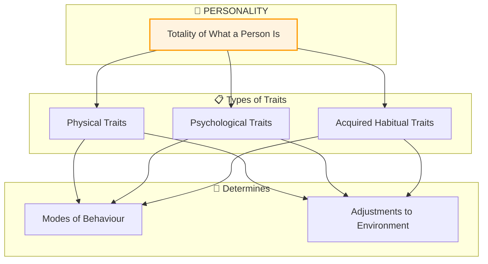

# 5:01 Meaning of the Term 'Personality'

!!! abstract "Section Overview"
    This section explores the etymology and psychological meaning of the term 'personality', tracing its origins from the Latin word 'persona' to its comprehensive psychological understanding as the totality of an individual's characteristics that determine their unique patterns of behavior and adjustment.

---

## 📖 Etymology of 'Personality'

!!! quote "Origin"
    The term **'personality'** has been derived from the Latin root **'persona'** which referred to the **facial mask** worn by Roman actors on the stage.

| Aspect | Description |
|--------|-------------|
| **Latin Root** | *Persona* |
| **Original Meaning** | Facial mask worn by Roman actors |
| **Theatrical Purpose** | Determined how a person is perceived by others |
| **Modern Evolution** | Refers to the totality of an individual's characteristics |

---

## 🧠 Common Misconceptions vs. Psychological Understanding

### Common (Narrow) Views

Many people look upon personality in a **narrow sense**:

| Misconception | Description |
|---------------|-------------|
| **Physical Attractiveness** | Personality as bodily or physical appeal |
| **Exceptional Traits** | Only those with commendable traits have "personality" |
| **Status-Based** | Ordinary/average people don't have personalities |

!!! warning "Limitation of Common Views"
    These common views fail to recognize that **psychologically, every individual, whatever be his status in society, is a personality or has a distinct personality.**

---

### Psychological Understanding

!!! note "Key Points 📌"
    Each person has a **unique and relatively stable, persisting organisation** of characteristics that go to make up his individual personality.

!!! quote "Definition"
    **Personality** refers to the **"totality of what a person is"**, which includes all traits (physical, psychological as well as a variety of acquired habitual traits) blended or organised within him in a **characteristically unique manner** that determines his modes of behaviour and his adjustments to the environment.

---

## 📊 Components of Personality

| Component | Description | Examples |
|-----------|-------------|----------|
| **Physical Traits** | Bodily characteristics | Height, build, appearance |
| **Psychological Traits** | Mental characteristics | Intelligence, temperament |
| **Habitual Traits** | Learned patterns | Habits, customs, routines |

---

## 🔑 Key Characteristics of Personality (Preview)

| Feature | Description |
|---------|-------------|
| **Unique** | Every individual has a distinct personality |
| **Stable** | Relatively persistent over time |
| **Organised** | Traits are blended and coordinated |
| **Comprehensive** | Includes all aspects of the person |
| **Behavioral** | Determines modes of behavior |
| **Adaptive** | Influences environmental adjustment |

---

!!! tip "Exam Tip 📝"
    Remember the etymology: **Persona → Mask → How others perceive us → Totality of being**
    
    Key phrase to memorize: Personality is the *"totality of what a person is"* organized in a *"characteristically unique manner"*.

---

!!! success "Summary"
    - **Personality** originates from Latin 'persona' (theatrical mask)
    - Unlike common beliefs, **everyone has a personality** regardless of status
    - Personality includes **physical, psychological, and habitual traits**
    - These traits are **uniquely organized** within each individual
    - Personality determines **behavior patterns** and **environmental adjustment**

---

> **Bridge →** Having understood the meaning of personality, let's explore the formal definitions provided by prominent psychologists in Section 5:02.

---

## ❓ Review Questions

1. What is the meaning of the term 'personality'? **(C)** [Ans. 5:01]
2. Explain the meaning of the term 'Personality', point out how the knowledge of personality is useful to classroom teachers. **(B)** [Ans. 5:01 + 5:04]
