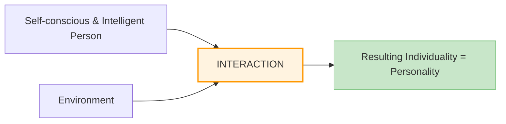
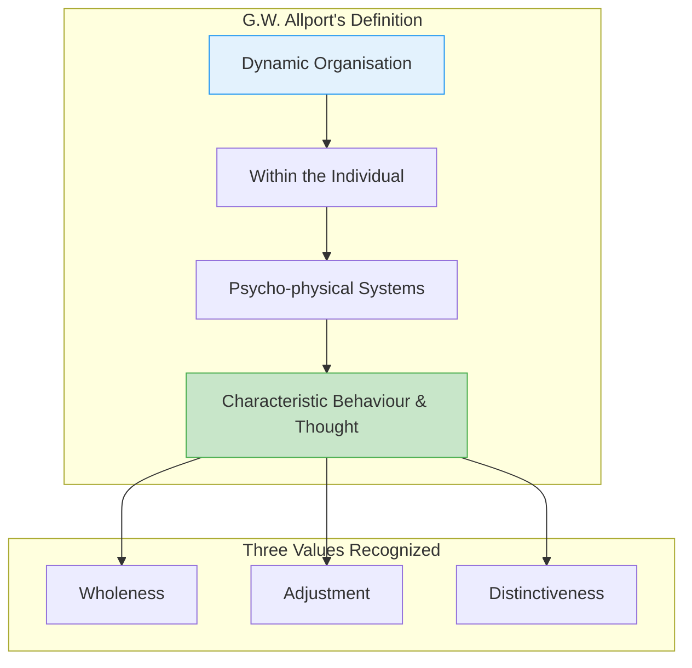
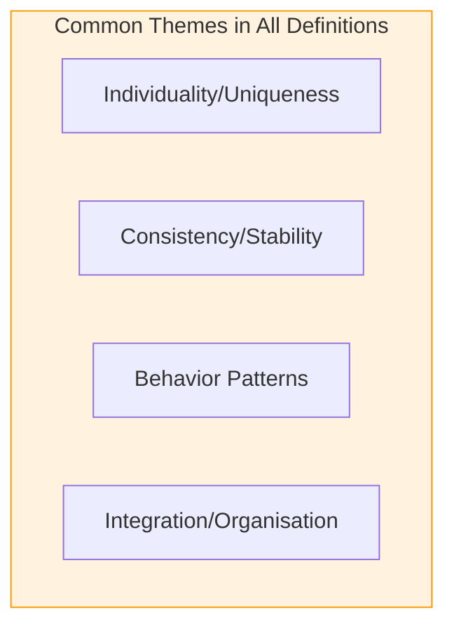

# 5:02 Definitions of Personality

!!! abstract "Section Overview"
    This section presents formal definitions of personality from three prominent psychologists: **F.S. Freeman**, **J.P. Guilford**, and **G.W. Allport**. Each definition highlights different aspects of personality—social interaction, individuality, and dynamic organization respectively.

---

## 📚 Three Major Definitions

### 1. F.S. Freeman's Definition

!!! quote "Definition by F.S. Freeman"
    "An individual's personality is the **resulting individuality** arising out of the **interaction** of a **self-conscious and intelligent person** and the **environment** in which he lives."

| Key Element | Explanation |
|-------------|-------------|
| **Resulting Individuality** | Personality is an outcome, not inborn |
| **Self-conscious** | Aware of oneself |
| **Intelligent Person** | Capable of thought and reasoning |
| **Environment** | Social and physical surroundings |
| **Interaction** | Dynamic relationship between person and environment |

---

### 2. J.P. Guilford's Definition

!!! quote "Definition by J.P. Guilford"
    "The fact that a man eats, sleeps and works does not define his personality, rather his personality is defined by **what he eats, how he sleeps and what is distinctive about his work pattern.**"
    
    "**Individuality or uniqueness** characterises one's personality. The **consistent and characteristic ways of functioning** of an individual reveals his personality."

| Key Element | Explanation |
|-------------|-------------|
| **Not the Activity** | What you do doesn't define personality |
| **How You Do It** | The distinctive manner matters |
| **Individuality** | Uniqueness is central |
| **Consistency** | Stable patterns of functioning |
| **Characteristic Ways** | Typical behavioral styles |

!!! example "Example"
    - Not *that* you eat → But *what* and *how* you eat
    - Not *that* you work → But *what is distinctive* about your work pattern
    - Not *that* you sleep → But *how* you sleep

---

### 3. G.W. Allport's Definition (Most Comprehensive)

!!! quote "Definition by G.W. Allport"
    "**Personality is a dynamic organisation within the individual of those psycho-physical systems that determine his characteristic behaviour and thought.**"

!!! note "Key Points 📌"
    Allport's definition is considered **comprehensive** because it recognizes three important values:
    
    1. **Wholeness** of personality
    2. **Adjustment** capacity
    3. **Distinctiveness** of man's personality

| Term | Meaning |
|------|---------|
| **Dynamic** | Active, changing, not static |
| **Organisation** | Structured, integrated whole |
| **Psycho-physical systems** | Mind-body connection |
| **Characteristic** | Typical, distinctive |
| **Behaviour and Thought** | Both actions and cognition |

---

## 📊 Comparison of Definitions

| Psychologist | Focus | Key Concept | Emphasis |
|--------------|-------|-------------|----------|
| **F.S. Freeman** | Person-Environment Interaction | Resulting individuality | Social context |
| **J.P. Guilford** | Uniqueness of Functioning | Consistent characteristic ways | Individual differences |
| **G.W. Allport** | Dynamic Organisation | Psycho-physical systems | Holistic integration |

---

## 🎯 Key Themes Across Definitions

| Theme | Present In |
|-------|------------|
| **Uniqueness** | Freeman ✓, Guilford ✓, Allport ✓ |
| **Environment Role** | Freeman ✓ |
| **Consistency** | Guilford ✓, Allport ✓ |
| **Dynamic Nature** | Allport ✓ |
| **Mind-Body Integration** | Allport ✓ |

---

!!! tip "Exam Tip 📝"
    **Most likely to be asked:** Allport's definition as it's the most comprehensive.
    
    **Memory aid for Allport:** **D-O-P-C-B-T**
    
    - **D**ynamic
    - **O**rganisation
    - **P**sycho-physical systems
    - **C**haracteristic
    - **B**ehaviour
    - **T**hought

---

!!! success "Summary"
    | Psychologist | One-Line Summary |
    |--------------|------------------|
    | **Freeman** | Personality = Person + Environment Interaction |
    | **Guilford** | Personality = How you do things uniquely |
    | **Allport** | Personality = Dynamic mind-body organisation |

---

> **Bridge →** These definitions reveal key characteristics of personality. Let's examine these characteristics systematically in Section 5:03.

---

## ❓ Review Questions

1. Define the term 'Personality' **(C)** [Ans. 5:02]
2. Explain the meaning of the term 'Personality', point out how the knowledge of personality is useful to classroom teachers. **(B)** [Ans. 5:01 + 5:04]
