# 5:03 Characteristics of Personality

!!! abstract "Section Overview"
    From the various definitions of personality, eight essential characteristics can be identified. These characteristics help us understand the fundamental nature of personality and how it manifests in individuals.

---

## 📋 Eight Characteristics of Personality

From the various definitions of the term 'personality', the following facts regarding personality could be arrived at:

---

## 📊 Detailed Analysis of Each Characteristic

| # | Characteristic | Description | Implication |
|---|----------------|-------------|-------------|
| i | **Self-consciousness** | Personality involves awareness of oneself | Enables self-reflection and self-evaluation |
| ii | **Through and through Social** | Personality develops and expresses in social context | Social interactions shape personality |
| iii | **Dynamic** | Personality is active, not static | Continuously evolving and changing |
| iv | **Product of Heredity and Environment** | Both genetic and environmental factors contribute | Nature and nurture both matter |
| v | **Adjustable or Modifiable** | Personality can change over time | Education and experiences can modify personality |
| vi | **Unique** | Each individual has a distinct personality | No two personalities are exactly alike |
| vii | **Integrated and Functions as a Whole** | All traits work together harmoniously | Not just a collection of separate traits |
| viii | **Assessable** | Personality can be measured and evaluated | Various assessment methods available |

---

## 🔍 Detailed Explanation

### i) Personality is Self-consciousness

!!! note "Key Points 📌"
    - Awareness of one's own existence, thoughts, and feelings
    - Ability to reflect on oneself
    - Distinguishes humans from other beings

---

### ii) Personality is Through and Through Social

!!! note "Key Points 📌"
    - Develops within social contexts
    - Expressed through social interactions
    - Influenced by social norms and expectations

---

### iii) Personality is Dynamic

!!! note "Key Points 📌"
    - Not fixed or static
    - Constantly evolving
    - Responds to new experiences and challenges

---

### iv) Personality is the Product of Heredity and Environment

```mermaid
flowchart LR
    subgraph HEREDITY["🧬 Heredity"]
        A[Genetic Factors]
        B[Biological Constitution]
    end
    
    subgraph ENVIRONMENT["🌍 Environment"]
        C[Social Factors]
        D[Cultural Influences]
    end
    
    HEREDITY --> E[PERSONALITY]
    ENVIRONMENT --> E
    
    style E fill:#c8e6c9,stroke:#4caf50,stroke-width:2px
```

---

### v) Personality is Adjustable or Modifiable

!!! note "Key Points 📌"
    - Can be changed through education
    - Responsive to therapy and counseling
    - Life experiences can alter personality

---

### vi) Personality is Unique

!!! note "Key Points 📌"
    - Each person has a distinct personality pattern
    - No two individuals are exactly alike
    - Even twins have unique personalities

---

### vii) Personality is Integrated and Functions as a Whole

---

### viii) Personality is Assessable

!!! note "Key Points 📌"
    - Can be measured using various methods
    - Subjective methods (interviews, questionnaires)
    - Objective methods (observation, rating scales)
    - Projective techniques (Rorschach, TAT)

---

## 🧠 Memory Aid

!!! tip "Exam Tip 📝"
    **Mnemonic: "SSDPAUIS"** (pronounced "Spa-You-Is")
    
    - **S**elf-consciousness
    - **S**ocial
    - **D**ynamic
    - **P**roduct of Heredity & Environment
    - **A**djustable
    - **U**nique
    - **I**ntegrated
    - A**s**sessable

---

## 📝 Quick Reference Table

| Category | Characteristics |
|----------|-----------------|
| **Nature** | Self-conscious, Dynamic, Unique |
| **Origin** | Product of Heredity & Environment |
| **Social Aspect** | Through and through Social |
| **Modifiability** | Adjustable or Modifiable |
| **Structure** | Integrated, Functions as Whole |
| **Measurement** | Assessable |

---

!!! success "Summary"
    Personality has **eight key characteristics**:
    
    1. It involves **self-consciousness**
    2. It is fundamentally **social**
    3. It is **dynamic** (not static)
    4. It results from **heredity and environment**
    5. It is **modifiable** through experiences
    6. It is **unique** to each individual
    7. It is **integrated** and works as a whole
    8. It can be **assessed** using various methods

---

> **Bridge →** Understanding these characteristics, let's now explore how teachers can use this knowledge of personality in their educational practice in Section 5:04.

---

## ❓ Review Questions

1. State the characteristics of personality **(C)** [Ans. 5:03]
