# 5:04 Uses of the Knowledge of Personality to Teachers

!!! abstract "Section Overview"
    Understanding personality psychology is not merely academic—it has practical applications for teachers. This section explains why knowledge of personality is essential for effective teaching, student guidance, and personal development of educators.

---

## 🎯 Three Key Uses for Teachers

```mermaid
flowchart TB
    subgraph USES["📚 Uses of Personality Knowledge"]
        A["i) Understanding Student Learning & Performance"]
        B["ii) Recognizing Disturbed Personalities"]
        C["iii) Personal & Interpersonal Understanding"]
    end
    
    A --> D[Better Guidance]
    B --> E[Early Intervention]
    C --> F[Effective Relationships]
    
    style USES fill:#e3f2fd,stroke:#2196f3,stroke-width:2px
```

---

## 📋 Detailed Explanation

### i) Understanding Student Learning and Performance

!!! note "Key Points 📌"
    The **personality factors of pupils affect their learning and performance** in classes, and knowledge of personality characteristics of pupils is needed to give them proper guidance.

| Application | Benefit |
|-------------|---------|
| **Identifying learning styles** | Tailored teaching methods |
| **Understanding motivation patterns** | Better student engagement |
| **Recognizing emotional factors** | Appropriate support |
| **Providing proper guidance** | Effective counseling |

---

### ii) Recognizing Disturbed Personalities

!!! warning "Important for Early Intervention"
    Recognition of **disturbed personalities** of some people will help teachers to have **immediate recourse to professional assistance** so that serious difficulties may be averted.

| Warning Signs | Teacher's Action |
|---------------|------------------|
| Withdrawal behavior | Monitor and refer |
| Excessive anxiety | Provide support, seek help |
| Aggressive tendencies | Early intervention |
| Emotional instability | Professional referral |

---

### iii) Personal and Interpersonal Understanding

!!! note "Key Points 📌"
    Even from a **personal angle**, much of our time is spent in:
    
    - Trying to **weigh up the personalities** of those around us
    - Trying to **influence them**
    - **Adjusting to them**

!!! info "Self-Knowledge Essential"
    For this purpose, a knowledge of **ourselves, our personality traits and attitudes are essential**.

| Personal Application | Benefit |
|---------------------|---------|
| **Self-awareness** | Better self-regulation |
| **Understanding others** | Improved relationships |
| **Influencing others** | Effective leadership |
| **Adjusting to others** | Harmonious interactions |

---

## 📊 Summary Table: Uses of Personality Knowledge

| # | Use | Description | Outcome |
|---|-----|-------------|---------|
| 1 | **Student Learning** | Understanding how personality affects learning | Proper guidance |
| 2 | **Early Detection** | Recognizing disturbed personalities | Professional referral |
| 3 | **Personal Growth** | Self-knowledge and interpersonal skills | Better adjustment |

---

## 🎓 Practical Applications for Teachers

```mermaid
flowchart TB
    subgraph CLASSROOM["🏫 In the Classroom"]
        A[Differentiated Instruction]
        B[Individual Attention]
        C[Behavior Management]
    end
    
    subgraph GUIDANCE["📋 In Guidance"]
        D[Career Counseling]
        E[Personal Counseling]
        F[Referral Services]
    end
    
    subgraph PERSONAL["👤 Personal Development"]
        G[Self-Reflection]
        H[Colleague Relations]
        I[Parent Communication]
    end
    
    style CLASSROOM fill:#e3f2fd,stroke:#2196f3
    style GUIDANCE fill:#fff3e0,stroke:#ff9800
    style PERSONAL fill:#c8e6c9,stroke:#4caf50
```

| Domain | Application |
|--------|-------------|
| **Classroom** | Adapting teaching to different personality types |
| **Guidance** | Providing appropriate counseling and referrals |
| **Personal** | Building effective relationships with all stakeholders |

---

!!! tip "Exam Tip 📝"
    **Three-Point Answer Structure:**
    
    1. **Learning & Performance** → Guidance
    2. **Disturbed Personalities** → Professional Help
    3. **Personal Use** → Self-knowledge & Adjustment

---

!!! success "Summary"
    Teachers benefit from personality knowledge in **three key ways**:
    
    1. **Understanding student factors** affecting learning for better guidance
    2. **Recognizing disturbed personalities** for early professional intervention
    3. **Personal development** through self-knowledge and improved interpersonal skills

---

> **Bridge →** Now that we understand why personality knowledge is important, let's examine the factors that influence personality development in Section 5:05.

---

## ❓ Review Questions

1. Why is the knowledge of psychology of personality needed to teachers? **(C)** [Ans. 5:04]
2. Explain the meaning of the term 'Personality', point out how the knowledge of personality is useful to classroom teachers. **(B)** [Ans. 5:01 + 5:04]
