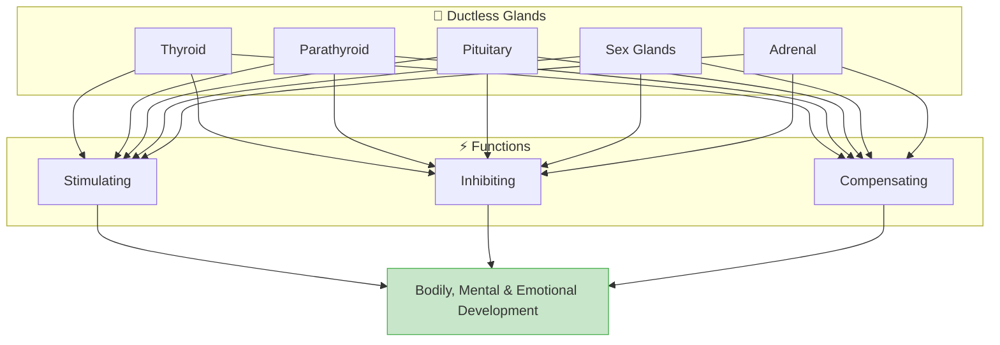
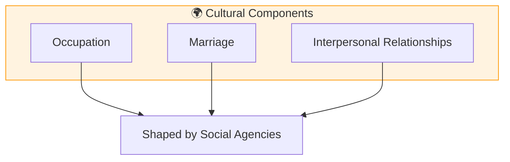
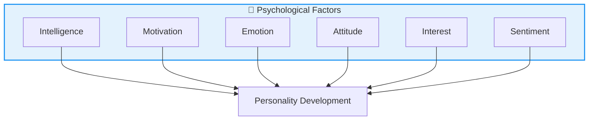

# 5:05 Factors Influencing Personality Development

!!! abstract "Section Overview"
    Man, the social animal has both a body and mind. His personality is influenced by **biological, psychological, and social factors**. This section provides a comprehensive overview of all factors affecting personality development, with detailed subsections covering each category.

---

## 📊 Overview of Personality Factors

```mermaid
flowchart TB
    subgraph FACTORS["🧠 PERSONALITY FACTORS"]
        direction TB
        subgraph BIO["🧬 Biological Factors"]
            B1[i) Physique]
            B2[ii) Chemique - Endocrine Glands]
            B3[iii) Nervous System]
        end
        
        subgraph SOC["👥 Sociological Factors"]
            S1[i) Home]
            S2[ii) School]
            S3[iii) Language]
            S4[iv) Culture]
        end
        
        subgraph PSY["🧠 Psychological Factors"]
            P1[i) Intelligence]
            P2[ii) Motivation]
            P3[iii) Emotion]
            P4[iv) Attitude]
            P5[v) Interest]
            P6[vi) Sentiment]
        end
    end
    
    style BIO fill:#ffcdd2,stroke:#f44336
    style SOC fill:#c8e6c9,stroke:#4caf50
    style PSY fill:#e3f2fd,stroke:#2196f3
```

---

## 📋 Factor Classification Table

| Category | Factors | Nature |
|----------|---------|--------|
| **Biological** | Physique, Chemique, Nervous System | Primarily Hereditary |
| **Sociological** | Home, School, Language, Culture | Environmental |
| **Psychological** | Intelligence, Motivation, Emotion, Attitude, Interest, Sentiment | Mixed (Hereditary + Environmental) |

!!! note "Key Points 📌"
    Among these factors, some are due to **heredity** and others arise due to **environmental influences**. Among the heredity factors, most important are **biological factors** and some of the psychological factors like **intelligence**. The individual's **biological constitution is a predisposing factor**—it determines the general direction in which his personality is likely to develop.

---

# 5:05:1 Biological Factors

There are **three biological factors** in personality development:

```mermaid
flowchart TB
    subgraph BIOLOGICAL["🧬 Biological Factors"]
        A[i) Physique]
        B[ii) Chemique]
        C[iii) Nervous System]
    end
    
    style BIOLOGICAL fill:#ffcdd2,stroke:#f44336,stroke-width:2px
```

---

## i) Physique

!!! quote "Definition"
    **Physique** refers to the physical characteristics of an individual including height, weight, physical appearance, physical strength, general health, physical deformities and abnormalities.

| Physical Characteristic | Influence on Personality |
|------------------------|--------------------------|
| **Short stature** | May develop feeling of inferiority |
| **Physical handicap** | May lead to inferiority complex |
| **Crippled condition** | Often emotionally unbalanced |
| **Fat/Obese** | May be somewhat lethargic |
| **Lean/Thin** | May be more active |
| **Ugly appearance** | May affect self-esteem |

!!! warning "Important Note"
    Physical factors influence personality **not directly but indirectly**. They affect one's **self-estimation or self-concept** which is intimately related to the development of personality.


---

## ii) Chemique (Endocrine Glands)

!!! quote "Definition"
    **Chemique** refers to the possible effects of the **ductless glands** (endocrine glands) on personality development.

### Major Endocrine Glands and Their Effects

| Gland | Secretion | Underactive Effect | Overactive Effect |
|-------|-----------|-------------------|-------------------|
| **Thyroid** | Thyroxine (controls growth rate) | Lethargic and despondent | Restless, irritable, unstable |
| **Parathyroid** | Calcium salts | Excessively high activity level | Quiet and slow in activities |
| **Pituitary** | Various hormones | Affects overall development | Various behavioral effects |
| **Sex Glands** | Sex hormones | Affects sexual behavior | Affects personality traits |
| **Adrenal** | Adrenaline | Affects stress response | Affects emotional reactions |



!!! note "Key Points 📌"
    These ductless glands do **interlocking activities**—they are:
    
    - **Stimulating** one another
    - **Inhibiting** one another
    - **Compensating** one another
    
    They play an important role in **bodily, mental, and emotional development**.

---

## iii) Nervous System

!!! quote "Definition"
    The **nervous system** controls the efficiency of sensory organs (which are the gateways of knowledge) and affects various mental and physical functions.

| Function | Dependence on Nervous System |
|----------|------------------------------|
| **Intellectual efficiency** | Quality of nervous system |
| **Physical power** | Neural coordination |
| **Patience** | Neural control |
| **Quickness of adjustment** | Neural processing speed |
| **Acquiring new responses** | Neural plasticity |
| **Reasoning and thinking** | Brain function |

!!! warning "Critical Point"
    **Any injury to the nervous system will affect the personality of the individual.**

---

# 5:05:2 Social Factors

**Home, school, language and culture** are the most important sociological factors influencing personality.

```mermaid
flowchart TB
    subgraph SOCIAL["👥 Social Factors"]
        A[I) Home]
        B[II) School]
        C[III) Culture]
    end
    
    style SOCIAL fill:#c8e6c9,stroke:#4caf50,stroke-width:2px
```

---

## I) Home

The home environment has multiple forces that influence personality:

### Home Factors Affecting Personality

| Factor | Description | Effect on Personality |
|--------|-------------|----------------------|
| **i) Parental Attitudes** | Rejection, over-protection, neglect | Distorted personality development |
| **ii) Over-ambitious Parents** | Unrealistic expectations | Failure, loss of self-respect, guilt, shame |
| **iii) Sex Preference** | Preference for boys | Pampering of males, neglect of females |
| **iv) Step Parents** | Loss of parents, orphanages | Stunted growth and personality |
| **v) Number of Children** | Only child or overcrowded | Various undesirable impacts |
| **vi) Socio-economic Status** | Education and economic level of parents | Telling effect on personality |
| **vii) Child-rearing Practices** | Feeding, toilet training, discipline | Shapes personality development |

### Detailed Analysis of Home Factors

#### i) Parental Attitudes

| Negative Attitude | Result |
|-------------------|--------|
| **Parental rejection** (unwanted children) | Distorted development |
| **Over-protection** | Dependency |
| **Only child syndrome** | Social adjustment issues |
| **Neglect** (servants' care) | Attachment problems |
| **Broken home** | Emotional instability |
| **Divorced parents** | Insecurity |
| **Alcoholic parents** | Various disorders |
| **Quarrelsome parents** | Anxiety and fear |

#### vii) Child-rearing Practices

| Practice Area | Variations |
|---------------|------------|
| **Feeding** | Breast-feeding vs. bottle-feeding |
| **Weaning** | Early vs. late weaning |
| **Toilet training** | Severe vs. permissive |
| **Discipline** | Authoritarian vs. democratic |

---

## II) School

Various school factors shape personality:

| School Factor | Influence |
|---------------|-----------|
| **Personality of teachers** | Role modeling |
| **School discipline** | Behavioral patterns |
| **Curricular activities** | Skill development |
| **Co-curricular activities** | Social skills |
| **School size** | Social opportunities |
| **Organizational climate** | Overall environment |

---

## III) Culture

!!! note "Key Points 📌"
    The culture in which a child is reared exerts the **broadest kind of social influence** on him.

### Three Important Cultural Components



### Cultural Differences Affecting Personality

| Cultural Aspect | Influence |
|-----------------|-----------|
| **Mode of dressing** | Self-expression |
| **Eating habits** | Social behaviors |
| **Attitudes to marriage** | Relationship patterns |
| **Child-rearing methods** | Developmental outcomes |
| **Family life** | Social skills |
| **Value system** | Moral development |
| **Beliefs** | World view |

!!! info "Geographical Influence"
    **Geographical differences** also contribute to cultural differences and hence geographical environment also **indirectly** plays a role in shaping personality.

---

# 5:05:3 Psychological Factors

One's **intelligence, motivation, attitude, emotion, interest and sentiment** are the important psychological factors that affect personality development.



| Factor | Role in Personality |
|--------|---------------------|
| **Intelligence** | Cognitive abilities, problem-solving |
| **Motivation** | Drive and goal-directed behavior |
| **Emotion** | Emotional responses and regulation |
| **Attitude** | Predispositions toward people/situations |
| **Interest** | Areas of engagement and passion |
| **Sentiment** | Organized emotional dispositions |

---

## 📊 Complete Factor Summary

| Category | Factors | Origin | Examples |
|----------|---------|--------|----------|
| **Biological** | Physique, Chemique, Nervous System | Hereditary | Height, glands, brain |
| **Sociological** | Home, School, Language, Culture | Environmental | Family, teachers, customs |
| **Psychological** | Intelligence, Motivation, Emotion, Attitude, Interest, Sentiment | Mixed | IQ, drives, feelings |

---

!!! tip "Exam Tip 📝"
    **Memory Aid for Factors:**
    
    - **BIO** = **P**hysique, **C**hemique, **N**ervous (PCN)
    - **SOCIAL** = **H**ome, **S**chool, **L**anguage, **C**ulture (HSLC)
    - **PSYCHO** = **I**ntelligence, **M**otivation, **E**motion, **A**ttitude, **I**nterest, **S**entiment (IMEAIS)

---

!!! success "Summary"
    Personality is influenced by **three categories** of factors:
    
    1. **Biological Factors** (Hereditary): Physique, Chemique (glands), Nervous System
    2. **Social Factors** (Environmental): Home, School, Language, Culture
    3. **Psychological Factors** (Mixed): Intelligence, Motivation, Emotion, Attitude, Interest, Sentiment

---

> **Bridge →** Understanding these factors provides the foundation for examining different theories that explain how personality develops. Let's explore the Type Approach to personality in Section 5:06.

---

## ❓ Review Questions

1. Mention the different factors that influence the personality. **(C)** [Ans. 5:05]
2. Discuss the various biological, social and psychological factors that influence the personality of an individual. **(A)** [Ans. 5:05 + 5:05:1 + 5:05:2 + 5:05:3]
3. Write short note on: Influence of ductless glands in the personality development of an individual **(B)** [Ans. (ii) of 5:05:1]
