# 5:06 Theories of Personality - Type Approach

!!! abstract "Section Overview"
    Psychologists adopt three major approaches to describe personality: **Type-approach**, **Trait-approach**, and **Type cum Trait Approach**. This section focuses on the Type-approach, which attempts to classify people according to their psychosomatic types or central themes like leadership style and values.

---

## 📊 Three Major Approaches to Personality

| Approach | Description | Method |
|----------|-------------|--------|
| **(i) Type-Approach** | Classifies people according to psychosomatic types | Categorization based on central themes |
| **(ii) Trait-Approach** | Lists basic personality traits | Rating on 5 or 9 point scales |
| **(iii) Type cum Trait** | Integrates type and trait approaches | Hierarchical approach |

---

# 5:06:1 Type Approach to Personality

!!! quote "Definition"
    **Type approach** to personality attempts to classify people into **a few types**, each characterising certain styles of life, which gives it a separate identity.

---

## 5:06:1:01 Galen's Classification

!!! info "Historical Classification"
    **Galen** classified people into **four types** according to their **temperament**:

```mermaid
flowchart TB
    subgraph GALEN["🏛️ Galen's Four Temperaments"]
        A["(i) Choleric - Irritable"]
        B["(ii) Melancholic - Sad"]
        C["(iii) Phlegmatic - Sleepy"]
        D["(iv) Sanguine - Smiling"]
    end
    
    style GALEN fill:#fff3e0,stroke:#ff9800,stroke-width:2px
```

| Temperament | Characteristic | Description |
|-------------|----------------|-------------|
| **Choleric** | Irritable | Quick-tempered, easily angered |
| **Melancholic** | Sad | Prone to sadness and depression |
| **Phlegmatic** | Sleepy | Calm, slow, unemotional |
| **Sanguine** | Smiling | Cheerful, optimistic, sociable |

---

## 5:06:1:02 Kretchmer's Classification

!!! info "Body Type Classification"
    **Earnest Kretchmer**, a German Psychiatrist, classified human personality into **three broad types** based on **bodily build**:

```mermaid
flowchart TB
    subgraph KRETCHMER["🧬 Kretchmer's Body Types"]
        subgraph BODY["Body Build"]
            A["Aesthenic<br>(Thin, long limbed, narrow chested)"]
            B["Pyknic<br>(Short, fat, barrel chested)"]
            C["Athletic<br>(Strong, sturdy limbs and bones)"]
        end
        
        subgraph PERSONALITY["Personality Type"]
            D["Schizothyme<br>(Introverted)"]
            E["Cyclothyme<br>(Extroverted)"]
        end
    end
    
    A --> D
    C --> D
    B --> E
    
    style KRETCHMER fill:#e3f2fd,stroke:#2196f3,stroke-width:2px
```

| Body Type | Physical Characteristics | Personality Traits | Personality Category |
|-----------|-------------------------|-------------------|---------------------|
| **Aesthenic** | Thin, long limbed, narrow chested | Shy, sensitive, aloof, withdrawing | **Schizothyme** (Introverted) |
| **Pyknic** | Short, fat, barrel chested | Jovial, lively, outgoing, fluctuating moods | **Cyclothyme** (Extroverted) |
| **Athletic** | Strong, sturdy limbs and bones | Similar to Aesthenic | **Schizothyme** |

!!! note "Key Points 📌"
    These personality types are each **prone to a distinct type of mental disorder**.

---

## 5:06:1:03 Spranger's Classification

!!! info "Value-Based Classification"
    **Edward Spranger**, a German philosopher, divided human beings into **six categories** based on **values or interests**:

```mermaid
flowchart TB
    subgraph SPRANGER["📚 Spranger's Six Value Types"]
        A["i) Theoretical"]
        B["ii) Economic"]
        C["iii) Aesthetic"]
        D["iv) Social"]
        E["v) Political"]
        F["vi) Religious"]
    end
    
    style SPRANGER fill:#c8e6c9,stroke:#4caf50,stroke-width:2px
```

| Type | Dominant Value | Characteristics |
|------|----------------|-----------------|
| **i) Theoretical** | Knowledge/Truth | Neglect social and political participation |
| **ii) Economic** | Money/Wealth | Interested in money-hoarding |
| **iii) Aesthetic** | Beauty | Love beauty, busy in sensuous gratification |
| **iv) Social** | Service | Interested in social activities |
| **v) Political** | Power | Dominating and desirous of power |
| **vi) Religious** | Unity/Mysticism | Devote themselves to religious activities |

!!! tip "Exam Tip 📝"
    **Allport, Vernon and Lindzey** have constructed an **inventory** to study these six values.

---

## 5:06:1:04 Sheldon's Classification

!!! info "Somatotype Classification"
    **Dr. William H. Sheldon**, an American Surgeon, classified human beings into **three broad categories** of physical dimensions with corresponding **temperamental characteristics**:

```mermaid
flowchart TB
    subgraph SHELDON["🏋️ Sheldon's Classification"]
        subgraph BODY["Body Type"]
            A["Endomorphic<br>(Round, fat, soft)"]
            B["Mesomorphic<br>(Hard, muscular)"]
            C["Ectomorphic<br>(Delicate, lean, linear)"]
        end
        
        subgraph TEMPERAMENT["Temperament"]
            D["Viscerotonia"]
            E["Somatotonia"]
            F["Cerebrotonia"]
        end
    end
    
    A --> D
    B --> E
    C --> F
    
    style SHELDON fill:#fff3e0,stroke:#ff9800,stroke-width:2px
```

### Sheldon's Complete Classification Table

| Body Type | Physical Description | Personality Type | Typical Traits |
|-----------|---------------------|------------------|----------------|
| **Endomorphic** | Round, fat, soft (tendency toward roundness) | **Viscerotonia** | Fond of food, inclined to eat too much, apprehensive, insecure, amiable, sleeps well, conforms to social conventions |
| **Mesomorphic** | Hard, muscular (predominance of muscle and bone) | **Somatotonia** | Adventurous, likes strenuous exercise and cold showers, dresses informally, withstands pain easily and willingly |
| **Ectomorphic** | Delicate, lean, linear (fragility and linearity) | **Cerebrotonia** | Asocial, unamiable, lacks desire for exercise, non-adventurous, does not withstand pain easily |

!!! note "Key Points 📌"
    **Sheldon's 7-Point Scale**: Each type of body dimension may be rated on a **7-point scale**, and the **normal physique** will be **4-4-4**.

---

## 5:06:1:05 Lippitt's Classification

!!! info "Leadership Style Classification"
    **Lippitt and White** identified three types of personality based on **leadership styles**:

| Leadership Style | Characteristics |
|------------------|-----------------|
| **(a) Authoritarian** | Forces his decisions ruthlessly with power on others |
| **(b) Democratic** | Seeks consensus while taking decisions |
| **(c) Laissez-faire** | Everyone acts on his own; the leader has no power or control over others |

---

## 5:06:1:06 Ogburn's Classification

!!! info "Sociological Classification"
    Sociologists like **Ogburn** classify human personality into **five types**:

| Type | Characteristics |
|------|-----------------|
| **(i) Revolutionist** | Seeks radical change |
| **(ii) Leader** | Guides and influences others |
| **(iii) Proud** | High self-regard |
| **(iv) Gambler** | Risk-taker |
| **(v) Exhibitionist** | Seeks attention and display |

---

## 5:06:1:07 Jung's Classification (Most Popular)

!!! quote "Definition"
    The most popular personality types are those introduced by **Carl Jung** - **Extroversion** and **Introversion**.

```mermaid
flowchart TB
    subgraph JUNG["🧠 Jung's Classification"]
        subgraph EXTROVERT["Extrovert"]
            E1[Susceptible to external stimulation]
            E2[Deeply involved in social activities]
            E3[Not bothered by criticism]
            E4[Displays emotions openly]
            E5[Less worried about failure]
            E6[Lacks self-criticism]
        end
        
        subgraph INTROVERT["Introvert"]
            I1[Immersed in own thoughts]
            I2[Indifferent to social situations]
            I3[Conceals emotions]
            I4[Highly sensitive to criticism]
            I5[Deeply upset by failure]
            I6[Invariably self-centred]
        end
    end
    
    style EXTROVERT fill:#c8e6c9,stroke:#4caf50
    style INTROVERT fill:#e3f2fd,stroke:#2196f3
```

### Comparison: Extrovert vs. Introvert

| Characteristic | Extrovert | Introvert |
|----------------|-----------|-----------|
| **Response to Stimuli** | Readily susceptible to external stimulation | Immersed in own thoughts, memories, imaginations |
| **Social Involvement** | Deeply involved in social activities | Indifferent to social situations |
| **Response to Criticism** | Not bothered by outside criticisms | Highly sensitive to criticisms |
| **Emotional Expression** | Displays emotions openly | Tends to conceal emotions |
| **Reaction to Failure** | Less worried about failure | Deeply upset by failure |
| **Self-Criticism** | Lacks self-criticism | Invariably self-centred (excessive self-focus) |

!!! warning "Criticism of Jung's Classification"
    This classification has been criticised on the ground that:
    
    - In general, people have characteristics of **both extroversion and introversion** mixed in them at different levels
    - They exhibit one type in **one situation** and the other in **another situation**
    - **No one is a perfect extrovert or an introvert**

---

# 5:06:2 Limitations of the Type-Approach

!!! warning "Limitations"

### 1. Physique-Personality Relationship Problem

One serious objection is that **changes of physique** often occur for individuals at **middle age** but this is **not often accompanied by any changes in personality characteristics**.

### 2. Few People Fit Distinct Types

Type approaches have obvious limitations. **Few people fit into such distinct types easily**. Jung himself says that **most persons appear to be atypical or ambiverts**.

### 3. Multiple Aspects of Traits

Even introversion-extroversion now appear to have aspects—one who is **introverted in social activity** may **not be equally so in his thinking**.

### 4. Oversimplification

Human personality is **too rich and often too unusual** to be described in one or two general types.

!!! note "Key Points 📌"
    The type approach tries to describe **practically useful distinctions** among persons, but such distinctions are **only relative**.

---

## 📊 Summary of All Type Classifications

| Psychologist | Basis | Types |
|--------------|-------|-------|
| **Galen** | Temperament | Choleric, Melancholic, Phlegmatic, Sanguine |
| **Kretchmer** | Body Build | Aesthenic, Pyknic, Athletic |
| **Spranger** | Values | Theoretical, Economic, Aesthetic, Social, Political, Religious |
| **Sheldon** | Somatotype | Endomorphic, Mesomorphic, Ectomorphic |
| **Lippitt** | Leadership | Authoritarian, Democratic, Laissez-faire |
| **Ogburn** | Social Role | Revolutionist, Leader, Proud, Gambler, Exhibitionist |
| **Jung** | Energy Direction | Extrovert, Introvert |

---

!!! tip "Exam Tip 📝"
    **Memory Aid for Theorists:**
    
    - **G**alen = **4** Temperaments (CMPS)
    - **K**retchmer = **3** Body types (APA → Schizo/Cyclo)
    - **S**pranger = **6** Values (TEASPR)
    - **S**heldon = **3** Somatotypes (EME → VSC)
    - **L**ippitt = **3** Leadership (ADL)
    - **J**ung = **2** Types (E-I) - **Most Popular**

---

!!! success "Summary"
    The **Type Approach** attempts to classify people into distinct categories:
    
    - Multiple classification systems exist (Galen, Kretchmer, Spranger, Sheldon, Lippitt, Ogburn, Jung)
    - **Jung's Extrovert-Introvert** is the most popular
    - **Limitations**: People rarely fit neatly into types; distinctions are relative; personality is too complex for simple categorization

---

> **Bridge →** Given the limitations of the Type approach, psychologists developed the Trait approach which describes personality using multiple traits rather than single categories. Let's explore this in Section 5:07.

---

## ❓ Review Questions

1. What are the three approaches used to describe personality? **(C)** [Ans. 5:06]
2. Explain the type approach to personality. [Ans. 5:06:1 + 5:06:1:01 to 5:06:1:06]
3. Write short notes on:
   - Galen's classification of personality **(C)** [Ans. 5:06:1:01]
   - Kretchmer's classification of personality **(C)** [Ans. 5:06:1:02]
   - Lippitt's classification of personality **(C)** [Ans. 5:06:1:05]
   - Sheldon's classification of personality **(C)** [Ans. 5:06:1:04]
   - Limitations of type approach in personality studies **(C)** [Ans. 5:06:2]
